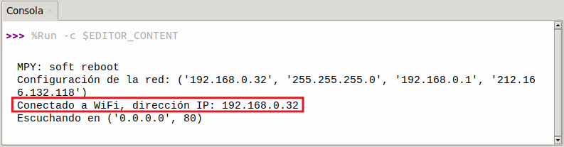
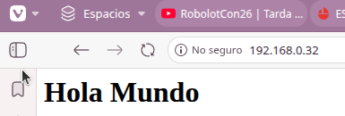
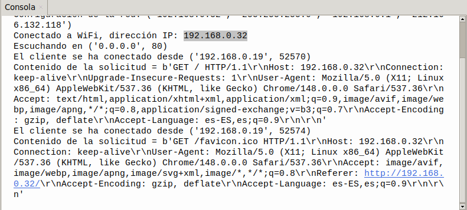

## <FONT COLOR=#007575>**18. WiFi**</font>
### <FONT COLOR=#AA0000>Resumen</font>
El ESP32 es un potente microcontrolador creado por [Expressif](https://www.espressif.com/) que incorpora un módulo Wi-Fi y Bluetooth integrado, ampliamente utilizado en el Internet de las cosas (IoT). Gracias a esta función, es posible controlar de forma remota la transmisión de datos a través de la red inalámbrica.

En las aplicaciones, el ESP32 puede utilizarse como:

* cliente para conectarse a una red Wi-Fi
* punto de acceso para crear una red propia.
  
A través de estas conexiones, el ESP32 recibe comandos para controlar dispositivos externos, como luces o termostatos. En el código se utilizan protocolos como [HTTP](https://es.wikipedia.org/wiki/Protocolo_de_transferencia_de_hipertexto) y [MQTT](https://es.wikipedia.org/wiki/MQTT) para comunicarse con el servidor y lograr el envío y la recepción de datos con el fin de controlar y supervisar de forma remota.

### <FONT COLOR=#AA0000>Introducción a WiFi ESP32</font>
La placa de desarrollo ESP32 integra Wi-Fi (2.4G) y Bluetooth (4.2), lo que le permite conectarse fácilmente a una red Wi-Fi y comunicarse con otros dispositivos de la red. Puedes visualizar páginas web en tu navegador a través de ESP32.

<figure markdown="span">
  {.center-img100}
  <figcaption>Imagen creada con ChatGPT</figcaption>
</figure>

* Modo estación base o cliente (STA / Modo cliente Wi-Fi): el ESP32 está conectado a un punto de acceso Wi-Fi (AP).
* Modo AP (Soft-AP / Modo de punto de acceso Wi-Fi): El/Los dispositivo(s) Wi-Fi está(n) conectado(s) al ESP32.
* Modo AP-STA: El ESP32 funciona como punto de acceso Wi-Fi y como dispositivo Wi-Fi conectado a otra red Wi-Fi.
* Estos modos admiten seguridad WPA, WPA2 y WEP.
* Es capaz de escanear puntos de acceso Wi-Fi (activos o pasivos).
* Admite la supervisión en tiempo real de paquetes [Wi-Fi IEEE 802.11](https://es.wikipedia.org/wiki/IEEE_802.11).

Puedes ampliar la información sobre la API de redes en ESP32 en:

[https://docs.espressif.com/projects/esp-idf/en/latest/esp32/api-reference/network/index.html](https://docs.espressif.com/projects/esp-idf/en/latest/esp32/api-reference/network/index.html){.center}

Esta información pertene a [ESP-IDF Programming Guide](https://docs.espressif.com/projects/esp-idf/en/latest/esp32/index.html), que es la documentación oficial de Espressif IoT Development Framework (ESP-IDF)

### <FONT COLOR=#AA0000>Prueba del código</font>
Abre Thonny. Conecta la placa al ordenador y selecciona el puerto al que está conectada Coding Box. En "Archivos", abre el programa [P18MP.py](../programas/MP/Proy/P18MP.py) y haz clic en el botón .

El programa es:

```python
'''
 * Archivo         : P17MP
 * Versión Thonny  : Thonny 5.0.0
'''
import network
import socket
import time
import machine

# Conexión WiFi 2.4 GHz
SSID = 'nombre de tu WiFi'  # nombre de tu WiFi
PASSWORD = 'contraseña de tu WiFi'  # contraseña de tu WiFi

# conectar a WiFi
def connect_wifi(ssid, password):
    # Crea objeto WLAN usando el modo STA (modo cliente)
    wlan = network.WLAN(network.STA_IF)
    wlan.active(True)  # activa la interface WLAN
    wlan.connect(ssid, password)  # Conecta a la red WiFi especificada

    timeout = 10  # Duración del tiempo de espera de conexión en segundos
    '''
    Si la conexión falla y el tiempo de espera aún no ha vencido, comprueba
    de nuevo el estado de la conexión
    '''
    while not wlan.isconnected() and timeout > 0:
        print("Conectando a la red WiFi...")
        time.sleep(1)
        timeout -= 1

    '''
    Si la conexión no se establece tras agotarse el tiempo de espera, se
    lanza una excepción
    '''
    if not wlan.isconnected():
        raise Exception("No es posible conectar a WiFi")
    '''
    Configuración de la red:
    dirección IP, máscara de subred, puerta de enlace y DNS
    '''
    print('Configuración de la red:', wlan.ifconfig())
    # Mostrar la dirección IP de la conexión establecida con éxito
    print('Conectado a WiFi, dirección IP:', wlan.ifconfig()[0])  
    return wlan

# crea página HTML
def web_page():
    html = """<html>
    <head>
        <title>Servidor Web ESP32</title>
    </head>
    <body>
        <h1>Hola Mundo</h1>
    </body>
    </html>"""
    return html  # Devuelve una sencilla pagina web con el texto Hola Mundo

# Inicia el servidor Web
def start_server():
    wlan = connect_wifi(SSID, PASSWORD)  # conecta a WiFi
    
    addr = socket.getaddrinfo('0.0.0.0', 80)[0][-1]
    # Obtener la dirección IP local y el puerto 80
    s = socket.socket()  # Crea un objeto socket (dispositivo que se conecta a WiFi)
    s.bind(addr)  # Asignar sockets a direcciones y puertos
    s.listen(5)  # Empieza a escuchar las conexiones entrantes. El número máximo de conexiones es de 5.
    print('Escuchando en', addr)  # Imprime la dirección y el puerto en los que el servidor está a la escucha

    while True:
        cl, addr = s.accept()  # Aceptar una conexión de cliente
        print('El cliente se ha conectado desde', addr)  # Imprime la dirección del cliente
        request = cl.recv(1024)  # Recibir solicitudes de los clientes, de hasta 1024 bytes
        request = str(request)  # Convertir la solicitud en una cadena
        print('Contenido de la solicitud = %s' % request)  # Imprimir contenido de la solicitud
        
        response = web_page()  # Generar una respuesta HTML
        cl.send('HTTP/1.1 200 OK\n')  # Enviar la cabecera de la respuesta HTTP
        cl.send('Tipo de contenido: texto/html\n')  # Especifica el tipo de contenido como HTML
        cl.send('Conexión: cerrada\n\n')  # Cerrar conexión
        cl.sendall(response)  # Enviar el contenido de una página HTML
        cl.close()  # Cierra la conexión del cliente

# Ejecutar el servidor
try:
    start_server()  # Intenta iniciar el servidor web
except Exception as e:
    # Si el inicio falla, aparece un mensaje de error
    print('No se ha podido iniciar el servidor:', e)  
    machine.reset()  # Reinicia el dispositivo para intentar volver a conectarte
```

### <FONT COLOR=#AA0000>Resultado de la prueba</font>
Haz clic en "Ejecutar script actual"  para ejecutar el código. Tras cargar el código, y una vez conectado a la red WiFi, verás una dirección IP. Ahora conecta tu dispositivo de control (teléfono móvil, tablet u ordenador) a la misma red WiFi y escribe la dirección IP en el navegador para acceder a la página web.

{.center-img100}

Escribiendo la dirección IP en un navegador vemos lo siguiente:

{.center-img}

La consola se actualiza con muchos datos de la conexión:

{.center-img100}

Pulsa "Ctrl+C" o haz clic en "Detener/Reiniciar el intérprete"  para detener la ejecución.
