## <FONT COLOR=#007575>**18. Panel de control**</font>
### <FONT COLOR=#AA0000>Resumen</font>
Se crea un panel de control que permite controlar módulos y leer valores de sensores.

### <FONT COLOR=#AA0000>Paso a paso</font>
Vamos a explicar paso paso cada parte del programa final dividiendolo por funciones para trabajar con los componentes del panel correspondientes.

La primera tarea será conectar a la red WiFi, crear las variables que vamos a necesitar e inicializar MQTT y los LED RGB direccionables. El bloque "Inicializar" y "MQTT Iniciar" (obtenido del panel de control creado) son los siguientes:

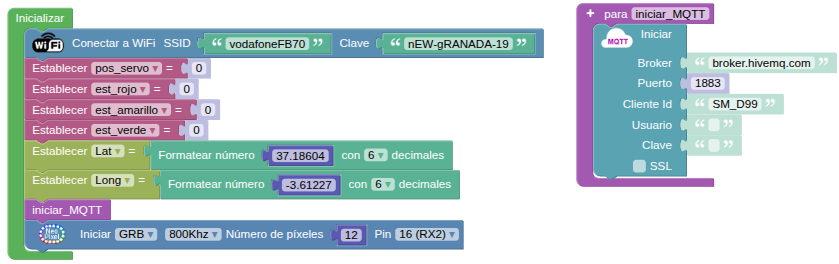{.center-img100}

#### <FONT COLOR=#0000FF>Servomotor</font>
Control de la posición de un servo desde el panel utilizando un compnente deslizador.

El componente "Deslizador" del panel es:

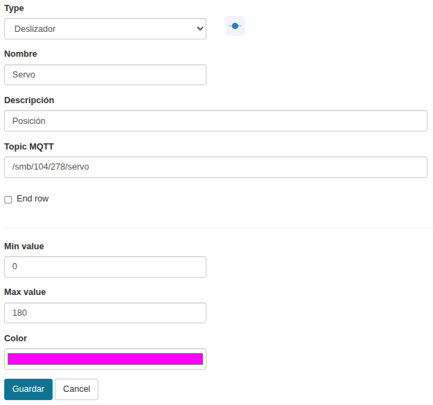{.center-img100}

La función es:

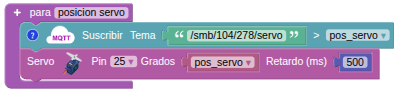{.center-img75}

#### <FONT COLOR=#0000FF>Iluminación</font>
Vamos a mostrar en el panel el valor numérico leido por la LDR, que estará comprendido entre 0 y 4095, en un componente Número y también mostraremos el valor en porcentaje en un componente Semicirculo.

El componente "Número" del panel es:

{.center-img100}

El componente "Semicirculo" del panel es:

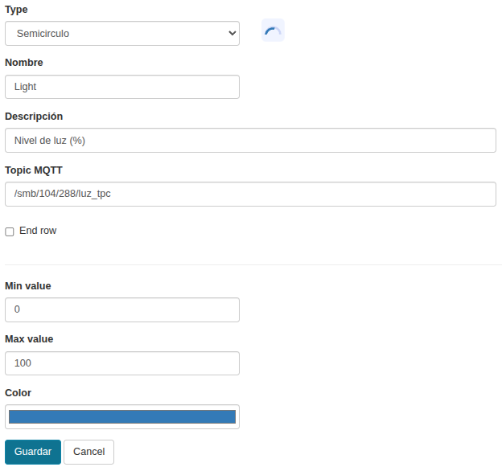{.center-img100}

La función es:

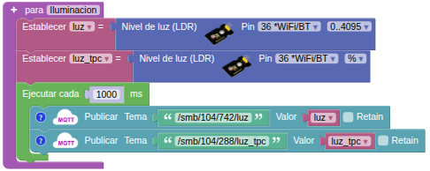{.center-img75}

#### <FONT COLOR=#0000FF>Distancia</font>
Se trata de mostrar la ditancia en un componente Nivel horizontal que mostrará la distancia medida en cm en forma gráfica mediante una barra y también de forma numérica.

El componente "Nivel horizontal" del panel es:

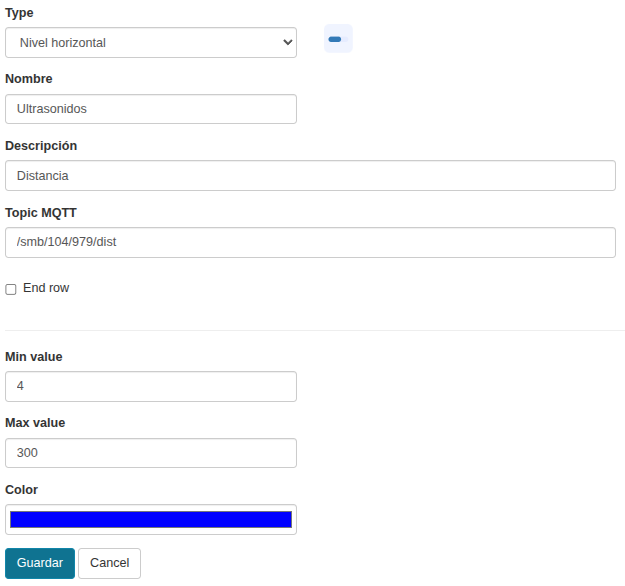{.center-img100}

Los valores máximo y mínimo se han configurado en función de los valores capaz de medir el sensor.

La función es:

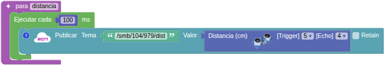{.center-img75}

#### <FONT COLOR=#0000FF>Control LED rojo</font>
Se trata de controlar el estado del LED rojo en Coding Box mediante un componente "Interruptor" en el panel y a su vez utilizar un componente "Indicador" en el panel que muestre el estado del LED. Por un lado hay que suscribirse al topic del interruptor para recibir el valor "0" o "1" en función de su posición y con esto publicar como debe estar el indicador, si en "1 o Verdadero" o "0 o Falso".

El componente "Interruptor" del panel es:

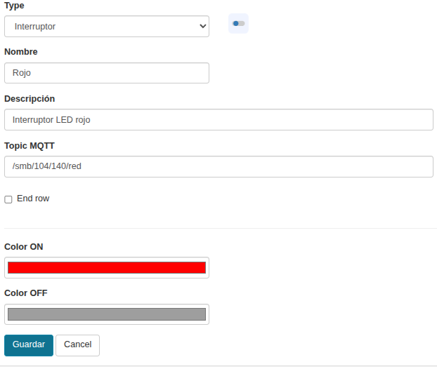{.center-img100}

El componente "Indicador" del panel es:

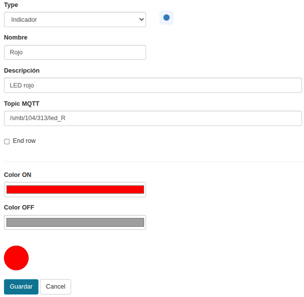{.center-img100}

La función es:

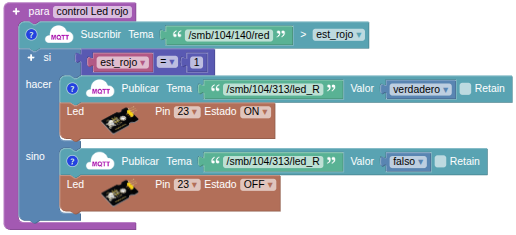{.center-img75}

#### <FONT COLOR=#0000FF>Control Led amarillo, ventilador y Rainbow</font>
Con un componente "Interruptor" en el panel y un componente "Indicador" en el panel se muestra el estado del LED amarillo. Cuando se acciona el interruptor el LED se enciende, el ventilador gira, los LEDs RGB direccionables realizan una ruleta en color amarillo y en un componente "Texto" se muestra el estado de ventilador y ruleta.

!!! Info "Aviso:"
    A partir de este componente no se realiza la acción de ponerle un alias al topic y se utiliza el mismo tal y como se genera. Los topics se diferencian por el número aleatorio (nnn) que le corresponde y que tras el identificador del panel, en este caso el 104, por lo que la cadena del topic será ahora ```/smb/104/nnn```.

El componente "Interruptor" del panel para LED, ventilador y Rainbow es:

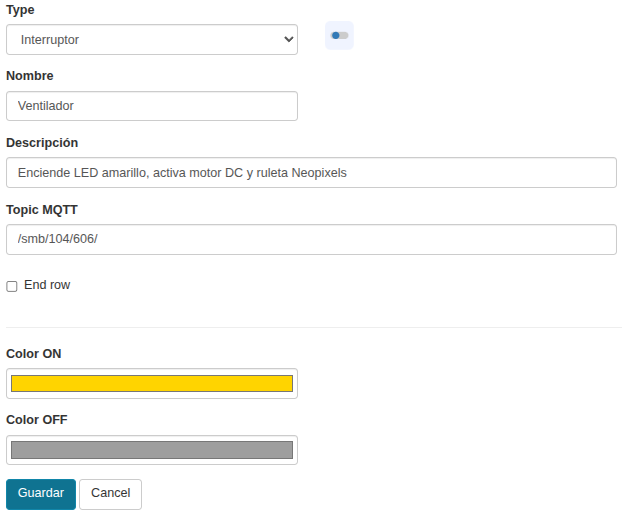{.center-img100}

El componente "Indicador" del panel para LED, ventilador y Rainbow es:

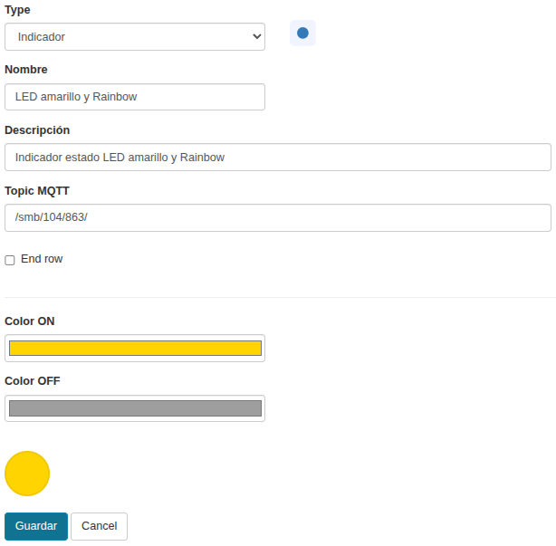{.center-img100}

El componente "Texto" del panel para LED, ventilador y Rainbow es:

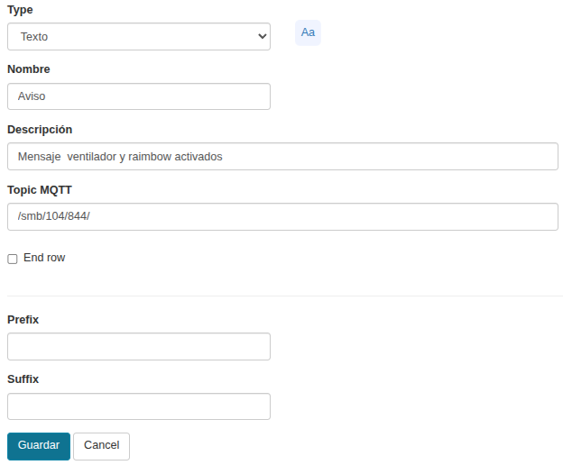{.center-img100}

La función es:

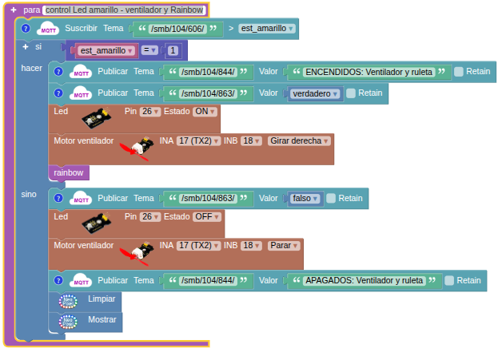{.center-img75}

Desde la función anterior se produce una llamada a la función "rainbow" que consiste en encender girando en sentido horario los LEDs de uno en uno en color amarillo. La función es:

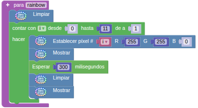{.center-img}

#### <FONT COLOR=#0000FF>Alarma</font>
Se trata de crear una alarma sonora que emita un pitido cuando el sensor de presencia detecta movimiento. Cuando la alarma se acciona sse enciende en LED verde en Coding Box y un indicador, también verde, en el panel.

El componente "Indicador" del panel es:

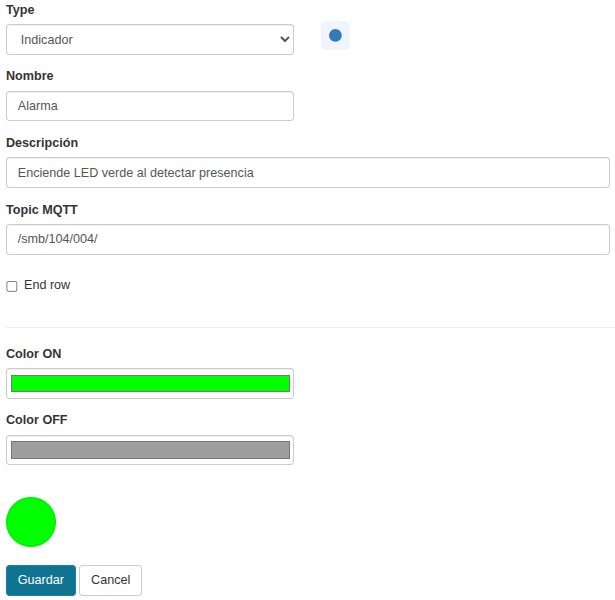{.center-img100}

La función es:

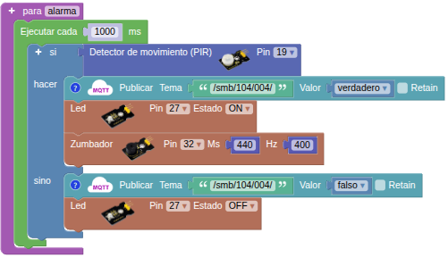{.center-img75}

#### <FONT COLOR=#0000FF>Mapa</font>
Se crea un mapa en el que se visualiza una coordenada determinada obtenida en [123coordenadas.com](https://www.123coordenadas.com/) cuyos valores de latitud y longitud se introducen en el bloque "Inicializar".

El componente "Mapa" del panel es:

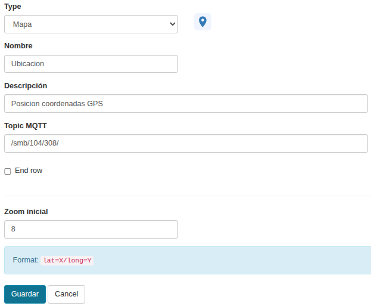{.center-img100}

La función es:

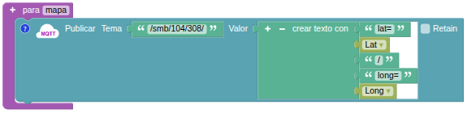{.center-img75}

Observa como se ha creado la cadena de texto a publicar con el formato indicado en el topic.

### <FONT COLOR=#AA0000>Prueba del código</font>
Puedes crear los bloques manualmente o abrir directamente el archivo de código que te puedes descargar del enlace: [18. Panel de control](../programas/SMB/P18SMB.abp).

El programa es el siguiente:

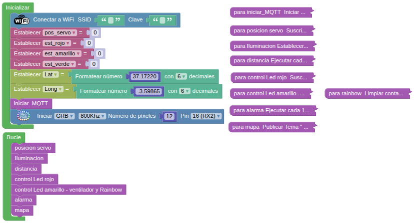{.center-img75}
[Descargar el programa](../programas/SMB/P18SMB.abp){.enlace-centrado}

El aspecto del panel Coding Box es el siguiente:

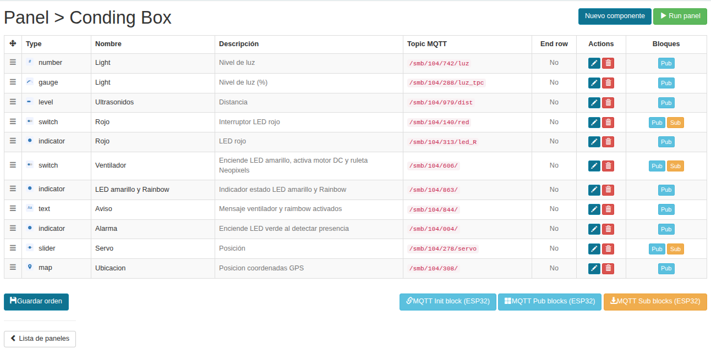{.center-img75}

### <FONT COLOR=#AA0000>Resultado de la prueba</font>
Conecta Coding Box a STEAMakersBlocks mediante un cable USB, por en marcha "Connector" y haz clic en el botón "Subir" para cargar el código. Una vez puesto en ejecución el panel puedes observar el funcionamiento de todo lo creado. Se aconseja ir creando y probando el panel paso a paso.

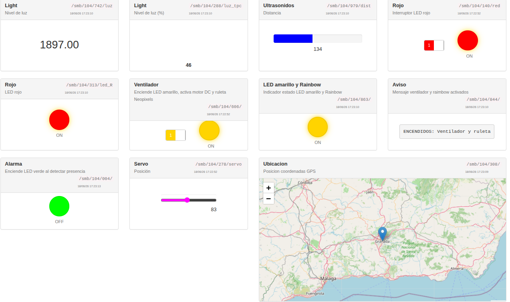{.center-img100}
