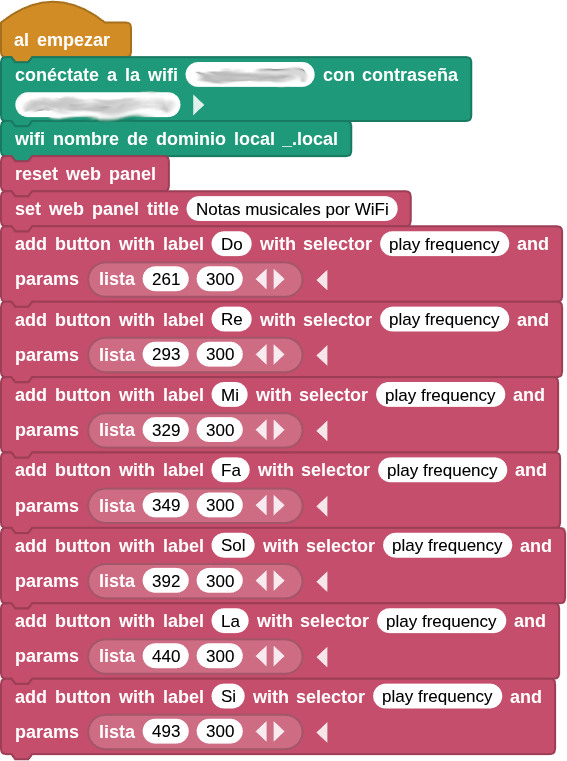
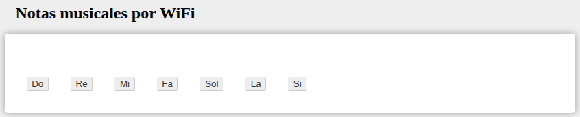

## **19. Notas musicales por WiFi**
### Resumen
En este proyecto, se han configurado siete botones para controlar el altavoz y que reproduzca los tonos Do, Re, Mi, Fa, Sol, La y Si.

### Prueba del código
Puedes crear los bloques manualmente o abrir directamente el archivo de código que te puedes descargar del enlace: [19. Notas musicales por WiFi](../programas/MB/18_Visualización_tiempo_real_WiFi.ubp).

El programa es el siguiente:

  
***[19. Notas musicales por WiFi](../programas/MB/19_Notas_musicales_WiFi.ubp)***

### Resultado de la prueba
Conecta Coding Box a MicroBlocks mediante USB o Bluetooth y haz clic en el botón "ejecutar" para cargar el código en la misma. Una vez conectado a la red WiFi, verás una dirección IP. Ahora conecta tu dispositivo de control (teléfono móvil, tablet u ordenador) a la misma red WiFi y escribe "CodingBox.local" o la dirección IP en el navegador para acceder a la página web.

{.center-img100}
