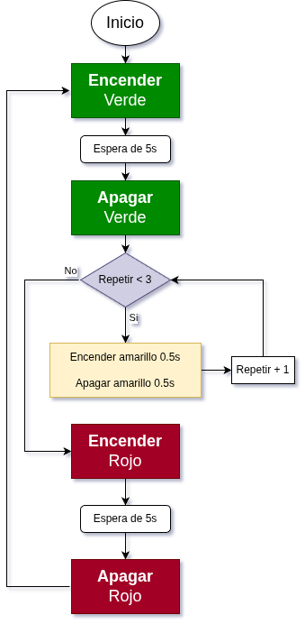

## <FONT COLOR=#007575>**1. Semáforo**</font>
### <FONT COLOR=#AA0000>Resumen</font>
El semáforo sirve para regular el paso de peatones y vehículos. En su versión más básica, tiene una luz roja, una amarilla y una verde que indican diferentes instrucciones.

* La luz roja indica Stop: los peatones y los vehículos deben detenerse.
* Amarillo para Precaución: peatones y conductores deben prepararse para detenerse. Si se está circulando, se debe reducir la velocidad.
* Verde para Adelante: peatones y vehículos pueden continuar circulando, pero deben respetar las normas de tráfico.

En este proyecto, vas a programar la ESP32 Coding Box para controlar un semáforo en miniatura. Por ejemplo, puedes configurar la duración de cada luz y el intervalo de tiempo entre ellas.

### <FONT COLOR=#AA0000>Ordinograma</font>

{.center-img} 

### <FONT COLOR=#AA0000>Prueba del código</font>
Abre Thonny. Conecta la placa al ordenador y selecciona el puerto al que está conectada Coding Box. En "Archivos", abre el programa [P1MP.py](../programas/MP/Proy/P1MP.py) y haz clic en el botón .

El programa es:

```python
'''
 * Archivo         : P1MP
 * Versión Thonny  : Thonny 5.0.0
'''
from machine import Pin
import time

LEDrojo = Pin(23,Pin.OUT)	#IO23 es el pin del LED rojo
LEDverde = Pin(27,Pin.OUT)	#IO27 es el pin del LED verde
LEDamarillo = Pin(26,Pin.OUT)	#IO26 es el pin del LED amarillo

#apaga todos los LEDs
LEDrojo.off()
LEDverde.off()
LEDamarillo.off()

#green led on for 5S; yellow led blink for 3; red led on for 5S; in a loop
while True:
    LEDverde.on()
    time.sleep(5)
    LEDverde.off()
    for i in range(0,3):
        LEDamarillo.on()
        time.sleep(0.5)
        LEDamarillo.off()
        time.sleep(0.5)
    LEDrojo.on()
    time.sleep(5)
    LEDrojo.off()
```

### <FONT COLOR=#AA0000>Resultado de la prueba</font>
Haz clic en "Ejecutar script actual"  para ejecutar el código. Tras cargar el código, verás que el LED verde se enciende durante 5 segundos y luego se apaga. Inmediatamente después, el LED amarillo parpadea tres veces. A continuación, el LED rojo se enciende durante 5 segundos y luego se apaga. Este funcionamiento imita exactamente el de un semáforo y se repetirá indefinidamente.

Pulsa "Ctrl+C" o haz clic en "Detener/Reiniciar el intérprete"  para detener la ejecución.
