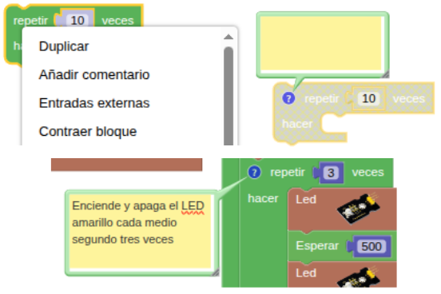
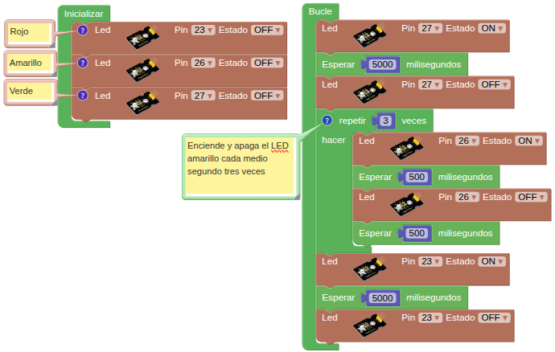

## **1. Semáforo**
### Resumen
El semáforo sirve para regular el paso de peatones y vehículos. En su versión más básica, tiene una luz roja, una amarilla y una verde que indican diferentes instrucciones.

* La luz roja indica Stop: los peatones y los vehículos deben detenerse.
* Amarillo para Precaución: peatones y conductores deben prepararse para detenerse. Si se está circulando, se debe reducir la velocidad.
* Verde para Adelante: peatones y vehículos pueden continuar circulando, pero deben respetar las normas de tráfico.

En este proyecto, vas a programar la ESP32 Coding Box para controlar un semáforo en miniatura. Por ejemplo, puedes configurar la duración de cada luz y el intervalo de tiempo entre ellas.

### Ordinograma

{.center-img} 

### Bloques

==**De Control:**==

*  repite la ejecución un número determinado de veces. Solo tienes que introducir el número de repeticiones que necesites en el cuadro blanco.

==**Comentarios:**==

A veces es conveniente añadir un comentario a un bloque y para hacerlo desplegamos las opciones del bloque pinchando con el botón derecho y añadimos un comentario pinchando en el icono del interrogante

{.center-img100}

### Prueba del código
Puedes crear los bloques manualmente o abrir directamente el archivo de código que te puedes descargar del enlace: [1. Semáforo](../programas/SMB/Proy/P1SMB.abp).

El programa es el siguiente:

{.center-img100}
[1. Semáforo](../programas/SMB/Proy/P1SMB.abp){.enlace-centrado}

### Resultado de la prueba
Conecta Coding Box a STEAMakersBlocks mediante un cable USB, por en marcha "Connector" y haz clic en el botón "Subir" para cargar el código. Verás que el LED verde se enciende durante 5 segundos y luego se apaga. Inmediatamente después, el LED amarillo parpadea tres veces. A continuación, el LED rojo se enciende durante 5 segundos y luego se apaga. Este funcionamiento imita exactamente el de un semáforo y se repetirá indefinidamente.
