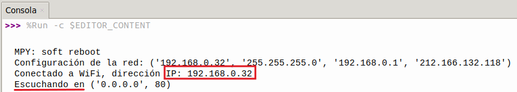
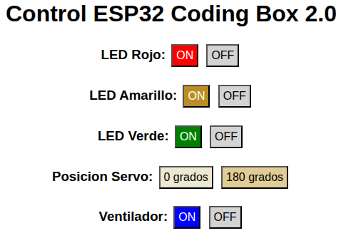
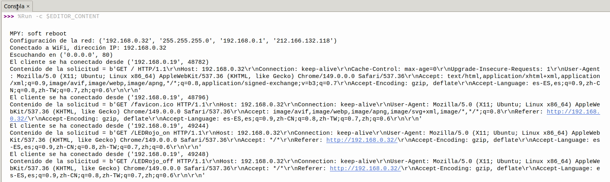

## <FONT COLOR=#007575>**20. Control WiFi**</font>
### <FONT COLOR=#AA0000>Resumen</font>
Control de los LEDs, el servo y el ventilador de forma inalámbrica mediante botones en una página web.

### <FONT COLOR=#AA0000>Prueba del código</font>
Abre Thonny. Conecta la placa al ordenador y selecciona el puerto al que está conectada Coding Box. En "Archivos", abre el programa [P20MP.py](../programas/MP/Proy/P20MP.py) y haz clic en el botón .

El programa es:

```python
'''
 * Archivo         : P20MP
 * Versión Thonny  : Thonny 5.0.0
'''
import network
import socket
import time
import machine
from machine import Pin, PWM
from servo import Servo

# Conexión WiFi 2.4 GHz
SSID = 'nombre de tu WiFi'  # nombre de tu WiFi
PASSWORD = 'contraseña de tu WiFi'  # contraseña de tu WiFi

LEDRojo = Pin(23, Pin.OUT)
LEDAmarillo = Pin(26, Pin.OUT)
LEDVerde = Pin(27, Pin.OUT)

servo = Servo(pin=25)

MA = Pin(18, Pin.OUT)
MB = Pin(17, Pin.OUT)

def connect_wifi(ssid, password):
    # Crea objeto WLAN usando el modo STA (modo cliente)
    wlan = network.WLAN(network.STA_IF)
    wlan.active(True)  # activa la interface WLAN
    wlan.connect(ssid, password)  # Conecta a la red WiFi especificada

    timeout = 10  # Duración del tiempo de espera de conexión en segundos
    '''
    Si la conexión falla y el tiempo de espera aún no ha vencido, comprueba
    de nuevo el estado de la conexión
    '''
    while not wlan.isconnected() and timeout > 0:
        print("Conectando a la red WiFi...")
        time.sleep(1)
        timeout -= 1

    '''
    Si la conexión no se establece tras agotarse el tiempo de espera, se
    lanza una excepción
    '''
    if not wlan.isconnected():
        raise Exception("No es posible conectar a WiFi")
    '''
    Configuración de la red:
    dirección IP, máscara de subred, puerta de enlace y DNS
    '''
    print('Configuración de la red:', wlan.ifconfig())
    # Mostrar la dirección IP de la conexión establecida con éxito
    print('Conectado a WiFi, dirección IP:', wlan.ifconfig()[0])  
    return wlan

# crea página HTML
def web_page():
    html = """<html>
    <head>
        <title>Control ESP32 Coding Box 2.0</title>
        <style>
            body { font-family: Arial, sans-serif; text-align: center; }
            button { padding: 5px 5px; font-size: 16px; margin: 3px; }
        </style>
        <script>
            function sendRequest(action) {
                var xhr = new XMLHttpRequest();
                xhr.open("GET", "/" + action, true);
                xhr.send();
            }
        </script>
    </head>
    <body>
        <h1>Control ESP32 Coding Box 2.0</h1>
        <h3>LED Rojo:
        <button style="background-color: red; color: white;" onclick="sendRequest('LEDRojo_on')">ON</button>
        <button style="background-color: #D3D3D3; color: black;" onclick="sendRequest('LEDRojo_off')">OFF</button><br></h3>
        
        <h3>LED Amarillo:
        <button style="background-color: #BA8E23; color: white;" onclick="sendRequest('LEDAmarillo_on')">ON</button>
        <button style="background-color: #D3D3D3; color: black;" onclick="sendRequest('LEDAmarillo_off')">OFF</button><br></h3>
        
        <h3>LED Verde:
        <button style="background-color: #008000; color: white;" onclick="sendRequest('LEDVerde_on')">ON</button>
        <button style="background-color: #D3D3D3; color: black;" onclick="sendRequest('LEDVerde_off')">OFF</button><br></h3>
        
        <h3>Posicion Servo:
        <button style="background-color: #EDE8D0; color: black;" onclick="sendRequest('servo_left')">0 grados</button>
        <button style="background-color: #E0CD95; color: black;" onclick="sendRequest('servo_right')">180 grados</button><br></h3>
        
        <h3>Ventilador:
        <button style="background-color: #0000FF; color: white;" onclick="sendRequest('fan_on')">ON</button>
        <button style="background-color: #D3D3D3; color: black;" onclick="sendRequest('fan_off')">OFF</button></h3>
    </body>
    </html>"""
    return html

# Control
def handle_request(request):
    if 'LEDRojo_on' in request:
        LEDRojo.value(1)
    elif 'LEDRojo_off' in request:
        LEDRojo.value(0)
    elif 'LEDAmarillo_on' in request:
        LEDAmarillo.value(1)
    elif 'LEDAmarillo_off' in request:
        LEDAmarillo.value(0)
    elif 'LEDVerde_on' in request:
        LEDVerde.value(1)
    elif 'LEDVerde_off' in request:
        LEDVerde.value(0)
    elif 'servo_left' in request:
        servo.set_angle(0)  
    elif 'servo_right' in request:
        servo.set_angle(180)  
    elif 'fan_on' in request:
        MA.value(1)
        MB.value(0)
    elif 'fan_off' in request:
        MA.value(0)
        MB.value(0)

# Iniciar servidor web
def start_server():
    wlan = connect_wifi(SSID, PASSWORD)
    addr = socket.getaddrinfo('0.0.0.0', 80)[0][-1]
    s = socket.socket()
    s.bind(addr)
    s.listen(5)
    print('Escuchando en', addr)

    while True:
        cl, addr = s.accept()
        print('El cliente se ha conectado desde', addr)
        request = cl.recv(1024)
        request = str(request)
        print('Contenido de la solicitud = %s' % request)
        
        handle_request(request)
        
        response = web_page()
        cl.send('HTTP/1.1 200 OK\n')
        cl.send('Content-Type: text/html\n')
        cl.send('Connection: close\n\n')
        cl.sendall(response)
        cl.close()

# Ejecutar el servidor
try:
    start_server()  # Intenta iniciar el servidor web
except Exception as e:
    # Si el inicio falla, aparece un mensaje de error
    print('No se ha podido iniciar el servidor:', e)  
    machine.reset()  # Reinicia el dispositivo para intentar volver a conectarte
```

### <FONT COLOR=#AA0000>Resultado de la prueba</font>
Haz clic en "Ejecutar script actual"  para ejecutar el código. Tras cargar el código, y una vez conectado a la red WiFi, verás una dirección IP. Ahora conecta tu dispositivo de control (teléfono móvil, tablet u ordenador) a la misma red WiFi y escribe la dirección IP en el navegador para ver los botones de control en la página web.

Si utilizas el punto de acceso de tu móvil, puedes acceder directamente a la dirección IP desde el propio móvil.

El primer paso es ejecutar el programa para obtener la IP:

{.center-img100}

Teclea la IP anterior es un navegador y verás la siguiente web:

{.center-img}

Prueba la funcionalidad de todos los botones para comprobar que todo está correcto. También puedes ver como la Consola refleja las peticiones y las respuestas.

{.center-img100}

Pulsa "Ctrl+C" o haz clic en "Detener/Reiniciar el intérprete"  para detener la ejecución.