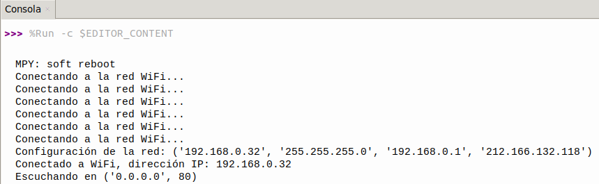
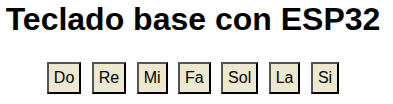

## <FONT COLOR=#007575>**21. Notas musicales por WiFi**</font>
### <FONT COLOR=#AA0000>Resumen</font>
En este proyecto, se han configurado siete botones para controlar el altavoz y que reproduzca los tonos Do, Re, Mi, Fa, Sol, La y Si.

### <FONT COLOR=#AA0000>Prueba del código</font>
Abre Thonny. Conecta la placa al ordenador y selecciona el puerto al que está conectada Coding Box. En "Archivos", abre el programa [P21MP.py](../programas/MP/Proy/P21MP.py) y haz clic en el botón .

El programa es:

```python
'''
 * Archivo         : P21MP
 * Versión Thonny  : Thonny 5.0.0
'''
import network
import socket
import machine
import time

# Conexión WiFi 2.4 GHz
SSID = 'nombre de tu WiFi'  # nombre de tu WiFi
PASSWORD = 'contraseña de tu WiFi'  # contraseña de tu WiFi

def connect_wifi(ssid, password):
    # Crea objeto WLAN usando el modo STA (modo cliente)
    wlan = network.WLAN(network.STA_IF)
    wlan.active(True)  # activa la interface WLAN
    wlan.connect(ssid, password)  # Conecta a la red WiFi especificada

    timeout = 10  # Duración del tiempo de espera de conexión en segundos
    '''
    Si la conexión falla y el tiempo de espera aún no ha vencido, comprueba
    de nuevo el estado de la conexión
    '''
    while not wlan.isconnected() and timeout > 0:
        print("Conectando a la red WiFi...")
        time.sleep(1)
        timeout -= 1

    '''
    Si la conexión no se establece tras agotarse el tiempo de espera, se
    lanza una excepción
    '''
    if not wlan.isconnected():
        raise Exception("No es posible conectar a WiFi")
    '''
    Configuración de la red:
    dirección IP, máscara de subred, puerta de enlace y DNS
    '''
    print('Configuración de la red:', wlan.ifconfig())
    # Mostrar la dirección IP de la conexión establecida con éxito
    print('Conectado a WiFi, dirección IP:', wlan.ifconfig()[0])  
    return wlan

# crea página HTML
def web_page():
    html = """<html>
    <head>
        <title>Servidor Web ESP32</title>
        <style>
            body { font-family: Arial, sans-serif; text-align: center; }
            button { padding: 5px 5px; font-size: 16px; margin: 3px; }
        </style>
        <script>
            function playTone(tone) {
                var xhr = new XMLHttpRequest();
                xhr.open("GET", "/play_" + tone, true);
                xhr.send();
            }
        </script>
    </head>
    <body>
        <h1>Teclado base con ESP32</h1>
        <button style="background-color: #EDE8D0; color: black;" onclick="playTone('do')">Do</button>
        <button style="background-color: #EDE8D0; color: black;" onclick="playTone('re')">Re</button>
        <button style="background-color: #EDE8D0; color: black;" onclick="playTone('mi')">Mi</button>
        <button style="background-color: #EDE8D0; color: black;" onclick="playTone('fa')">Fa</button>
        <button style="background-color: #EDE8D0; color: black;" onclick="playTone('sol')">Sol</button>
        <button style="background-color: #EDE8D0; color: black;" onclick="playTone('la')">La</button>
        <button style="background-color: #EDE8D0; color: black;" onclick="playTone('si')">Si</button>
    </body>
    </html>"""
    return html

# Iniciar servidor web
def start_server():
    wlan = connect_wifi(SSID, PASSWORD)
    addr = socket.getaddrinfo('0.0.0.0', 80)[0][-1]
    s = socket.socket()
    s.bind(addr)
    s.listen(5)
    print('Escuchando en', addr) 

    while True:
        cl, addr = s.accept()  
        print('El cliente se ha conectado desde', addr) 
        request = cl.recv(1024) 
        request = str(request)  
        print('Contenido de la solicitud = %s' % request) 
        
        response = web_page() 

        # Comprueba la ruta de la solicitud y reproduce la nota correspondiente
        if '/play_do' in request:
            play_tone('do')
        elif '/play_re' in request:
            play_tone('re')
        elif '/play_mi' in request:
            play_tone('mi')
        elif '/play_fa' in request:
            play_tone('fa')
        elif '/play_sol' in request:
            play_tone('sol')
        elif '/play_la' in request:
            play_tone('la')
        elif '/play_si' in request:
            play_tone('si')

        cl.send('HTTP/1.1 200 OK\n')
        cl.send('Content-Type: text/html\n')
        cl.send('Connection: close\n\n')
        cl.sendall(response)
        cl.close()  # Cierra la conexión cliente

# reproduce tono
def play_tone(tone):
    tones = {
        'do': 261,
        're': 293,
        'mi': 329,
        'fa': 349,
        'sol': 392,
        'la': 440,
        'si': 493
    }
    frequency = tones.get(tone, 0)
    if frequency > 0:
        pwm = machine.PWM(machine.Pin(32))  # Salida PWM pin GPIO32
        pwm.freq(int(frequency))
        pwm.duty(512)  # Establece duty cycle a 50%
        time.sleep_ms(200)  
        pwm.deinit()  # apaga PWM

# Ejecutar el servidor
try:
    start_server()  # Intenta iniciar el servidor web
except Exception as e:
    # Si el inicio falla, aparece un mensaje de error
    print('No se ha podido iniciar el servidor:', e)  
    machine.reset()  # Reinicia el dispositivo para intentar volver a conectarte
```

### <FONT COLOR=#AA0000>Resultado de la prueba</font>
Haz clic en "Ejecutar script actual"  para ejecutar el código. Tras cargar el código, y una vez conectado a la red WiFi, verás una dirección IP. Ahora conecta tu dispositivo de control (teléfono móvil, tablet u ordenador) a la misma red WiFi y escribe la dirección IP en el navegador para ver los botones de control en la página web.

Si utilizas el punto de acceso de tu móvil, puedes acceder directamente a la dirección IP desde el propio móvil.

El primer paso es ejecutar el programa para obtener la IP:

{.center-img100}

Teclea la IP anterior es un navegador y verás la siguiente web:

{.center-img}

Prueba la funcionalidad de todos los botones para comprobar que suenan todas las notas de forma correcta.

Pulsa "Ctrl+C" o haz clic en "Detener/Reiniciar el intérprete"  para detener la ejecución.
