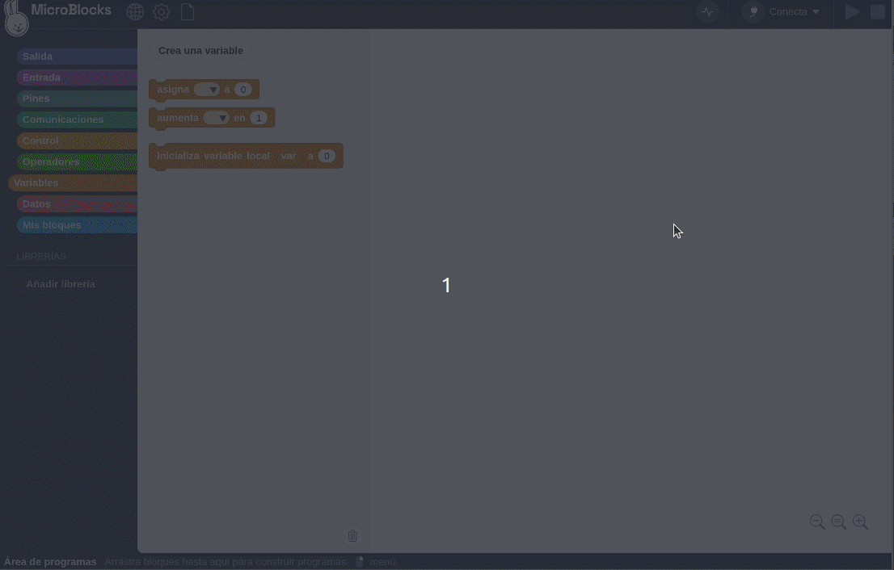
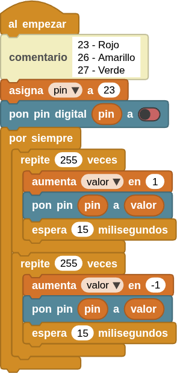

## **2. Efecto breathing usando PWM**
### Resumen
El LED con efecto respiración PWM utiliza un PWM programable integrado para generar una forma de onda analógica. Tras el encendido, el brillo del LED se puede ajustar mediante el ciclo de trabajo de dicha forma de onda, lo que permite crear el mencionado efecto. De este modo, se puede simular la luz ambiental modificando el brillo del LED con el paso del tiempo. Además, el LED con efecto de respiración puede crear un pequeño espectáculo de luces de colores que crea un ambiente tranquilo y acogedor.

En la actividad [14. Servomotor](https://fgcoca.github.io/Guia_Coding_Box_2.0/files/A14MB/#pwm) puedes encontrar la descripción completa del concepto de PWM.

### Variables en MicroBlocks
En MicroBlocks se contemplan dos tipos de variables, las globales y las locales. Cuando hablamos en estos términos hablamos de ámbito (scope) de las variables y determina la zona donde se define la variable, que son global y local.

Las variables locales son las definidas dentro de una función y solamente está disponible para el código que se ejecuta dentro de la función.

Las variables globales se definen en cualquier punto del programa, normalmente al principio, y pueden ser llamadas desde cualquier sitio del programa, incluso desde las funciones.

*  Este bloque es en realidad un botón que crea una nueva variable global. Si existe una variable con el mismo nombre, se creará una nueva con el mismo nombre y el número 2 añadido. Cuando creamos una variable se nos pide el nombre de la misma en una ventana emergente y una vez creada aparecerá un nuevo bloque para acceder al valor de la variable creada. Además esta nueva variable estará disponible para su selección en dos de los bloques que explicaremos después.
*  Este bloque es en realidad un botón que sirve para eliminar una variable previamente creada.

En la animación siguiente vemos el proceso de creación y eliminación de variables.

La opción de desplegar el nombre de las variables mostradas desde el bloque se puede utilizar para añadir variables mientras se edita el código del programa, sin pasar a las opciones de la categoría variables.

*  Este bloque asigna el valor a cualquier variable, global o local, en la cantidad especificada en el área de entrada. La cantidad que se asigna puede ser un número positivo o negativo. Para mostrar los nombres de las variables locales en el menú de selección, este bloque debe estar físicamente unido a la secuencia de bloques en la que se utiliza el bloque 'Inicializar local' que veremos a continuación.
*  Este bloque modifica el valor de cualquier variable, ya sea global o local, en la cantidad especificada en el campo de entrada. La cantidad de modificación puede ser un número positivo o negativo.
*  Este bloque se utiliza para crear e inicializar variables locales. El nombre predeterminado de la variable 'var' puede cambiarse por cualquier otro haciendo clic en el nombre y escribiendo un nuevo nombre en el cuadro de diálogo que se abre. Despés, si es necesario cambiar el valor de la variable local, se puede utilizar el bloque 'asigna valor a' de la categoría variables. En la animación siguiente vemos este proceso y la disponibilidad o no de la variable local.

???+ Note "Una variable global tiene:"
    * **Alcance global:** Una variable global puede utilizarse en cualquier script que no tenga una variable local del mismo nombre que la anule.
    * **Tiempo de vida largo:** Una variable global es creada explícitamente y vive hasta que es explícitamente borrada. Conserva su valor cuando los scripts se inician y detienen e incluso cuando no hay scripts en ejecución. Sin embargo, al hacer clic en el botón "Detener", todas las variables globales se borran e inicializan con el valor cero. Las variables globales también se inicializan a cero cuando se crean por primera vez y cuando se carga un proyecto.

???+ Note "Por el contrario, una variable local tiene:"
    * **Ámbito local:** Una variable local sólo puede utilizarse en el script en el que aparece. Si varios scripts utilizan variables locales con el mismo nombre, esas variables son independientes entre sí. Aunque esta práctica se desaconseja porque puede inducir a errores.
    * **Tiempo de vida limitado:** Una variable local de un script se crea cuando se inicia el script y se elimina cuando éste finaliza. Se crea una nueva variable local cada vez que se inicia un script (incluyendo un script de función), y las variables locales de cada invocación de script son independientes entre sí.
    * **Precedencia sobre las globales:** Si una variable local tiene el mismo nombre que una variable global, la variable local prevalece sobre la global en el script en el que aparece la variable local. Una variable es local en todo el script sin importar en qué parte del script aparezca "inicializar var local a", aunque es una buena práctica de codificación que "inicializar var local a" preceda a cualquier otra referencia a esa variable.

### Bloques

==**De la clase Variables:**==

*  para asignar valores a la variable.
*  para aumentar (o disminuir) la variable en el valor especificado.
*  se utiliza para obtener el valor de la variable con ese nombre.

==**De la clase Pines:**==

*  Genera una señal de modulación por ancho de pulso (PWM) en el pin indicado, con un nivel de potencia entre 0 y 1023. PWM funciona activando y desactivando rápidamente los pines. La potencia se controla modificando el ciclo de trabajo, es decir, el porcentaje de tiempo que los pines están activos en cada ciclo. El valor 0 significa que el pin está desactivado, mientras que el valor 1023 significa potencia máxima (es decir, el pin está activo el 100 % del tiempo). Cuando el valor es 512, el ciclo de trabajo es del 50 %, por lo que el pin está activado la mitad del tiempo y desactivado la otra mitad. PWM se puede utilizar para controlar el brillo de los LEDs o la velocidad de los motores.

### Prueba del código
Puedes crear los bloques manualmente o abrir directamente el archivo de código que te puedes descargar del enlace: [2. Efecto breathing usando PWM](../programas/MB/2_Efecto_breathing_usando_PWM.ubp).

El programa es el siguiente:

  
***[2. Efecto breathing usando PWM](../programas/MB/2_Efecto_breathing_usando_PWM.ubp)***

### Resultado de la prueba
Conecta Coding Box a MicroBlocks mediante USB o Bluetooth y haz clic en el botón "ejecutar" para cargar el código en la misma. El LED establecido se enciende y se apaga gradualmente, y viceversa. "Respira" de manera uniforme.
