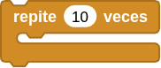
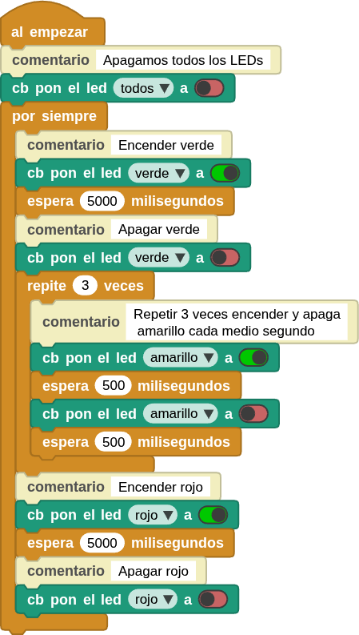

## **2. Efecto breathing usando PWM**
### Resumen
El LED con efecto respiración PWM utiliza un PWM programable integrado para generar una forma de onda analógica. Tras el encendido, el brillo del LED se puede ajustar mediante el ciclo de trabajo de dicha forma de onda, lo que permite crear el mencionado efecto. De este modo, se puede simular la luz ambiental modificando el brillo del LED con el paso del tiempo. Además, el LED con efecto de respiración puede crear un pequeño espectáculo de luces de colores que crea un ambiente tranquilo y acogedor.

En la actividad [14. Servomotor]() puedes encontrar la descripción completa del concepto de PWM.

### Bloques

==**De la clase Control:**==

*  repite la ejecución un número determinado de veces. Solo tienes que introducir el número de repeticiones que necesites en el cuadro blanco.

### Prueba del código
Puedes crear los bloques manualmente o abrir directamente el archivo de código que te puedes descargar del enlace: [1. Semáforo](../programas/MB/1_Semaforo.ubp).

El programa es el siguiente:

  
***[1. Semáforo](../programas/MB/1_Semaforo.ubp)***

### Resultado de la prueba
Conecta Coding Box a MicroBlocks mediante USB o Bluetooth y haz clic en el botón "ejecutar" para cargar el código en la misma. Verás que el LED verde se enciende durante 5 segundos y luego se apaga. Inmediatamente después, el LED amarillo parpadea tres veces. A continuación, el LED rojo se enciende durante 5 segundos y luego se apaga. Este funcionamiento imita exactamente el de un semáforo y se repetirá indefinidamente.
