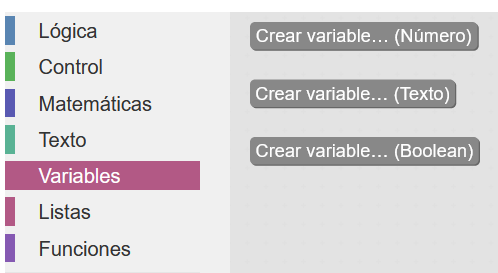
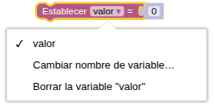
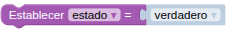
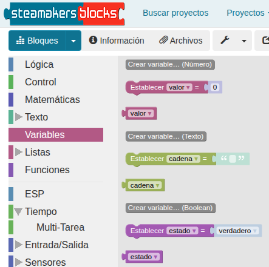
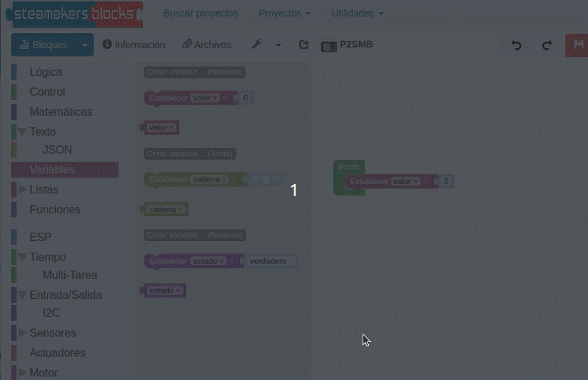
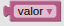
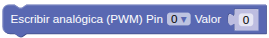
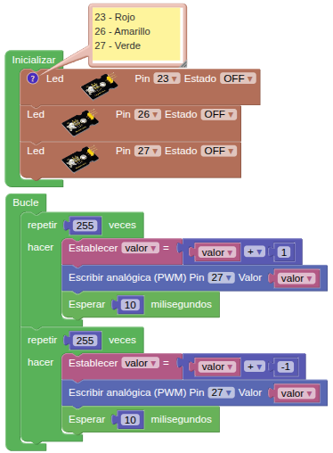

## <FONT COLOR=#007575>**2. Efecto breathing usando PWM**</font>
### <FONT COLOR=#AA0000>Resumen</font>
El LED con efecto respiración PWM utiliza un PWM programable integrado para generar una forma de onda analógica. Tras el encendido, el brillo del LED se puede ajustar mediante el ciclo de trabajo de dicha forma de onda, lo que permite crear el mencionado efecto. De este modo, se puede simular la luz ambiental modificando el brillo del LED con el paso del tiempo. Además, el LED con efecto de respiración puede crear un pequeño espectáculo de luces de colores que crea un ambiente tranquilo y acogedor.

En la actividad [14. Servomotor](https://fgcoca.github.io/Guia_Coding_Box_2.0/files/A14MB/#pwm) puedes encontrar la descripción completa del concepto de PWM.

### <FONT COLOR=#AA0000>Variables</font>
#### <FONT COLOR=#0000FF>Concepto de variable</font>
El concepto de variable en programación consiste simplemente en asignarle un nombre significativo a un espacio de memoria donde almacenar determinada información durante la ejecución normal del programa. El concepto es muy amplio y complejo y en nuestro caso no vamos a entrar en detalles sobre el mismo, pero si indicar que no se debe confundir con el concepto de variable matemática, ya que una expresión como x = x + 1 que es una aberración en matemáticas tiene todo el sentido en programación. Lógicamente en matemáticas no se puede cumplir pero en programación significa que a la variable x se le sume uno y el resultado se vuelva a guardar en la misma variable.

???- Note "Una variable global tiene:"
    * **Alcance global:** Una variable global puede utilizarse en cualquier script que no tenga una variable local del mismo nombre que la anule.
    * **Tiempo de vida largo:** Una variable global es creada explícitamente y vive hasta que es explícitamente borrada. Conserva su valor cuando los scripts se inician y detienen e incluso cuando no hay scripts en ejecución. Sin embargo, al hacer clic en el botón "Detener", todas las variables globales se borran e inicializan con el valor cero. Las variables globales también se inicializan a cero cuando se crean por primera vez y cuando se carga un proyecto.

???- Note "Por el contrario, una variable local tiene:"
    * **Ámbito local:** Una variable local sólo puede utilizarse en el script en el que aparece. Si varios scripts utilizan variables locales con el mismo nombre, esas variables son independientes entre sí. Aunque esta práctica se desaconseja porque puede inducir a errores.
    * **Tiempo de vida limitado:** Una variable local de un script se crea cuando se inicia el script y se elimina cuando éste finaliza. Se crea una nueva variable local cada vez que se inicia un script (incluyendo un script de función), y las variables locales de cada invocación de script son independientes entre sí.
    * **Precedencia sobre las globales:** Si una variable local tiene el mismo nombre que una variable global, la variable local prevalece sobre la global en el script en el que aparece la variable local. Una variable es local en todo el script sin importar en qué parte del script aparezca "inicializar var local a", aunque es una buena práctica de codificación que "inicializar var local a" preceda a cualquier otra referencia a esa variable.

#### <FONT COLOR=#0000FF>En STEAMakersBlocks</font>
En STEAMakersBlocks existen tres tipos de variables: numéricas, booleanas y de texto:

{.center-img}

* **Numéricas**: permiten almacenar números enteros o fraccionarios y son siempre globales de tipo ```double```. Utilizan 4 bytes (32 bits) por lo que en realidad en un tipo ```float``` con un rango de valores de: \(-3.4 \times 10^{38}\) a \(+3.4 \times 10^{38}\).

{.center-img}

* **Texto**: permite almacenar texto. Internamente utiliza el tipo de dato ```String```.

{.center-img33}

* **Booleanas**: permite almacenar valores lógicos booleanos o de dos estados (verdadero/falso, ON/OFF, HIGH/LOW, 1/0, +V/GND).

{.center-img33}

El aspecto de "Variables" tras crear las anteriores es el siguiente:

{.center-img33}

En la animación siguiente podemos ver como crear, eliminar y renombrar una variable.

{.center-img100}  
<div class="center-text"><p><b>Crear, renombrar y eliminar una variable</b></p></div>

### <FONT COLOR=#AA0000>Bloques</font>

==**De Variables:**==

*  para asignar valores a la variable.
*  para obtener el valor de la variable con ese nombre.

==**De Entrada/Salida:**==

*  Genera una señal de modulación por ancho de pulso (PWM) en el pin indicado, con un nivel de potencia entre 0 y 255. PWM funciona activando y desactivando rápidamente los pines. La potencia se controla modificando el ciclo de trabajo, es decir, el porcentaje de tiempo que los pines están activos en cada ciclo. El valor 0 significa que el pin está desactivado, mientras que el valor 255 significa potencia máxima (es decir, el pin está activo el 100 % del tiempo). Cuando el valor es 127, el ciclo de trabajo es del 50 %, por lo que el pin está activado la mitad del tiempo y desactivado la otra mitad. PWM se puede utilizar para controlar el brillo de los LEDs o la velocidad de los motores.

### <FONT COLOR=#AA0000>Prueba del código</font>
Puedes crear los bloques manualmente o abrir directamente el archivo de código que te puedes descargar del enlace: [2. Efecto breathing usando PWM](../programas/SMB/Proy/P2SMB.abp).

El programa es el siguiente:

{.center-img}
[2. Efecto breathing usando PWM](../programas/SMB/Proy/P2SMB.abp){.enlace-centrado}

### <FONT COLOR=#AA0000>Resultado de la prueba</font>
Conecta Coding Box a STEAMakersBlocks mediante un cable USB, por en marcha "Connector" y haz clic en el botón "Subir" para cargar el código. El LED establecido se enciende y se apaga gradualmente, y viceversa. "Respira" de manera uniforme.
