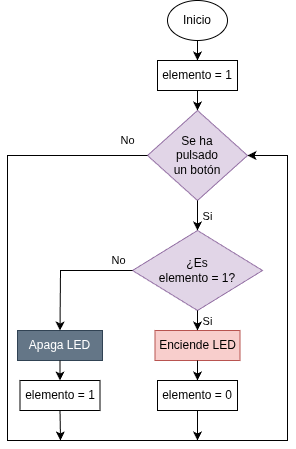
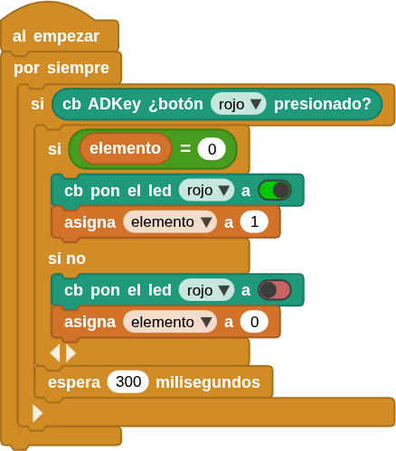

## **3. Control de LED con botón**
### Resumen
En este proyecto, controlamos el encendido y apagado del LED mediante un botón ADKey. El LED se enciende al pulsar el botón y se apaga al volver a pulsarlo.

### Ordinograma

{.center-img} 

### Bloques

==**De la clase Operadores:**==

*  se utiliza para determinar si dos valores son iguales. Si lo son, devuelve verdadero; de lo contrario, devuelve falso.

### Prueba del código
Puedes crear los bloques manualmente o abrir directamente el archivo de código que te puedes descargar del enlace: [3. Control de LED con botón](../programas/MB/3_Control_LED_boton.ubp).

El programa es el siguiente:

  
***[3. Control de LED con botón](../programas/MB/3_Control_LED_boton.ubp)***

### Resultado de la prueba
Conecta Coding Box a MicroBlocks mediante USB o Bluetooth y haz clic en el botón "ejecutar" para cargar el código en la misma. Pulsa el botón rojo y se encenderá el LED rojo; vuelve a pulsarlo y el LED se apagará.

Puedes probar el mismo programa con los botones y LEDs amarillo y verde.

