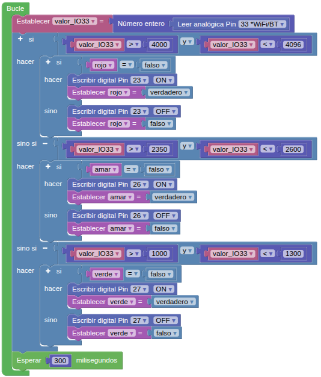

## **3. Control de LEDs con botones**
### Resumen
En este proyecto, controlamos el encendido y apagado del cada LED mediante el botón botón ADKey del mismo color. Cada LED se enciende al pulsar su botón y se apaga al volver a pulsarlo.

### Bloques

==**De Lógica:**==

*  Se utiliza para evaluar una condición booleana.  Devuelve verdadero o falso en función de si la condición indicada se cumple o no.

### Prueba del código
La solución está basada en la actividad [6. Botones ADKey](https://fgcoca.github.io/Guia_Coding_Box_2.0/files/A6SMB/) de STEAMakerBlocks. Puedes crear los bloques manualmente o abrir directamente el archivo de código que te puedes descargar del enlace: [3. Control de LEDs con botones](../programas/SMB/Proy/P3SMB.abp).

El programa es el siguiente:

{.center-img100}
[3. Control de LEDs con botones](../programas/SMB/Proy/P3SMB.abp){.enlace-centrado}

### Resultado de la prueba
Conecta Coding Box a STEAMakersBlocks mediante un cable USB, por en marcha "Connector" y haz clic en el botón "Subir" para cargar el código. Pulsa el botón rojo y se encenderá el LED rojo; vuelve a pulsarlo y el LED se apagará. Prueba lo mismo con los botones y LEDs amarillo y verde.
