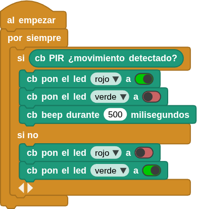

## **4. Alarma antirrobo**
### Resumen
Una alarma antirrobo es un dispositivo que avisa de una intrusión ilegal en una zona protegida. Juega un papel importante en la seguridad. Podemos encontrarla en todas partes: hogares, tiendas, almacenes, supermercados, etc.

En definitiva, protege nuestra seguridad personal y la de nuestros bienes.

### Ordinograma

{.center-img}

### Prueba del código
Puedes crear los bloques manualmente o abrir directamente el archivo de código que te puedes descargar del enlace: [4. Alarma antirrobo](../programas/MB/4_Alarma_antirrobo.ubp).

El programa es el siguiente:

  
***[4. Alarma antirrobo](../programas/MB/4_Alarma_antirrobo.ubp)***

### Resultado de la prueba
Conecta Coding Box a MicroBlocks mediante USB o Bluetooth y haz clic en el botón "ejecutar" para cargar el código en la misma. Cuando el sensor PIR detecta un movimiento en las inmediaciones, el zumbador emite una alarma, el LED rojo se enciende y el verde se apaga. Si no se detecta ninguna intrusión, el LED rojo se apaga, el verde se enciende y el zumbador permanece en silencio.
