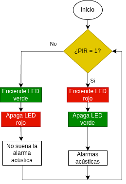
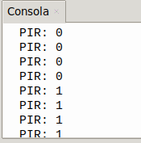

## <FONT COLOR=#007575>**4. Alarma antirrobo**</font>
### <FONT COLOR=#AA0000>Resumen</font>
Una alarma antirrobo es un dispositivo que avisa de una intrusión ilegal en una zona protegida. Juega un papel importante en la seguridad. Podemos encontrarla en todas partes: hogares, tiendas, almacenes, supermercados, etc.

En definitiva, protege nuestra seguridad personal y la de nuestros bienes.

### <FONT COLOR=#AA0000>Ordinograma</font>

{.center-img}

### <FONT COLOR=#AA0000>Prueba del código</font>
Abre Thonny. Conecta la placa al ordenador y selecciona el puerto al que está conectada Coding Box. En "Archivos", abre el programa [P4MP.py](../programas/MP/Proy/P4MP.py) y haz clic en el botón .

El programa es:

```python
'''
 * Archivo         : P4MP
 * Versión Thonny  : Thonny 5.0.0
'''
from machine import Pin,PWM
import time

#Establece el pin, la frecuencia y el ciclo de trabajo del 50% del PWM
altavoz = PWM(Pin(32), freq=5000, duty=128)

LEDrojo = Pin(23,Pin.OUT)
LEDverde = Pin(27,Pin.OUT)
pir = Pin(19,Pin.IN)

while True:
    #lee el valor del sensor PIR y lo asigna a la variable PIR
    PIR = pir.value()
    print("PIR:",PIR)	#imprime en la consola el valor de la variable PIR
    if PIR == 1:		#determina si PIR = 1
        LEDverde.off()	#apaga el verde
        LEDrojo.on()	#enciende rojo
        altavoz.duty(50)	#ciclo de trabajo del altavoz al 50%
        altavoz.freq(880)	#frecuencia del altavoz
    else:
        LEDrojo.off()	#apaga rojo
        LEDverde.on()	#enciende verde
        altavoz.duty(0)	#ciclo de trabajo del altavoz al 0%, detiene el sonido
    time.sleep(0.1)
```

### <FONT COLOR=#AA0000>Resultado de la prueba</font>
Haz clic en "Ejecutar script actual"  para ejecutar el código. Tras cargar el código, cuando el sensor PIR detecta un movimiento en las inmediaciones, el zumbador emite una alarma, el LED rojo se enciende y el verde se apaga. Si no se detecta ninguna intrusión, el LED rojo se apaga, el verde se enciende y el zumbador permanece en silencio.

Pulsa "Ctrl+C" o haz clic en "Detener/Reiniciar el intérprete"  para detener la ejecución.

{.center-img20}
