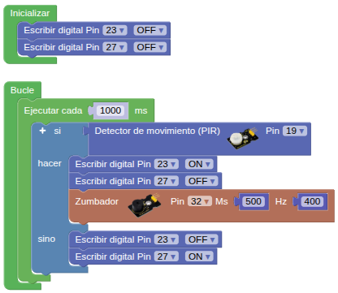

## **4. Alarma antirrobo**
### Resumen
Una alarma antirrobo es un dispositivo que avisa de una intrusión ilegal en una zona protegida. Juega un papel importante en la seguridad. Podemos encontrarla en todas partes: hogares, tiendas, almacenes, supermercados, etc.

En definitiva, protege nuestra seguridad personal y la de nuestros bienes.

### Prueba del código
Puedes crear los bloques manualmente o abrir directamente el archivo de código que te puedes descargar del enlace: [4. Alarma antirrobo](../programas/SMB/Proy/P4SMB.abp).

El programa es el siguiente:

{.center-img75}
[4. Alarma antirrobo](../programas/SMB/Proy/P4SMB.abp){.enlace-centrado}

### Resultado de la prueba
Conecta Coding Box a STEAMakersBlocks mediante un cable USB, por en marcha "Connector" y haz clic en el botón "Subir" para cargar el código. Cuando el sensor PIR detecta un movimiento en las inmediaciones, el zumbador emite una alarma, el LED rojo se enciende y el verde se apaga. Si no se detecta ninguna intrusión, el LED rojo se apaga, el verde se enciende y el zumbador permanece en silencio.
