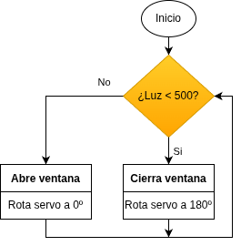
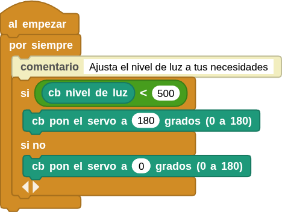

## **5. Cerrar ventana al oscurecer**
### Resumen
En este proyecto, se programa el sistema para que la ventana se cierre automáticamente al anochecer. Para ello, necesitamos una fotorresistencia que detecte la luz ambiental. Establecemos un umbral para la fotorresistencia. Cuando el valor de la luz ambiental es inferior al umbral establecido, el servo cierra la ventana.

### Ordinograma

{.center-img}

### Bloques

==**De la clase Operadores:**==

*  se utiliza para comparar dos valores. Si el primero es mayor que el segundo, devuelve verdadero.
*  se utiliza para comparar dos valores. Si el primero es menor que el segundo, devuelve verdadero.
*  determina si se cumplen las condiciones en ambos lados. Si es así, devuelve "True"; si no se cumple alguna de las condiciones, devuelve "False".

### Prueba del código
Puedes crear los bloques manualmente o abrir directamente el archivo de código que te puedes descargar del enlace: [5. Cerrar ventana al oscurecer](../programas/MB/5_Cerrar_ventana_oscurecer.ubp).

El programa es el siguiente:

  
***[5. Cerrar ventana al oscurecer](../programas/MB/5_Cerrar_ventana_oscurecer.ubp)***

### Resultado de la prueba
Conecta Coding Box a MicroBlocks mediante USB o Bluetooth y haz clic en el botón "ejecutar" para cargar el código en la misma. Tapa la fotorresistencia para que su valor analógico sea inferior a 500 y el servo girará hasta los 180°. Si el valor analógico supera los 500, el servo girará hasta los 0°.
