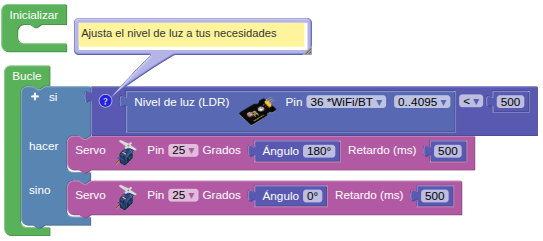

## **5. Cerrar ventana al oscurecer**
### Resumen
En este proyecto, se programa el sistema para que la ventana se cierre automáticamente al anochecer. Para ello, necesitamos una fotorresistencia que detecte la luz ambiental. Establecemos un umbral para la fotorresistencia. Cuando el valor de la luz ambiental es inferior al umbral establecido, el servo cierra la ventana.

### Bloques

==**De Lógica:**==

*  se utiliza para comparar dos valores. Devuelve verdadero o falso según si la condición indicada se cumple entre los dos operandos (numéricos).

### Prueba del código
Puedes crear los bloques manualmente o abrir directamente el archivo de código que te puedes descargar del enlace: [5. Cerrar ventana al oscurecer](../programas/SMB/Proy/P5SMB.abp).

El programa es el siguiente:

{.center-img75}
[5. Cerrar ventana al oscurecer](../programas/SMB/Proy/P5SMB.abp){.enlace-centrado}

### Resultado de la prueba
Conecta Coding Box a STEAMakersBlocks mediante un cable USB, por en marcha "Connector" y haz clic en el botón "Subir" para cargar el código. Tapa la fotorresistencia para que su valor analógico sea inferior a 500 y el servo girará hasta los 180°. Si el valor analógico supera los 500, el servo girará hasta los 0°.
