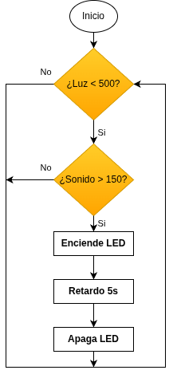

## <FONT COLOR=#007575>**6. Luz controlada por voz**</font>
### <FONT COLOR=#AA0000>Resumen</font>
El dispositivo de control de la luz por voz se compone principalmente de un sensor de sonido, una fotorresistencia y un LED. La fotorresistencia se utiliza para evitar que el LED se encienda durante el día. El sensor de sonido mide el volumen para determinar si se ha superado el umbral establecido. Si es así, el LED se enciende durante unos segundos.

### <FONT COLOR=#AA0000>Ordinograma</font>

{.center-img}

### <FONT COLOR=#AA0000>Prueba del código</font>
Abre Thonny. Conecta la placa al ordenador y selecciona el puerto al que está conectada Coding Box. En "Archivos", abre el programa [P6MP.py](../programas/MP/Proy/P6MP.py) y haz clic en el botón .

El programa es:

```python
'''
 * Archivo         : P6MP
 * Versión Thonny  : Thonny 5.0.0
'''
from machine import Pin,ADC
import time

luminosidad = ADC(Pin(36))  #entrada ADC pin GPIO 36
luminosidad.atten(ADC.ATTN_11DB)	#rango de tensión 0-3.3V
luminosidad.width(ADC.WIDTH_12BIT)	#resolución ADC

sonido = ADC(Pin(34))
sonido.atten(ADC.ATTN_11DB)	#rango de tensión 0-3.3V
sonido.width(ADC.WIDTH_12BIT)	#resolución ADC

led = Pin(23,Pin.OUT)

while True:
    '''
    Lee el valor del sensor de luz y comprueba si es inferior a 500.
    Si no es así, sale del bucle.
    '''
    while luminosidad.read() < 500:
        '''
        Lee el valor del sensor de sonido y comprueba si es superior a 200.
        Si es así, enciende el LED durante 5 s.
        '''
        if sonido.read() > 200:
            led.on()
            time.sleep(5)
            led.off()
```

### <FONT COLOR=#AA0000>Resultado de la prueba</font>
Haz clic en "Ejecutar script actual"  para ejecutar el código. Tras cargar el código, tapa la fotorresistencia para que su valor analógico sea inferior a 500, haz ruido cerca del micrófono y verás que el LED se enciende durante 5 segundos.

Pulsa "Ctrl+C" o haz clic en "Detener/Reiniciar el intérprete"  para detener la ejecución.
