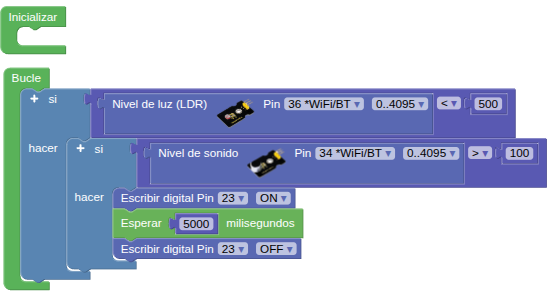

## **6. Luz controlada por voz**
### Resumen
El dispositivo de control de la luz por voz se compone principalmente de un sensor de sonido, una fotorresistencia y un LED. La fotorresistencia se utiliza para evitar que el LED se encienda durante el día. El sensor de sonido mide el volumen para determinar si se ha superado el umbral establecido. Si es así, el LED se enciende durante unos segundos.

### Prueba del código
Puedes crear los bloques manualmente o abrir directamente el archivo de código que te puedes descargar del enlace: [6. Luz controlada por voz](../programas/SMB/Proy/P6SMB.abp).

El programa es el siguiente:

{.center-img75}
[6. Luz controlada por voz](../programas/SMB/Proy/P6SMB.abp){.enlace-centrado}

### Resultado de la prueba
Conecta Coding Box a STEAMakersBlocks mediante un cable USB, por en marcha "Connector" y haz clic en el botón "Subir" para cargar el código. Tapa la fotorresistencia para que su valor analógico sea inferior a 500, haz ruido cerca del micrófono y verás que el LED se enciende durante 5 segundos.
