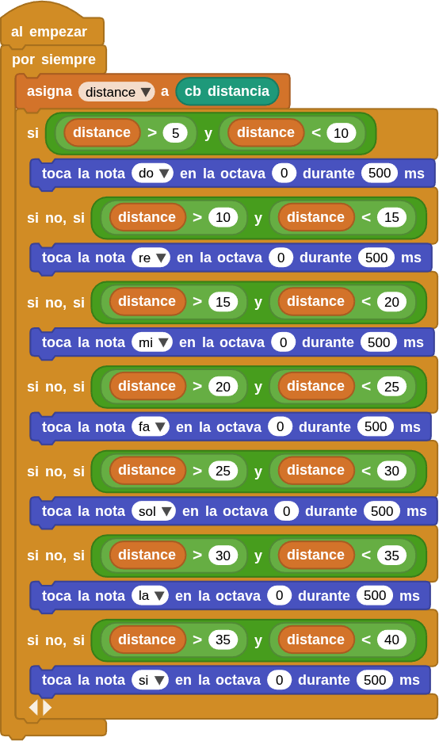

## **7. Notas musicales sin contacto**
### Resumen
Se trata de hacer una suerte de piano analógico con un sensor ultrasónico para detectar la distancia a la que te encuentras. Reproduce diferentes tonos en función de los valores de distancia. Si hay un espacio abierto, puedes colocarlo en el suelo para intentar reproducir música.

### Ordinograma

{.center-img}

* Si la distancia está entre 5 y 10 cm suena la nota Do durante 500ms
* Si la distancia está entre 10 y 15 cm suena la nota Re durante 500ms
* Si la distancia está entre 15 y 20 cm suena la nota Mi durante 500ms
* Si la distancia está entre 20 y 25 cm suena la nota Fa durante 500ms
* Si la distancia está entre 25 y 30 cm suena la nota Sol durante 500ms
* Si la distancia está entre 30 y 35 cm suena la nota La durante 500ms
* Si la distancia está entre 35 y 40 cm suena la nota Si durante 500ms

### Prueba del código
Puedes crear los bloques manualmente o abrir directamente el archivo de código que te puedes descargar del enlace: [7. Notas musicales sin contacto](../programas/MB/7_Notas_musicales_sin_contacto.ubp).

El programa es el siguiente:

  
***[7. Notas musicales sin contacto](../programas/MB/7_Notas_musicales_sin_contacto.ubp)***

### Resultado de la prueba
Conecta Coding Box a MicroBlocks mediante USB o Bluetooth y haz clic en el botón "ejecutar" para cargar el código en la misma. Coloca la mano delante del sensor ultrasónico y el altavoz emitirá un sonido. Puedes controlar el tono moviendo la mano delante del sensor.

Tonos correspondientes a la distancia:

* Do: 5-10cm
* Re: 10-15cm
* Mi: 15-20cm
* Fa: 20-25cm
* Sol: 25-30cm
* La: 30-35cm
* Si: 35-40cm
