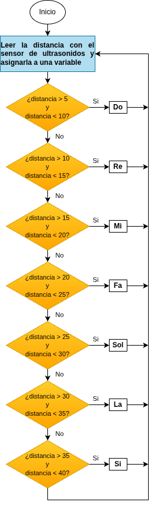

## <FONT COLOR=#007575>**7. Notas musicales sin contacto**</font>
### <FONT COLOR=#AA0000>Resumen</font>
Se trata de hacer una suerte de piano analógico con un sensor ultrasónico para detectar la distancia a la que te encuentras. Reproduce diferentes tonos en función de los valores de distancia. Si hay un espacio abierto, puedes colocarlo en el suelo para intentar reproducir música.

### <FONT COLOR=#AA0000>Ordinograma</font>

{.center-img}

* Si la distancia está entre 5 y 10 cm suena la nota Do durante 500ms
* Si la distancia está entre 10 y 15 cm suena la nota Re durante 500ms
* Si la distancia está entre 15 y 20 cm suena la nota Mi durante 500ms
* Si la distancia está entre 20 y 25 cm suena la nota Fa durante 500ms
* Si la distancia está entre 25 y 30 cm suena la nota Sol durante 500ms
* Si la distancia está entre 30 y 35 cm suena la nota La durante 500ms
* Si la distancia está entre 35 y 40 cm suena la nota Si durante 500ms

### <FONT COLOR=#AA0000>Prueba del código</font>
Abre Thonny. Conecta la placa al ordenador y selecciona el puerto al que está conectada Coding Box. En "Archivos", abre el programa [P7MP.py](../programas/MP/Proy/P7MP.py) y haz clic en el botón .

El programa es:

```python
'''
 * Archivo         : P7MP
 * Versión Thonny  : Thonny 5.0.0
'''

from machine import Pin, PWM
import time

#Establece el pin, la frecuencia y el ciclo de trabajo del 0% del PWM
trompeta = PWM(Pin(32), freq=5000, duty=0)

# define una matriz para almacenar las frecuencias
a = [523, 587, 659, 698, 784, 880, 988]

# establece los pines de control del sensor ultrasónico
Trigger = Pin(5, Pin.OUT)
Echo = Pin(4, Pin.IN)

distancia = 0  # valor inicial de la distancia
VelocidadSonido = 340  # 340 m/s

def obtenerDistancia():
    """
    habilita el sensor de ultrasonidos para detectar la distancia
    retorna la distancia detectada en cm
    """
    # mantiene el Trigger en alto 10 us para habilitar el sensor
    Trigger.value(1)
    time.sleep_us(10)
    Trigger.value(0)
    
    #espera hasta que el pin Echo está em estado alto. Almacena el timepo de inicio
    while Echo.value() == 0:
        Inicio = time.ticks_us()
        
    #espera hasta que el pin Echo está em estado bajo. Almacena el timepo de finalización
    while Echo.value() == 1:
        Paro = time.ticks_us()
    
    # calcula el tiempo que el pin Echo está en estado alto
    Tiempo = time.ticks_diff(Paro, Inicio)
    # calcula la distancia en cm
    ValorDistancia = Tiempo * VelocidadSonido // 2 // 10000 #// = división entera
    return ValorDistancia

def toca_nota(index):
    # Reproduce la escala especificada
    trompeta.duty(40)  #el duty cycle（0-255）del PWM ajusta el volumen del sonido
    trompeta.freq(a[index])  #frecuencia PWM corresponde a la frecuencia del tono
    time.sleep_ms(500)  #reproduce el tono durante 500ms
    trompeta.duty(0)  #detiene el tono 

while True:
    distancia = obtenerDistancia()  #obtener el valor de la distancia
    # reproduce el tono de acurdo con la distancia detectada
    if 5 < distancia < 10:
        print("Do")
        toca_nota(0)
    elif 10 < distancia < 15:
        print("Re")
        toca_nota(1)
    elif 15 < distancia < 20:
        print("Mi")
        toca_nota(2)
    elif 20 < distancia < 25:
        print("Fa")
        toca_nota(3)
    elif 25 < distancia < 30:
        print("So")
        toca_nota(4)
    elif 30 < distancia < 35:
        print("La")
        toca_nota(5)
    elif 35 < distancia < 40:
        print("Si")
        toca_nota(6)
    
    time.sleep_ms(100)  # retardo entre medidas
```

### <FONT COLOR=#AA0000>Resultado de la prueba</font>
Haz clic en "Ejecutar script actual"  para ejecutar el código. Tras cargar el código, coloca la mano delante del sensor ultrasónico y el altavoz emitirá un sonido. Puedes controlar el tono moviendo la mano delante del sensor. En la consola se irá escribiendo el nombre de la nota que suena.

Tonos correspondientes a la distancia:

* Do: 5-10cm
* Re: 10-15cm
* Mi: 15-20cm
* Fa: 20-25cm
* Sol: 25-30cm
* La: 30-35cm
* Si: 35-40cm

Pulsa "Ctrl+C" o haz clic en "Detener/Reiniciar el intérprete"  para detener la ejecución.
