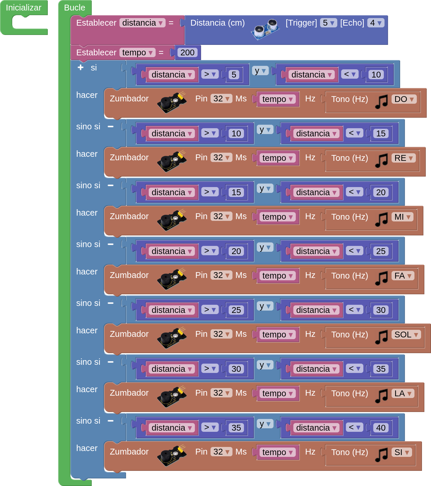

## **7. Notas musicales sin contacto**
### Resumen
Se trata de hacer una suerte de piano analógico con un sensor ultrasónico para detectar la distancia a la que te encuentras. Reproduce diferentes tonos en función de los valores de distancia. Si hay un espacio abierto, puedes colocarlo en el suelo para intentar reproducir música.

### Prueba del código
Puedes crear los bloques manualmente o abrir directamente el archivo de código que te puedes descargar del enlace: [7. Notas musicales sin contacto](../programas/SMB/Proy/P7SMB.abp).

El programa es el siguiente:

{.center-img75}
[7. Notas musicales sin contacto](../programas/SMB/Proy/P7SMB.abp){.enlace-centrado}

### Resultado de la prueba
Conecta Coding Box a STEAMakersBlocks mediante un cable USB, por en marcha "Connector" y haz clic en el botón "Subir" para cargar el código. Coloca la mano delante del sensor ultrasónico y el altavoz emitirá un sonido. Puedes controlar el tono moviendo la mano delante del sensor.

Tonos correspondientes a la distancia:

* Do: 5-10cm
* Re: 10-15cm
* Mi: 15-20cm
* Fa: 20-25cm
* Sol: 25-30cm
* La: 30-35cm
* Si: 35-40cm
