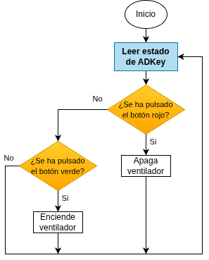

## <FONT COLOR=#007575>**8. Ventilador con botones on/off**</font>
### <FONT COLOR=#AA0000>Resumen</font>
En este experimento se programa el control de encendido y apagado del ventilador mediante botones.

### <FONT COLOR=#AA0000>Ordinograma</font>

{.center-img}

### <FONT COLOR=#AA0000>Prueba del código</font>
Abre Thonny. Conecta la placa al ordenador y selecciona el puerto al que está conectada Coding Box. En "Archivos", abre el programa [P8MP.py](../programas/MP/Proy/P8MP.py) y haz clic en el botón .

El programa es:

```python
'''
 * Archivo         : P8MP
 * Versión Thonny  : Thonny 5.0.0
'''
from machine import Pin,ADC
import time

ADkey = ADC(Pin(33))			#entrada ADC pin GPIO 33
ADkey.atten(ADC.ATTN_11DB)	#rango de tensión 0-3.3V
ADkey.width(ADC.WIDTH_12BIT)	#resolución ADC

#pines de control del motor IO18 e IO17
INB = Pin(18,Pin.OUT)
INA = Pin(17,Pin.OUT)

while True:
    valorBoton = ADkey.read()	#lee el valor analógico del botón pulsado
    #determina si se ha pulsado el rojo y si es cierto el motor se para
    if valorBoton > 3500:
        INB.off()
        INA.off()
    #determina si se ha pulsado el amarillo y si es cierto el motor gira
    elif valorBoton > 2000 and valorBoton < 3000:
        INB.on()
        INA.off()
    time.sleep_ms(300)
```

### <FONT COLOR=#AA0000>Resultado de la prueba</font>
Haz clic en "Ejecutar script actual"  para ejecutar el código. Tras cargar el código, al pulsar el botón amarillo, el ventilador se acciona a máxima velocidad. Al pulsar el botón rojo, el ventilador se apaga.

Pulsa "Ctrl+C" o haz clic en "Detener/Reiniciar el intérprete"  para detener la ejecución.
