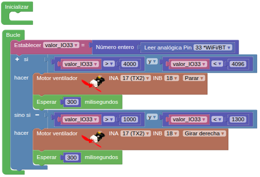

## **8. Ventilador con botones on/off**
### Resumen
En este experimento se programa el control de encendido y apagado del ventilador mediante botones.

### Prueba del código
Puedes crear los bloques manualmente o abrir directamente el archivo de código que te puedes descargar del enlace: [8. Ventilador con botones on/off](../programas/SMB/Proy/P8SMB.abp).

El programa es el siguiente:

{.center-img75}
[8. Ventilador con botones on/off](../programas/SMB/Proy/P8SMB.abp){.enlace-centrado}

### Resultado de la prueba
Conecta Coding Box a STEAMakersBlocks mediante un cable USB, por en marcha "Connector" y haz clic en el botón "Subir" para cargar el código. Al pulsar el botón verde, el ventilador se acciona a máxima velocidad. Al pulsar el botón rojo, el ventilador se apaga.
