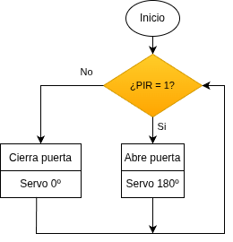

## <FONT COLOR=#007575>**9. Puerta automática**</font>
### <FONT COLOR=#AA0000>Resumen</font>
Muchos centros comerciales, tiendas en general, hospitales, etc., abren sus puertas cuando se acerca alguien y las cierran cuando no detectan a nadie. En este caso, utilizamos un sensor de movimiento PIR para simular este tipo de puerta automática. La puerta se abre cuando se detecta a alguien y se cierra cuando no hay nadie presente.

### <FONT COLOR=#AA0000>Ordinograma</font>

{.center-img}

### <FONT COLOR=#AA0000>Prueba del código</font>
Abre Thonny. Conecta la placa al ordenador y selecciona el puerto al que está conectada Coding Box. En "Archivos", abre el programa [P9MP.py](../programas/MP/Proy/P9MP.py) y haz clic en el botón .

El programa es:

```python
'''
 * Archivo         : P9MP
 * Versión Thonny  : Thonny 5.0.0
'''
from machine import Pin
import time
from servo import Servo

PIR = Pin(19,Pin.IN)
servo = Servo(pin=25)

while True:
    pir = PIR.value()
    if pir == 1:
        servo.set_angle(0)  # servo a 0 grados. Puerta abierta
    else:
        servo.set_angle(180)  # servo a 180 grados. Puerta cerrada
    time.sleep_ms(300)
```

### <FONT COLOR=#AA0000>Resultado de la prueba</font>
Haz clic en "Ejecutar script actual"  para ejecutar el código. Tras cargar el código, pasa la mano por delante del sensor de movimiento PIR y el servo girará hasta los 180 grados (puerta abierta). Al cabo de un tiempo, volverá a los 0 grados (puerta cerrada) si no se detecta nada.

Pulsa "Ctrl+C" o haz clic en "Detener/Reiniciar el intérprete"  para detener la ejecución.
