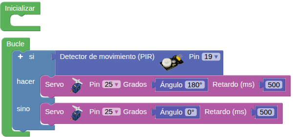

## **9. Puerta automática**
### Resumen
Muchos centros comerciales, tiendas en general, hospitales, etc., abren sus puertas cuando se acerca alguien y las cierran cuando no detectan a nadie. En este caso, utilizamos un sensor de movimiento PIR para simular este tipo de puerta automática. La puerta se abre cuando se detecta a alguien y se cierra cuando no hay nadie presente.

### Prueba del código
Puedes crear los bloques manualmente o abrir directamente el archivo de código que te puedes descargar del enlace: [9. Puerta automática](../programas/SMB/Proy/P9SMB.abp).

El programa es el siguiente:

{.center-img75}
[9. Puerta automática](../programas/SMB/Proy/P9SMB.abp){.enlace-centrado}

### Resultado de la prueba
Conecta Coding Box a STEAMakersBlocks mediante un cable USB, por en marcha "Connector" y haz clic en el botón "Subir" para cargar el código. Pasa la mano por delante del sensor de movimiento PIR y el servo girará hasta los 180 grados (puerta abierta). Al cabo de un tiempo, volverá a los 0 grados (puerta cerrada) si no se detecta nada.
