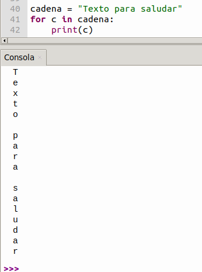

Sección dedicada a dar explicación de código MicroPython utilizado en las actividades y proyectos que se desarrollan.

## <FONT COLOR=#007575>**Importación en MicroPython**</font>
En MicroPython, las librerías son archivos o módulos que contienen funciones preescritas que puedes usar en tu código. Como los microcontroladores tienen memoria limitada, en lugar de cargar todo el sistema, importas solo lo que necesitas mediante la palabra reservada ```import```.

Las formas de importar son:

* **Importar todo el módulo**: Se utiliza ```import``` seguido del nombre. Para acceder a sus funciones, debes usar el prefijo del módulo y un punto.

```python
import machine
pin = machine.Pin(2, machine.Pin.OUT)
```

* **Importar funciones específicas**: Se utiliza ```from ... import ...```. Esto te permite usar la función directamente sin escribir el nombre del módulo cada vez, lo cual ahorra memoria.

```python
from machine import Pin
pin = Pin(2, Pin.OUT)
```

* **Renombrar un módulo**: Usando ```as```, puedes asignar un alias corto. Es muy útil para simplificar nombres largos o mantener estándares.

```python
import time as t
t.sleep(1)
```

Algunas librerías de uso común son:

* **```machine```**: Es la librería fundamental para interactuar con el hardware (pines GPIO, PWM, I2C, SPI).
* **```time```**: Para gestionar pausas (esperas o delays) y temporizadores.
* **```network```**: Para conectar el dispositivo a redes Wi-Fi.

!!! Info ""
    MicroPython utiliza nombres de librerías con el prefijo u (por ejemplo, utime o uos) para indicar que son versiones ultraligeras adaptadas desde la biblioteca estándar de Python.

## <FONT COLOR=#007575>**Control del Sistema y Placa**</font>
Estos comandos gestionan el estado, la frecuencia y la memoria de tu placa ESP32.

&#x1F7E3; <FONT COLOR=#0000FF><b><i>import machine</i></b></font>

Es la instrucción que carga la librería nativa de MicroPython que permite acceder a los componentes físicos de la placa y controlarlos.

&#x1F7E3; <FONT COLOR=#0000FF><b><i>from machine import Pin</i></b></font>

Importa "Pin"" de "machine" para activar sus funciones y dar acceso a pines.

La clase ***machine.Pin*** tiene la siguiente sintaxis:

```python
machine.Pin(id,mode,pull,value)
```

* ```id```: Número de pin GPIO en ESP32. Por ejemplo para habilitar el pin GPIO22 deberás escribir 22.
* ```mode```: El modo de trabajo del pin puede ser ```Pin.IN(0)``` para configurar el pin como entrada; ```Pin.OUT(1)``` para configurar el pin como salida (normal) o ```Pin.OPEN_DRAIN(2)``` que configura el pin como salida de drenador abierto.
* ```pull```: Especifica si el pin está conectado a una resistencia de polarización y solo es válido en modo de entrada y puede ser ```None``` para sin polarización (ni pull-up ni pull-down); ```Pin.PULL_UP(1)``` que habilita la resistencia de pull-up o ```Pin.PULL_DOWN(2)``` que habilita la resistencia de pull-down.
* ```value```: Solo funcionan en los modos ```Pin.OUT``` y ```Pin.OPEN_DRAIN```; asigna el valor inicial del pin de salida. De lo contrario, el estado del pin permanece inalterado. El 0 corresponde al estado lógico bajo (apagado), mientras que el 1 corresponde al estado lógico alto (encendido). ```Pin.on()``` - establece el pin en estado alto y ```Pin.off()``` - establece el pin en estado bajo.

&#x1F7E3; <FONT COLOR=#0000FF><b><i>from machine import Pin, PWM</i></b></font>

Sirve para importar la clase PWM (Modulación por Ancho de Pulso) desde el módulo de hardware de MicroPython. Te permite simular salidas analógicas en pines digitales modificando el ciclo de trabajo de la señal eléctrica.

La clase **machine.PWM** en MicroPython permite generar señales PWM. Transforma un pin digital en una salida capaz de emular voltajes analógicos.

**Parámetros Principales**. Una señal PWM se define por:

* **```machine.PWM(pin)```**: Constructor del objeto PWM: reinicializa el GPIO especificado y lo configura como salida PWM. Siendo ```pin``` el GPIO que debe configurarse como salida PWM.
* **```PWM.freq（valor）```**: Cantidad de ciclos que la señal se repite por segundo, medida en Hertz (Hz). Establece la frecuencia de salida PWM. Siendo ```valor``` la frecuencia de salida PWM. El valor debe ajustarse a la fórmula de cálculo de la frecuencia PWM.
* **```PWM.duty（valor）```**: Porcentaje de tiempo que la señal está en nivel "alto" (3.3V o 5V) dentro de cada ciclo. Establece el ciclo de trabajo. El valor correspondiente se calcula automáticamente a partir de ```valor```, que establece la relación del ciclo de trabajo.
* **```pwm.deinit(pin)```**: Desactiva el PWM en ese pin.

## <FONT COLOR=#007575>**Tiempo**</font>
Para la gestiona de retardos o demoras.

&#x1F7E3; <FONT COLOR=#0000FF><b><i>import time</i></b></font>

El módulo ```time``` de Python permite trabajar con horas, medir tiempos de ejecución y realizar pausas.

* ```time.time()```: Devuelve el tiempo actual en segundos desde el Epoch. Para medir el tiempo de ejecución de un programa, se recomienda usar ```time.perf_counter()```
* ```time.sleep(2)```: Pausa el programa durante 2 segundos.
* ```time.sleep_ms(500)```: Pausa durante 500 milisegundos.
* ```time.sleep_us(100)```: Pausa durante 100 microsegundos.

!!! Info "Epoch"
    Según [Wikipedia](https://es.wikipedia.org/wiki/%C3%89poca_(inform%C3%A1tica)), el ```epoch time``` (tiempo Epoch) o tiempo Unix es un sistema utilizado en informática para medir el tiempo mediante un número entero simple. Representa la cantidad total de segundos transcurridos desde la medianoche del 1 de enero de 1970 (00:00:00 UTC)

&#x1F7E3; <FONT COLOR=#0000FF><b><i>time.sleep(1)</i></b></font>

Retardo de un segundo.

&#x1F7E3; <FONT COLOR=#0000FF><b><i>time.sleep_ms(1)</i></b></font>

Retardo de un milisegundo. El de uso más común.

&#x1F7E3; <FONT COLOR=#0000FF><b><i>time.sleep_us(1)</i></b></font>

Retardo de un microsegundo.

!!! Info "Conversión:"
    1s = 1000 ms, 1 ms = 1000 µs

## <FONT COLOR=#007575>**Entradas y Salidas Digitales (GPIO)**</font>
Controla pines físicos como entradas o salidas para leer sensores o encender LEDs.

* ```pin = machine.Pin(2, machine.Pin.OUT)```: Configura el pin GPIO 2 como salida.
* ```pin = machine.Pin(4, machine.Pin.IN, machine.Pin.PULL_UP)```: Configura el pin GPIO 4 como entrada con resistencia pull-up.
* ```pin.value(1) o pin.on()```: Pone el pin en nivel alto (3.3V).
* ```pin.value(0) o pin.off()```: Pone el pin en nivel bajo (0V).
* ```estado = pin.value()```: Lee el valor digital actual del pin (0 o 1).

&#x1F7E3; <FONT COLOR=#0000FF><b><i>led = Pin23(Pin.OUT)</i></b></font>

Conecta el LED al pin io23 y configura el pin como salida.

!!! Quote "¿Por qué salida?"
    El código está escrito para la placa base. En esta placa, el pin io23 envía niveles de tensión (alto o bajo) al módulo conectado.

&#x1F7E3; <FONT COLOR=#0000FF><b><i>led.on() y led.off()</i></b></font>

En el pin io23 de la placa base, se envía un nivel alto (1) y un nivel bajo (0), respectivamente; es decir, envía un nivel alto (1) o un nivel bajo (0) al módulo LED para encenderlo o apagarlo.

## <FONT COLOR=#007575>**Estructuras de control**</font>
Se dividen en condicionales y bucles, y son esenciales para tomar decisiones y automatizar acciones en microcontroladores.

### <FONT COLOR=#AA0000>Bucle While</font>
El bucle ```while``` en MicroPython es una estructura de control que repite un bloque de código continuamente mientras una condición específica sea verdadera. En microcontroladores (como ESP32), se usa mucho ```while True``` para crear bucles infinitos que mantienen el dispositivo ejecutando tareas en segundo plano.

Sintaxis básica

```python
while condicion:
    # Aquí va el código que se repite mientras la condición sea True
```

&#x1F7E3; <FONT COLOR=#0000FF><b><i>While True:</i></b></font>

Las instrucciones de esta función se ejecutarán en un bucle infinito.

### <FONT COLOR=#AA0000>Bucle for</font>
En MicroPython, el bucle ```for``` se utiliza para repetir un bloque de código a lo largo de una secuencia de elementos o un rango de números. Es ideal para recorrer listas, cadenas de texto o realizar acciones repetitivas.

En su sintaxis básica utiliza la palabra reservada ```for``` acompañada de una variable temporal, seguida de ```in```, el objeto iterable y dos puntos (:). El código a repetir debe ir identado.

```python
for variable in secuencia:
    # Código a ejecutar en cada repetición
```

Los casos más comunes son:

* ***Repetir un número fijo de veces***. Se utiliza la función ```range()```, la cual genera una sucesión de números.

```python
for i in range(10):  # Cuenta del 0 al 9
    print(i)
```

* ***2. Recorrer listas o tuplas***. Itera directamente sobre los elementos de una colección, por ejemplo, los pines de unos LEDs.

```python
pines = [1, 2, 3, 4]
for pin in pines:
    print("Activando pin:", pin)
```

* ***Recorrer cadenas de caracteres***. El bucle recorre el contenido de la cadena elemento por elemento.

```python
cadena = "Texto para saludar"
for c in cadena:
    print(c)
```
{.center-img33}

* ***Modificadores***. Puedes alterar el comportamiento del bucle usando las instrucciones ```break``` (Termina el bucle inmediatamente) o ```continue``` que salta el resto de la iteración actual y pasa a la siguiente.

### <FONT COLOR=#AA0000>Condicional if-else</font>
La estructura if-else en MicroPython permite tomar decisiones en el código. Evalúa una condición y, si es verdadera, ejecuta un bloque de código; si es falsa, ejecuta un bloque alternativo. Se utiliza la indentación (espacios o tabulaciones) para definir qué instrucciones pertenecen a cada bloque.

Palabras clave importantes

* **if**: Evalúa una condición inicial.
* **else**: Ejecuta el código por defecto si la condición del if no se cumple.
* **elif**: (Abreviatura de else if) Permite encadenar múltiples condiciones adicionales si las anteriores fueron falsas.

## <FONT COLOR=#007575>**Entradas Analógicas (ADC)**</font>
Permiten leer señales analógicas, como potenciómetros o sensores de temperatura.

* ```adc = machine.ADC(machine.Pin(34))```: Configura el pin GPIO 34 para leer señales analógicas y convertirlo en valores digitales. En ESP32 prepara el hardware para la Conversión Analógico-Digital (ADC), asigna el pin y realiza la preparación para la lectura creando el objeto ```adc```.
* ```adc.atten(machine.ADC.ATTN_11DB)```: Rango de medición de 0V a ~3.6V (atenuación completa).
* ```valor = adc.read_u16()```: Devuelve el valor leído en 16 bits (0 a 65535).
* ```valor = adc.read()```: Devuelve el valor original de 12 bits (0 a 4095).

&#x1F7E3; <FONT COLOR=#0000FF><b><i>adc = ADC(Pin(34))</i></b></font>

Crea el objeto ```adc``` y establece el pin GPIO 34 como entrada. ```Pin(34)``` asigna un pin; ```ADC(Pin(34))``` significa que el pin GPIO 34 es el pin de entrada del ADC.

&#x1F7E3; <FONT COLOR=#0000FF><b><i>adc.atten(ADC.ATTN_11DB)</i></b></font>

Establece el valor de atenuación del ADC. La atenuación amplía el rango de tensión del ADC. ```ADC.ATTN_11DB``` es un ajuste opcional del ESP32 que amplía el rango de tensión de 0-3,6 V. El ADC del ESP32 admite diferentes ajustes de atenuación:

* ```ADC.ATTN_0DB``` rango de voltaje de entrada de 0 a 1V
* ```ADC.ATTN_2_5DB```：rango de voltaje de entrada de 0 a 1.34V
* ```ADC.ATTN_6DB```：rango de voltaje de entrada de 0 a 2V
* ```ADC.ATTN_11DB```：rango de voltaje de entrada de 0 a 3.3V

El ajuste de la atenuación te ayuda a leer con precisión las señales analógicas en diferentes rangos de tensión.

&#x1F7E3; <FONT COLOR=#0000FF><b><i>adc.width(ADC.WIDTH_12BIT)</i></b></font>

Establece la resolución del ADC en 12 bits. El ADC del ESP32 se puede configurar con diferentes resoluciones:

* ```ADC.WIDTH_9BIT```: resolución de 9 bits
* ```ADC.WIDTH_10BIT```: resolución de 10 bits
* ```ADC.WIDTH_11BIT```: resolución de 11 bits
* ```ADC.WIDTH_12BIT```: resolución de 12 bits

La resolución de 12 bits significa que el ADC puede subdividir la tensión de entrada en $2^{12} = 4096$ niveles, lo que permite obtener mediciones más precisas.

## <FONT COLOR=#007575>**Funciones**</font>
En MicroPython, las funciones son bloques de código reutilizables que realizan tareas específicas. Sirven para estructurar los programas y evitar la repetición de instrucciones, permitiendo pasar variables (argumentos) y obtener resultados. Son fundamentales para mantener un código limpio y eficiente en microcontroladores.

Para trabajar con funciones en MicroPython, se utilizan conceptos y palabras clave del estándar de Python:

* **Definición (```def```)**: Se usa la palabra reservada ```def```, seguida del nombre de la función, paréntesis para los parámetros opcionales y dos puntos (:). El código de la función debe ir identado.
* **Argumentos**: Son los datos de entrada que recibe la función.
* **Retorno (```return```)**: Permite devolver un resultado final después de ejecutar el bloque de código.
* **Llamada o invocación**: Para ejecutar la función, simplemente se escribe su nombre seguido de paréntesis.

Por ejemplo:

```python
# Definición de la función 
def sumar(a,b):
    # Bloque de código
    suma = a + b
    return suma

# Llamada a la función
resultado = sumar(6,8)
print('La suma es:', resultado)
```
que dará como resultado:

```powershell
La suma es: 14
```

### <FONT COLOR=#AA0000>Built-in Functions</font>

Se trata de la categoría de Funciones Integradas del lenguaje principal Python.A diferencia de los comandos, no pertenece a ningún módulo de hardware y no requiere un comando import para poder usarse.

Sus características clave en entorno ESP32 son:

* ```print()```: Envía texto, variables o estados de sensores hacia la consola (STDOUT) para que puedas verlos en tu computadora a través del entorno de desarrollo (como Thonny IDE).

!!! Info "STDOUT"
    En MicroPython, ```stdout``` (Standard Output o Salida Estándar) es el canal predeterminado que utiliza el microcontrolador para enviar mensajes de texto o resultados. Por lo general, este canal está dirigido a la consola o terminal serie (como el REPL) de tu ordenador mediante el puerto USB o UART.

&#x1F7E3; <FONT COLOR=#0000FF><b><i>print("Valor del ADC de sonido:",V_adc)</i></b></font>

Muestra los caracteres entre comillas dobles y el valor de la variable V_adc. Se produce un salto de línea tras la impresión.

&#x1F7E3; <FONT COLOR=#0000FF><b><i>print(valor_PIR, end = " ")</i></b></font>

Imprime ```valor_PIR``` sin saltos de línea. ```end=" "``` significa que no debe haber salto de línea y que debe terminar con un espacio, para mostrar de forma continua los cambios en el estado del sensor en la misma línea.


++++++++++++++++++++++++++++++++++++++++++++++

machine.freq(): Devuelve la frecuencia actual de la CPU.
machine.freq(240000000): Fuerza la CPU a 240 MHz.
machine.reset(): Reinicia la placa por software.
machine.unique_id(): Devuelve el identificador único (MAC) del chip.
machine.idle(): Pone la CPU en estado de bajo consumo hasta la próxima interrupción.


Entradas Analógicas (ADC)
Permite leer señales analógicas, como potenciómetros o sensores de temperatura.
adc = machine.ADC(machine.Pin(34))
adc.atten(machine.ADC.ATTN_11DB): Rango de medición de 0V a ~3.6V (atenuación completa).
valor = adc.read_u16(): Devuelve el valor leído en 16 bits (0 a 65535).
valor = adc.read(): Devuelve el valor original de 12 bits (0 a 4095).


Protocolos de Comunicación (I2C y SPI)
Comunícate con pantallas OLED, giróscopos y otros dispositivos periféricos.
I2C:
i2c = machine.I2C(0, scl=machine.Pin(22), sda=machine.Pin(21), freq=400000)
dispositivos = i2c.scan(): Escanea y devuelve las direcciones I2C conectadas en hexadecimal.i2c.readfrom(dir, bytes) / i2c.writeto(dir, 'dato')

SPI:
spi = machine.SPI(1, baudrate=10000000, polarity=0, phase=0, sck=machine.Pin(18), mosi=machine.Pin(23), miso=machine.Pin(19))
spi.write(buf) / spi.read(nbytes)


Sistema de Archivos 
import os
os.listdir(): Lista los archivos y carpetas en el sistema.
os.remove('archivo.py'): Elimina un archivo.
os.mkdir('carpeta'): Crea una carpeta nueva.


Conectividad (Wi-Fi y Bluetooth)
Activa las interfaces de red inalámbricas de tu ESP32.
Wi-Fi:
import networkw
lan = network.WLAN(network.STA_IF): Crea un objeto de interfaz de red Wi-Fi (modo estación).
wlan.active(True): Enciende el módulo Wi-Fi.
wlan.connect('SSID', 'PASSWORD'): Conecta a una red Wi-Fi.
wlan.isconnected(): Devuelve True si la conexión fue exitosa.
wlan.ifconfig(): Devuelve la configuración IP (IP, máscara, gateway, DNS).

