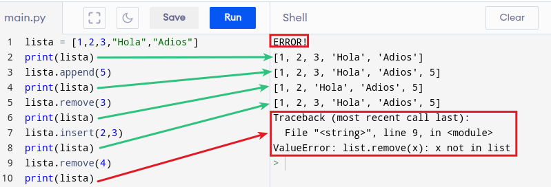
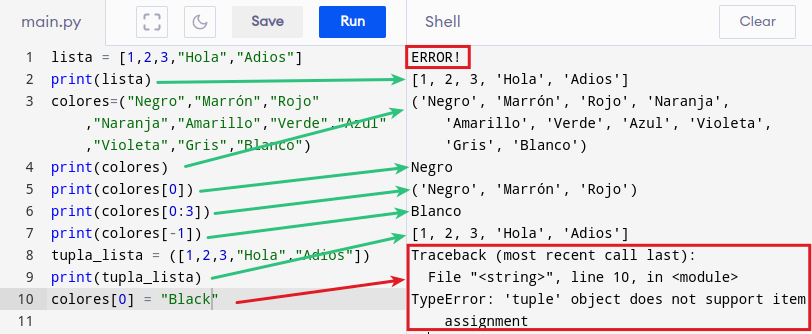
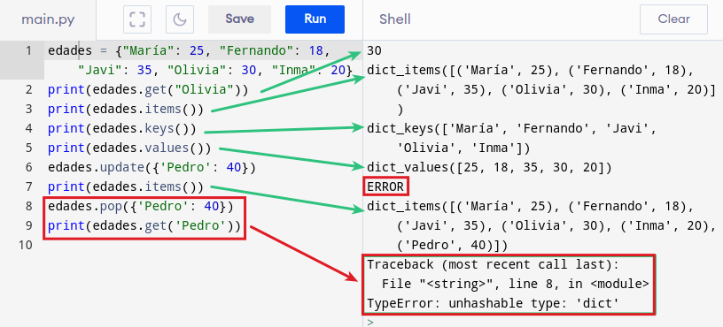

## <FONT COLOR=#007575>**Las listas (list)**</font>
Se trata de un tipo de dato que permite almacenar series de datos de cualquier tipo bajo su estructura. Se suelen asociar a las matrices o arrays de otros lenguajes de programación.

En Python las listas son muy versatiles permitiendo almacenar un conjunto arbitrario de datos. Es decir, podemos guardar en ellas lo que sea.

Una lista se crea con ```[]``` y sus elementos se separan por comas. Una gran ventaja es que pueden tener datos de diferentes tipos.

~~~python
lista = [1, "Hola", 3.141592, [1 , 2, 3], Image.HAPPY]
~~~

Las de principales propiedades de las listas:

* Son ordenadas, mantienen el orden en el que han sido definidas
* Pueden ser formadas por tipos arbitrarios de datos
* Pueden ser indexadas con [i]
* Se pueden anidar, es decir, meter una lista dentro de otra
* Son mutables, ya que sus elementos pueden ser modificados
* Son dinámicas, ya que se pueden añadir o eliminar elementos

Hay dos métodos aplicables:

* **```append```**. Permite agregar elementos a la lista.
* **```remove```**. Elimina elementos de la lista.
* **```insert(pos,elem)```**. Inserta el elemento ```elem``` en la posición ```pos``` indicada.

En el ejemplo vemos el funcionamiento.

{.center-img100}

## <FONT COLOR=#007575>**Las tuplas (tuple)**</font>
Son muy similares a las listas con una diferencia principal con las mismas y es que las tuplas no pueden ser modificadas directamente, lo que implica que no dispone de los métodos vistos para listas. Una tupla permite tener agrupados un número inmutable de elementos.

Una tupla se crea con ```()``` y sus elementos se separan por comas.

~~~python
tupla = (1, 2, 3)
~~~

Principales propiedades:

* Se pueden declarar sin usar los paréntesis, pero no se recomienda. No usarlos puede llevarnos a ambigüedades del tipo print(1, 2, 3) y print((1, 2, 3)).
* Si la tupla tiene un solo elemento esta debe finalizar con coma.
* Se pueden anidar tuplas, por ejemplo ```tupla2 = tupla1, 4, 5, 6, 7```.
* Se pueden declarar tuplas vacias, por ejemplo ```tupla3 = ()```.
* Las tuplas son *iterables* por lo que sus elementos pueden ser accesados mediante la notación de índice del elemento entre corchetes. Si se quiere acceder a un rango de indices se separan por ":" ambos índices.
* Es posible convertir listas en tuplas simplemente poniendo la lista dentro de los paréntesis de la tupla, por ejemplo, ```tupla_lista = ([1, "Hola", 3.141592, [1 , 2, 3], Image.HAPPY])```

A continuación vemos un ejemplo.

{.center-img100}

## <FONT COLOR=#007575>**Diccionarios (dict)**</font>
Estas estructuras contienen la colección de elementos con la forma ```clave:valor``` separados por comas y encerrados entre ```{}```. Las claves son objetos inmutables y los valores pueden ser de cualquier tipo. Sus principales características son:

* En lugar de por índice como en listas y tuplas, en diccionarios se acceder al valor por su clave.
* Permiten eliminar cualquier entrada.
* Al igual que las listas, el diccionario permite modificar los valores.
* El método ```dicc.get()``` accede a un valor por la clave del mismo.
* El método ```dicc.items()``` devuelve una lista de tuplas ```clave:valor```.
* El método ```dicc.keys()``` devuelve una lista de las claves.
* El método ```dicc.values()``` devuelve una lista de los valores.
* El método ```dicc.update()``` añade elemento ```clave:valor``` al diccionario.
* El método ```del dicc``` borra el par ```clave:valor```.
* El método ```dicc.pop()``` borra el par ```clave:valor```.

A continuación vemos un ejemplo.

{.center-img100}
