En esta sección vamos a ver lo ¡Imprescindible para principiantes!.

Si quieres saber mas sobre Microblocks puedes consultar [Entorno de programación Microblocks](https://fgcoca.github.io/Guia_fundamental_ESP32_microSTEAMakers/microSTEAMakers/uB/)

## <FONT COLOR=#007575>**¿Qué es MicroBlocks?**</font>
MicroBlocks es un lenguaje de programación gráfico gratuito similar a Scratch, compatible con numerosas placas educativas basasadas en microcontroladores, como micro:bit, ESP32/ESP8266, Raspberry Pi Pico, etc.

¡Usa MicroBlocks para aprender sobre computación física!

## <FONT COLOR=#007575>**¿Cuáles son sus características?**</font>
**Programación en tiempo real**: MicroBlocks es un entorno de programación en tiempo real. Al hacer clic en un bloque, este se ejecuta inmediatamente en la placa. Prueba los bloques de comandos para ver y trazar los valores de los sensores en tiempo real, sin tener que esperar a que se compile o se descargue el código.

**Funcionamiento autónomo**: MicroBlocks descarga tu código a medida que lo escribes. Una vez programado, se ejecuta de forma independiente (sin conexión). Crea juegos portátiles, aplicaciones de fitness o dispositivos wearables luminosos.

**Tareas paralelas o multitarea**: ¿Quieres controlar un motor mientras se muestra una animación? ¡No hay problema! MicroBlocks te permite escribir scripts independientes para cada tarea y ejecutarlos simultáneamente. La programación paralela se vuelve más sencilla e intuitiva.

**Portabilidad del programa**: Con MicroBlocks, tu placa funciona como una memoria USB. No es necesario guardar archivos: basta con conectarla para volver a cargar el código. ¡Comparte tu placa con tus amigos y podrán explorar tus scripts o añadir nuevas funciones directamente!

Aunque existen otros lenguajes de programación basados en bloques para microcontroladores, lo que realmente distingue a MicroBlocks es su combinación de programación en tiempo real y funcionamiento autónomo. Otros lenguajes solo admiten una de estas características.

## <FONT COLOR=#007575>**¿Cómo funciona MicroBlocks?**</font>
El sistema MicroBlocks consta de tres componentes:

* **Editor de bloques**: se ejecuta en un ordenador durante el desarrollo.
* **Máquina virtual**: ejecuta el código del usuario en el microcontrolador.
* **Sistema de comunicación**: actualiza el código de la placa conforme se editan los scripts.

El editor de bloques permite a los usuarios crear y editar código mientras gestionan las bibliotecas de MicroBlocks para añadir funcionalidades. Algunas bibliotecas admiten sensores o dispositivos, como servos y LEDs direccionables (NeoPixeles), y otras proporcionan API para texto, listas y música. Las propias bibliotecas están escritas en MicroBlocks, por lo que los usuarios pueden explorarlas, modificarlas y ampliarlas.

Se puede **obtener información sobre los sensores a través de la retroalimentación en tiempo real**. La clave para comprender los sensores es observar sus respuestas en directo. Por ejemplo, ¿cómo cambia la aceleración al lanzar un micro:bit? El sistema de comunicación muestra los valores de los sensores y los resultados en pequeños "bocadillos", y permite representar gráficamente los datos en tiempo real. Esta representación convierte las propiedades físicas y eléctricas abstractas en fenómenos intuitivos y observables.

## <FONT COLOR=#007575>**Programación con MicroBlocks**</font>
Existen dos métodos para programar con MicroBlocks.

* ==**En línea en el navegador (recomendado)**==

Haz clic en el enlace: [MicroBlocks](https://microblocks.fun/)

MicroBlocks se puede ejecutar en los navegadores Chromium, Chrome o Edge sin necesidad de instalar ningún software. Haz clic en la imagen 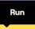, situada en la esquina superior derecha, para empezar a programar.

???+ info "Sobre navegadores"
    Chromium es el motor de código abierto base, Chrome es el navegador de Google (con servicios propios y más consumo de RAM) y Edge es la versión optimizada de Microsoft (con mejor gestión de recursos e IA Copilot). Ambos, Chrome y Edge, utilizan el motor Chromium para renderizar webs.

    !!! note "Otros navegadores"
        MicroBlocks también puede ejecutarse en otros navegadores como Firefox, Opera o Vivaldi, pero solo puede conectarse a la placa principal cuando se ejecuta en los navegadores Chromium, Chrome o Edge en ordenadores de sobremesa, portátiles o Chromebooks. Los dispositivos móviles no están soportados.

<center>

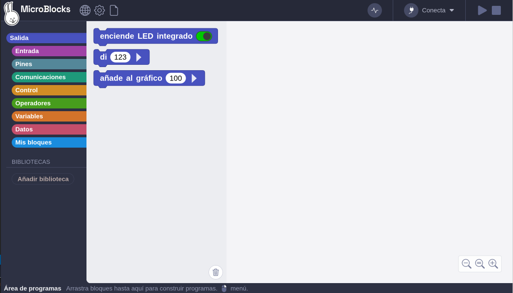

</center>

No se requiere ninguna aplicación ni conocimientos técnicos profesionales para ejecutar MicroBlocks en un navegador.

* ==**Software MicroBlocks**==

Entra en [Get Started - MicroBlocks](https://microblocks.fun/get-started#computer)

Después haz clic en el enlace de [descarga](), selecciona el sistema operativo de tu ordenador. Por ejemplo, elige el sistema "Linux".

<center>

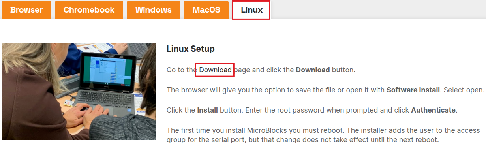

</center>

Haz clic aquí para descargar los MicroBlocks.

<center>

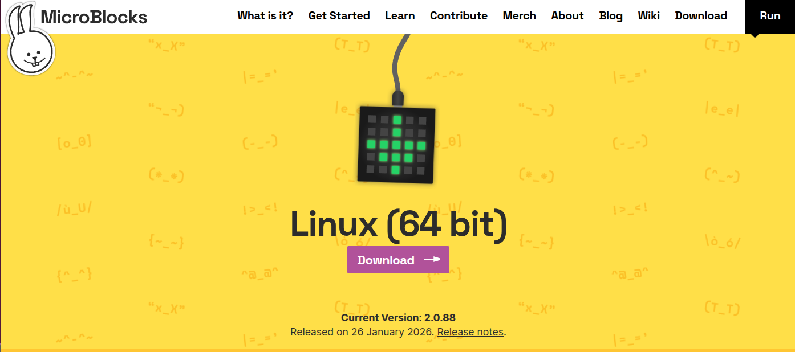

</center>

Se descarga el paquete "ublocks-amd64.deb" que procedemos a instalar desde una terminal con el comando

<center>```sudo dpkg -i ublocks-amd64.deb```</center>

También se puede abrir el archivo anterior con el instalador de software y hacer la instalación desde la ventana del mismo.

???+ Info "Mas opciones"
    En la página de descargas se dan más opciones para otras plataformas, máquinas virtuales precompiladas, versiones previas tanto para descarga como en línea y finalmente las versiones no estables denominadas **Pilot** que están disponibles tanto para descarga como para trabajar en navegador.
    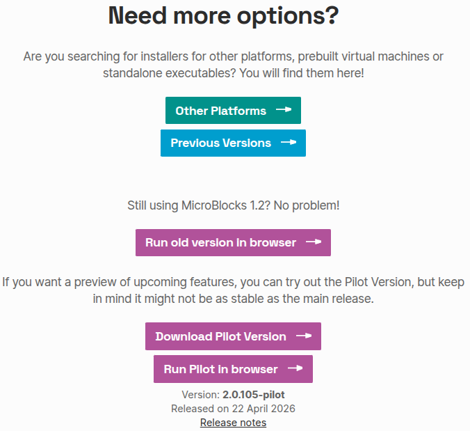{.center-img}

* ==**Opcional: Guardar la aplicación web MicroBlocks**==

Para mayor comodidad, puedes guardar una copia de MicroBlocks como una "*aplicación web progresiva*" que podrás abrir mediante un icono de acceso directo, igual que una aplicación convencional. Una vez guardada, ¡la aplicación web de MicroBlocks funciona incluso sin conexión!

Para guardar la aplicación web de MicroBlocks, abre MicroBlocks en tu navegador y, a continuación, haz clic en el botón de instalación situado en la parte superior derecha de la barra de direcciones del navegador:

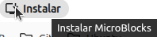{.center-img33}

Esto instalará la aplicación web y abrirá MicroBlocks en una nueva ventana. Además, se añadirá un acceso directo para que puedas abrir la aplicación web más adelante.

## <FONT COLOR=#007575>**Consideraciones para Linux**</font>
La primera vez que instales MicroBlocks, deberás reiniciar el sistema. El instalador añade al usuario al grupo de acceso del puerto serie, pero ese cambio no surtirá efecto hasta el siguiente reinicio.

### <FONT COLOR=#AA0000>Usuarios de Linux</font>
Si utilizas Linux, es posible que tengas que conceder permiso a tu usuario para acceder al puerto serie. Si MicroBlocks no se conecta a tu placa, ejecuta:

```sh
groups
```

para comprobar que perteneces a los grupos "**dialout**" y "**tty**".

Si no perteneces a los grupos "**dialout**" y "**tty**", puedes añadirte manualmente de la siguiente manera:

```powershell
sudo usermod -a -G dialout <your user name>
```

y

```powershell
sudo usermod -a -G tty <your user name>
```

Deberás cerrar sesión y volver a iniciar sesión para que este cambio surta efecto.

Para comprobar que Linux detecta tu placa, asegúrate de que esté conectada y, a continuación, ejecuta:

```powershell
ls /dev | grep ACM
```

Deberías ver una entrada correspondiente a tu placa, normalmente ttyACM0.

En 2022, algunas distribuciones de Linux, como Ubuntu y Mint, empezaron a instalar por defecto un paquete llamado BRLTTY (abreviatura de Braille TTY). Desafortunadamente, este paquete entra en conflicto con las placas de microcontroladores que utilizan el chip USB-serial CP210x, incluidas muchas de las compatibles con MicroBlocks. BRLTTY bloquea estas placas, por lo que no aparece ninguna entrada para ellas en /dev. Este problema se puede resolver eliminando el paquete BRLTTY.

```powershell
sudo apt remove brltty
```

### <FONT COLOR=#AA0000>Chrome BLE Setup</font>
Para utilizar Bluetooth Low Energy (BLE) en el navegador Chromium o Chrome en Linux, es necesario activar una opción de configuración de Chrome, ya que, en el momento de escribir este artículo, Web Bluetooth sigue siendo experimental en la versión de Chrome para Linux. Para ello, escribe:

```dotnetcli
chrome://flags
```

en la barra de direcciones de Chrome. Se abrirá la ventana:

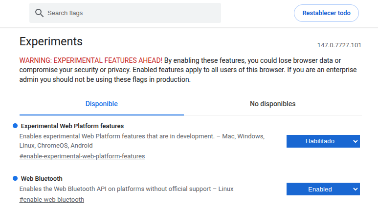{.center-img100}

A continuación, busca y activa:

Experimental Web Platform features

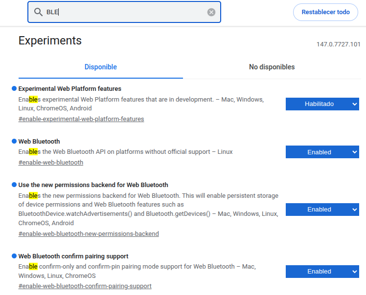{.center-img100}

## <FONT COLOR=#007575>**¿Por qué usar MicroBlocks?**</font>
**MicroBlocks** tiene una característica que lo distingue de otros lenguajes de programación por bloques y es que la programación real ocurre según se desarrolla el programa, lo que podemos denominar como programación en directo o en vivo y, debido a esto, que implica que el código se descarga según se escribe tenemos la otra característica que le dota de independencia o autonomía, ya que cuando demos el programa por bueno, este ya está grabado como firmware en la placa.

Otra de la características importantes que ofrece **MicroBlocks** es la multitarea o posibilidad de desarrollar funcionalidades que trabajan de forma paralela y separada cada tarea. Por ejemplo, reproducir un sonido mientras se controla un servomotor. Esta forma de trabajo hace que el código sea mas sencillo de escribir y de entender.

Cuando trabajamos con **MicroBlocks** la placa que conectemos se comporta como una tarjeta de memoria. No hay necesidad de leer un archivo de proyecto, simplemente conectamos la placa y el script o programa nos aparecerá en el IDE. Es decir, **MicroBlocks** lee el programa que hay en la placa y lo carga de manera automática.

El funcionamiento de **MicroBlocks** se basa en:

* El editor de bloques o IDE que se puede ejecutar online o de manera local.
* Una máquina virtual que se ejecuta en la placa microcontroladora. Esta máquina virtual es la encargada de ejecutar el programa de usuario y lo hace compilando en código de bytes o instrucciones de bajo nivel muy parecidas al código máquina. Si tenemos habilitados los bloques avanzados podemos ver los bytes generados por el programa, como vemos en la animación siguiente realizada con una placa microSTEAMakers conectada:

<center>

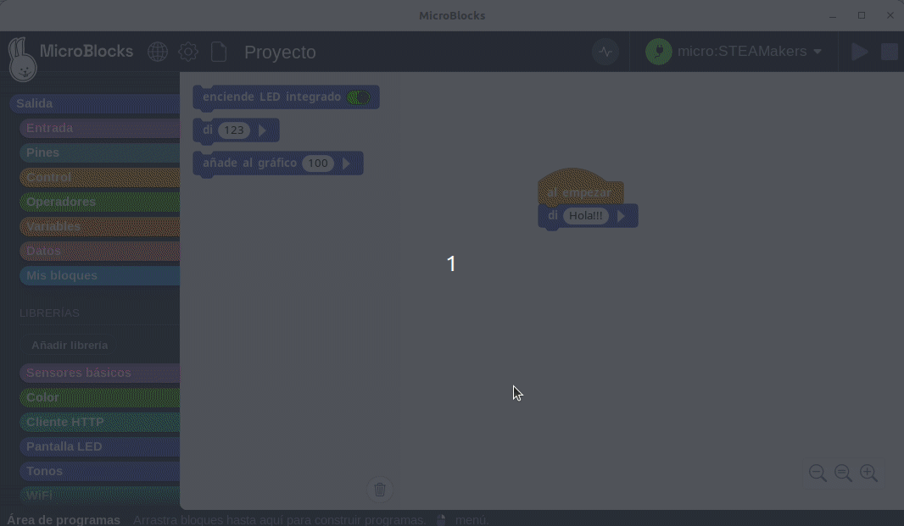  

</center>

La parte que por ahora más nos importa de la información de bytes es la primera línea, que muestra el número de bytes compilados. Los scripts en MicroBlocks no deben superar los 1000 bytes, de ahí la importancia de esta información.

* El sistema de comunicación entre la placa y el host remoto o el ordenador que hace que el firmware se actualice según se escribe el programa. Este sistema es el encargado de enviar los bytes y comandos para iniciar el programa y procesar mensajes del microcontrolador. Así el editor proporciona realimentación gráfica de lo que sucede en el microcontrolador y directamente puede mostrar valores en un "bocadillo de conversación" como el de la figura siguiente.

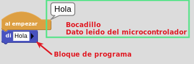{.center-img}

**MicroBlocks** también dispone de una herramienta de representación gráfica que estudiaremos en su momento.

Una funcionalidad importante del editor es que, además de programar por bloques, administra las Librerias, que están escritas en **MicroBlocks**. Las librerias escritas en **MicroBlocks** pueden ser editadas por los usuarios.

## <FONT COLOR=#007575>**Cuatro pilares de MicroBlocks**</font>
Según [Bernat Romagosa](http://romagosa.work/), que es desarrollador de software del [equipo de MicroBlocks](https://microblocks.fun/about), este es un software en vivo capaz de trabajar con varias placas. Bernat también es miembro del Comité de Liderazgo del Proyecto. El lenguaje está desarrollado en torno a cuatro conceptos que consideran esenciales para un lenguaje de programación educativo. Ellos los llaman los cuatro pilares de MicroBlocks:

1. **Vivo**. El primero de estos pilares es que MicroBlocks es un lenguaje de programación "en directo" o "en vivo", lo que significa que puedo arrastrar un bloque a la zona de programa y ver el resultado de cambiarlo en la ejecución en la placa de manera inmediata. Esto significa que no hay que esperar ni ciclos de carga ni compilaciones ni nada de esto. El programa trabaja en tiempo real con la placa.
2. **Multitarea**. El segundo pilar es que se trata de un lenguaje de programación multitares o que trabaja en paralelo, lo que significa que se pueden ejecutar varias tareas al mismo tiempo.
3. **Autónomo**. El tercero de los pilares es que MicroBlocks es un lenguaje autónomo, lo que significa que si, en cualquier momento, desconectamos la micro:bit del ordenador y alimentamos de forma externa el programa se seguirá ejecutando tal y como estaba sin modificaciones y sin tener que presionar ningún botón. No hay que esperar ningún ciclo de carga de firmware.
4. **Portatil**. El cuarto pilar es que se trata de un programa diseñado para que sea portatil por lo que si cambiamos de tipo de placa, esta seguirá ejecutando exactamente el mismo programa. La portabilidad se ha llevado al extremos de que si nos hemos olvidado de guardar nuestro programa en el ordenador, simplemente con conectar la placa este se carga en el IDE o también podemos, con la placa desconectada, escoger la opción de "Recuperar proyecto de la placa" que está en el menú del icono "Fichero". Tengase en cuenta que en este proceso los comentarios se pierden.

El siguiente ejemplo, basado en [Exploring sound with the micro:bit V2 & MicroBlocks, MicroBlocks Team](https://www.youtube.com/watch?v=bJIswaur8Gg) y creado para la placa microSTEAMakers, nos puede servir para ver todo esto. Se trata de crear un programa en el que un corazón lata en la pantalla a un intervalo determinado por una variable. Con el botón A disminuiremos el intervalo y con el botón B lo aumentaremos. El programa se debe ir creando en orden, con una placa conectada y ejectándose la tarea principal, para poder ir viendo los cambios que hagamos como se reflejan en la placa inmediatamente. El programa es:

<center>

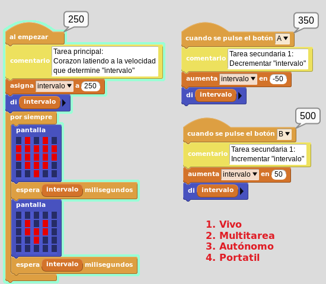  

</center>

## <FONT COLOR=#007575>**Firmware de la placa base**</font>

<FONT COLOR=#FF0000><b>Aquí se muestra cómo grabar el firmware utilizando el navegador, lo que puede servir de referencia para cuando los usuarios utilizan el software MicroBlocks.</b></font>

[MicroBlocks](https://microblocks.fun/run/microblocks.html)

Haz clic en el enlace y ábrelo en el navegador para acceder a la página de programación. Si quieres cambiar el idioma, haz clic aquí  y escoge el que quieras.

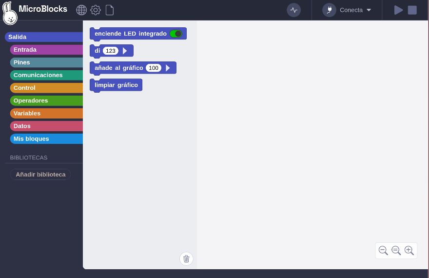{.center-img100}

Con Coding Box conectada a un puerto USB, haz clic aquí  para actualizar el firmware de la placa y selecciona el firmware para Coding Box.

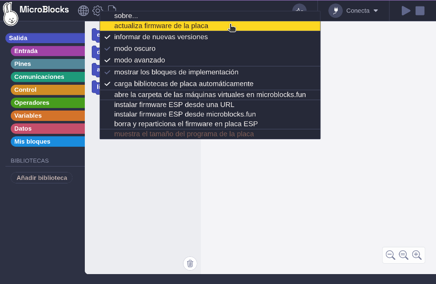{.center-img100}

MicroBlocks dispone de un firmware específico **KidsBits** para Coding Box, así que lo instalamos.

???+ info "Sobre KidsBits y Coding Box"
    La denominación completa del producto en [Keyestudio](https://www.keyestudio.com/products/keyestudio-kidsbits-maker-educational-esp32-coding-box-v20-starter-kit-support-kidsblock-desktop-micropython-programming) es:

    **Kidsbits STEM ESP32 Coding Box V2.0 IOT Starter Kit Support KidsBlock/MicroPython Programming**

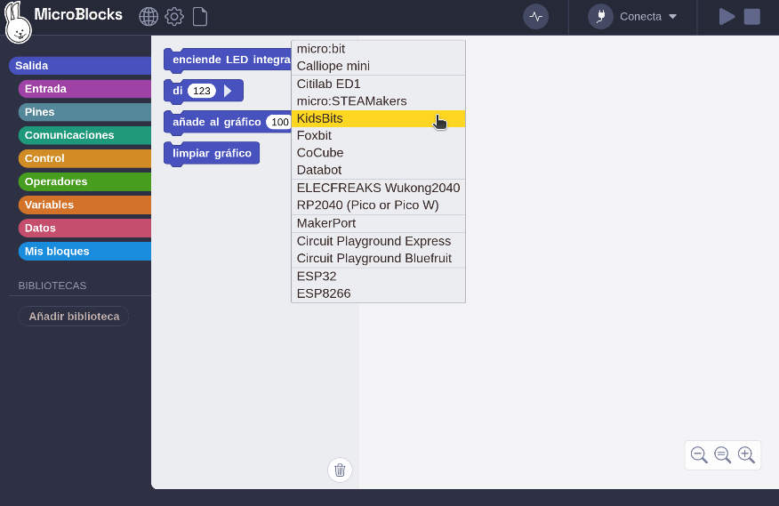{.center-img100}

Selecciona el puerto serie USB y conéctalo. Si tienes alguna otra duda al respecto, vuelve al apartado "**Consideraciones para Linux**".

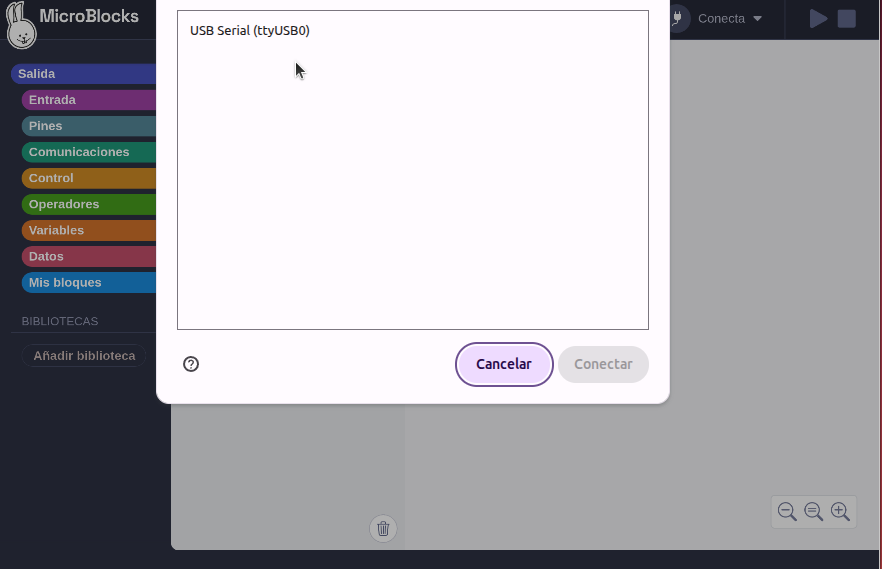{.center-img100}

Cuando el progreso de la carga alcance el 100 %, la carga del firmware habrá finalizado.

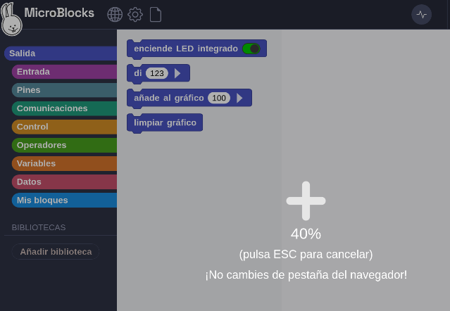{.center-img75}

Haz clic en ***De acuerdo***.

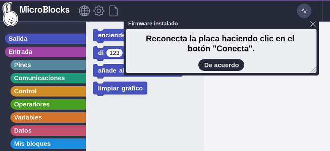{.center-img75}

## <FONT COLOR=#007575>**El IDE de MicroBlocks**</font>
La siguiente imagen muestra la interfaz principal del editor MicroBlocks.

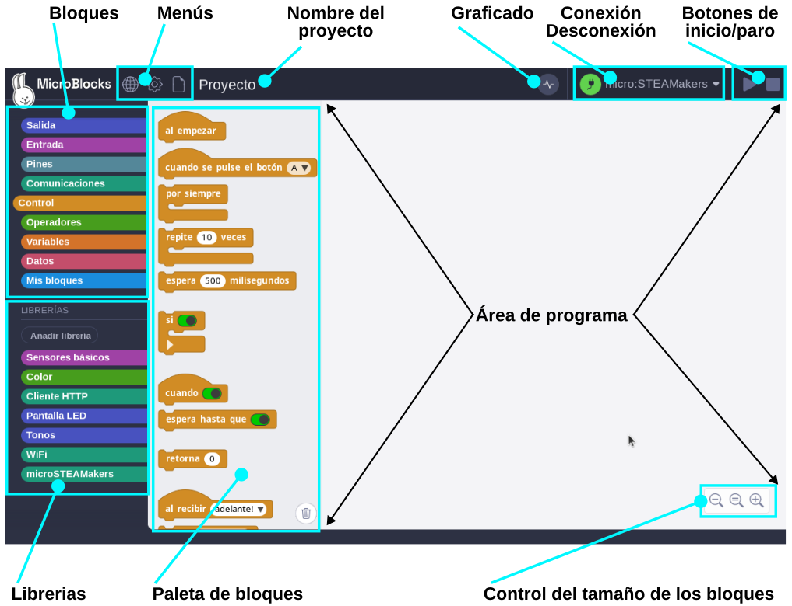{.center-img100}

* **Bloques**. Los bloques están organizados por categorias codificadas por colores. Cuando se selecciona una categoría se despliegan los correspondientes a esa categoria en la zona denominada **paleta de bloques**. En la wiki de MicroBlocks podemos encontrar una referencia completa a los bloques ([Block Reference](https://wiki.microblocks.fun/reference_manual)) con multitud de ejemplos resueltos.

==**Categorías de bloques:**==

Esta sección contiene todas las categorías de bloques que se utilizan para programar con MicroBlocks. Están divididas en nueve grupos con distintos colores. Al seleccionar una categoría, los bloques que contiene aparecerán en una lista a la derecha (como si abrieras un cajón lleno de bloques de construcción).

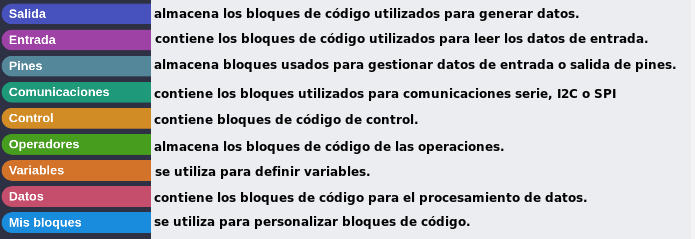{.center-img100}

* **Barra de menús**. Contiene, de izquierda a derecha, el icono en forma de globo terraqueo para configurar el idioma, la rueda dentada para entrar en opciones de MicroBlocks, la hoja de papel que muestra el menú archivo, el gráfico es un menú con opciones de graficar y conectar y el conector USB para el menú conectar.
* **Nombre del proyecto**. Es el nombre del proyecto actual.Botones de inicio/parada. Son dos iconos que sirven para controlar la ejecución de los programas.
* **Librerias**. Aquí se muestran las diversas bibliotecas que se cargan según sea requerido.
* **Área de bloques de programa**. Es donde se crea el programa o script de usuario y las funciones, que en MicroBlocks se conocen como bloques personalizados.
* **Barra de información**. Si vamos moviendo el ratón por los diversos bloques y áreas del IDE en esta barra se muestra el tipo de bloque y una breve información de ayuda sobre los bloques; así como la funcionalidad de las distintas áreas. La información detallada del bloque está disponible a través del menú contextual de cada bloque.
* **Controles tamaño bloques**. Estos tres controles permiten cambiar el tamaño de los bloques aumentando (+) o disminuyendo (-), así como establecerlos en el tamaño predeterminado o del 100% de zoom (=).

## <FONT COLOR=#007575>**Conexión de Coding Box**</font>
Haz clic aquí 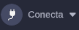 para conectarte por USB o Bluetooth. Una vez establecida la conexión, podemos cargar el código directamente en Coding Box. En este caso, elegimos la conexión por USB.

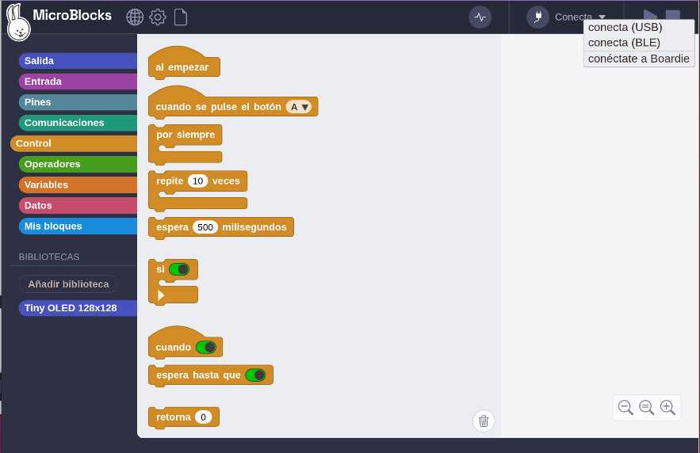{.center-img100}

Conexión USB:

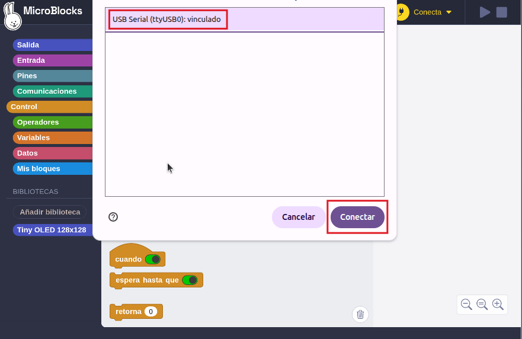{.center-img100}

Conexión Bluetooth:

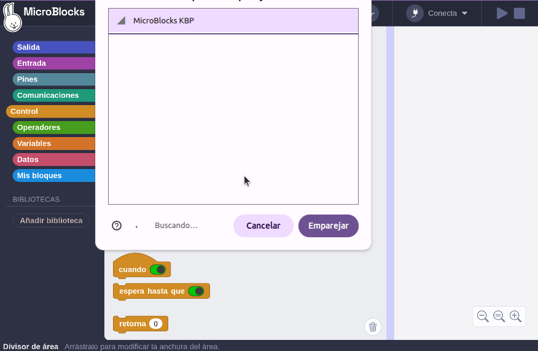{.center-img100}

Una vez conectado, se cargarán los archivos de biblioteca que necesita Coding Box y sus dependencias (o los cargamos nosotros) y se mostrará .

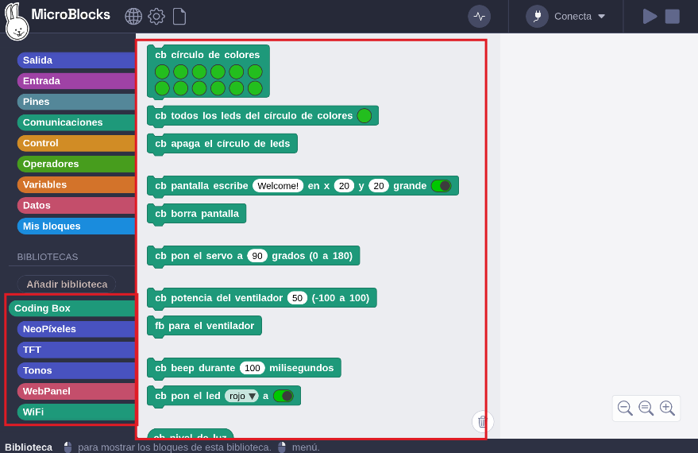{.center-img100}

## <FONT COLOR=#007575>**Subir código**</font>
Una vez conectada Coding Box, carga el código. Podemos crear el código manualmente o abrir un archivo de código proporcionado.

Al cargar el código, dado que el código de MicroBlocks funciona en tiempo real, solo tienes que hacer clic sobre el bloque (incluso en la zona de bloques) para ejecutarlo y así cargarlo en Coding Box. A continuación vemos como encender y apagar el LED rojo.

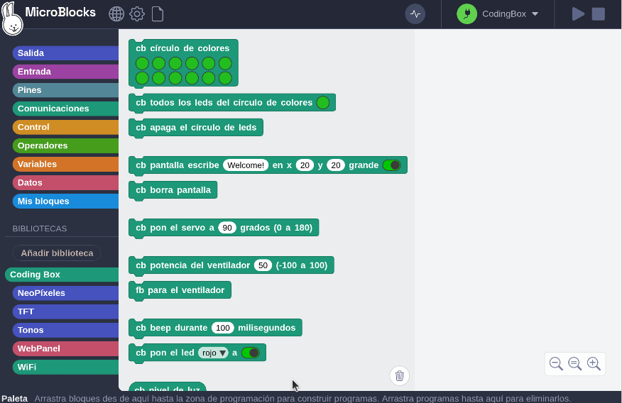{.center-img100}

## <FONT COLOR=#007575>**Cómo abrir**</font>
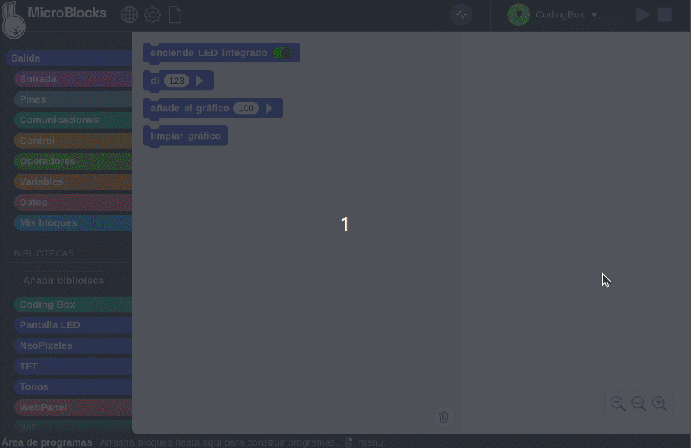{.center-img100}

## <FONT COLOR=#007575>**Cómo subir archivos**</font>
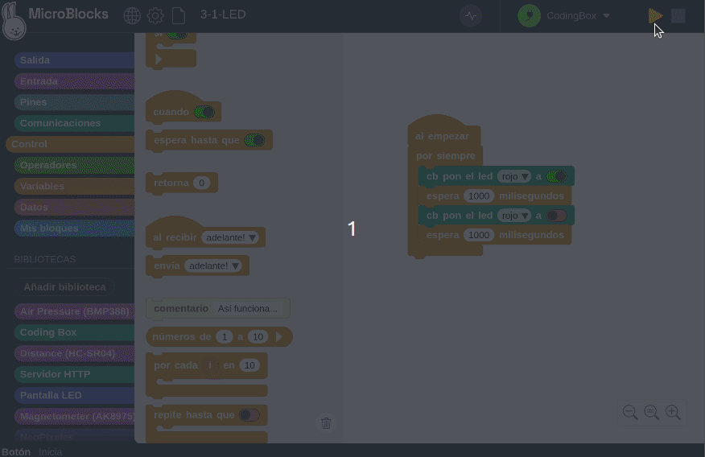{.center-img100}
