**MicroPython** es una versión simplificada del lenguaje Python 3 que incluye solo una pequeña parte de su biblioteca estándar. Tras su optimización, puede ejecutarse en microcontroladores y entornos con restricciones. Estas son las principales características de MicroPython:

- **Compatibilidad**: MicroPython se desarrolla para ser lo más compatible posible con Python estándar (CPython), por lo que, si conoces Python, ya dominas los fundamentos de MicroPython.
- **Acceso al hardware**: además de las bibliotecas principales de Python, MicroPython incluye módulos para acceso a bajo nivel al hardware, lo que proporciona un control directo sobre los recursos de hardware del microcontrolador.
- **Línea de comandos interactiva (REPL)**: MicroPython ofrece una línea de comandos interactiva (REPL) para que los usuarios puedan ejecutar comandos directamente desde un ordenador de sobremesa en una plataforma embebida. Esto resulta muy útil para realizar pruebas y depuración rápidas en tiempo real de sistemas embebidos.

???+ Info "¿Qué significa REPL en Python?"
    **REPL** (por sus siglas en inglés de Read-Eval-Print Loop o Bucle de Lectura-Evaluación-Impresión), también conocido como alto nivel interactivo o consola de lenguaje, es un entorno de programación interactiva basado en un proceso cíclico donde se lee un fragmento de código ingresado por el usuario, se evalúa y se devuelve un resultado al usuario. [Wikipedia](https://es.wikipedia.org/wiki/REPL#:~:text=Un%20bucle%20Lectura%2DEvaluaci%C3%B3n%2DImpresi%C3%B3n,se%20eval%C3%BAa%20y%20se%20devuelve)

- **Compatibilidad con multihilo**: el firmware de MicroPython es compatible con el multihilo, por lo que un único microcontrolador puede gestionar varias tareas integradas simultáneamente, lo que acelera la ejecución.
- **Proyecto de código abierto**: MicroPython es un proyecto de código abierto cuyo código fuente está disponible en GitHub. Se rige por la licencia MIT y su uso es gratuito para fines educativos y comerciales.
- **Amplia compatibilidad**: MicroPython es compatible con una gran variedad de placas de microcontroladores y sistemas operativos en tiempo real (RTOS), como ESP32, ESP8266, STM32, etc. Además, ofrece numerosas bibliotecas y módulos para satisfacer las diferentes necesidades de desarrollo.

## <FONT COLOR=#007575>**Instalación de Thonny**</font>
**Thonny** es un IDE de Python para principiantes que está disponible en el [sitio oficial de Thonny](https://thonny.org/).

Si mueves el ratón a Linux verás las opciones de instalación:

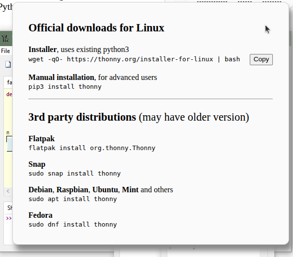{.center-img100}

En mi caso utilizo un instalador manual para Python3:

```powershell
pip3 install thonny
```
Asegurando así que se instala la [versión 5.0.0](https://github.com/thonny/thonny/releases/tag/v5.0.0).

Una vez instalado se puede ejecutar Thonny desde la terminal pero no aparece en las aplicaciones de Ubuntu. Para solucionar esto vamos a proceder a crear un archivo de nombre thonny.desktop, para lo que escribimos en la shell de comandos lo siguiente:

```powershell
sudo nano ~/.local/share/applications/thonny.desktop
```

Se abre el editor *nano* con el archivo vacío. Escribimos las siguientes líneas:

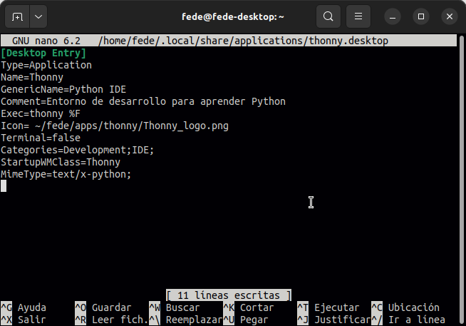{.center-img100}

Si no quieres teclearlas copialas de aquí:

```powershell
[Desktop Entry]
Type=Application
Name=Thonny
GenericName=Python IDE
Comment=Entorno de desarrollo para aprender Python
Exec=thonny %F
Icon= ~/fede/apps/thonny/Thonny_logo.png
Terminal=false
Categories=Development;IDE;
StartupWMClass=Thonny
MimeType=text/x-python;
```

Guarda los cambios con la combinación de teclas CTRL+O y sal del editor *nano* mediante CTRL+X. El acceso directo en aplicaciones se ha creado y ya puedes ejecutar Thonny.

Ya puedes abrir Thonny y se mostrará de la forma siguiente:

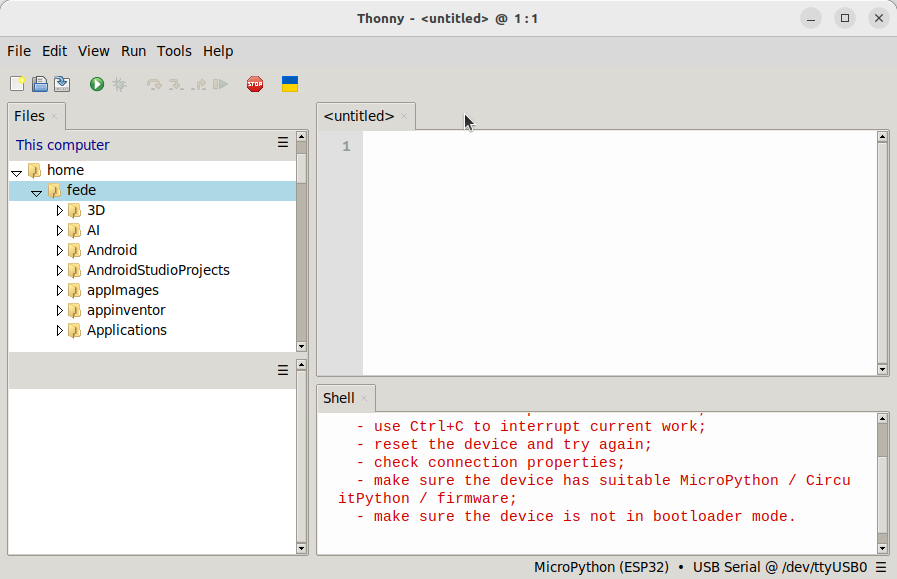{.center-img100}

Puedes configurar el IDE en Español sin mas que dirigirte a "Run $→$ Configure interpreter..." y escoger el idioma en "General $→$ Language":

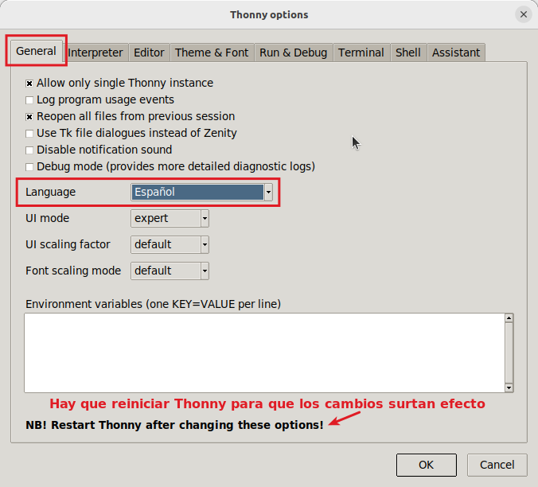{.center-img100}

Una vez reiniciado Thonny el aspecto de su IDE es el siguiente:

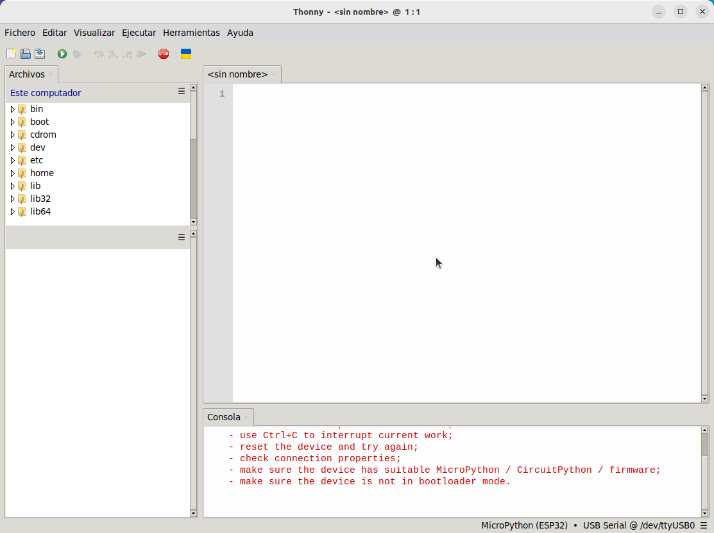{.center-img100}

poner en español y seguir por Burn firmware

## <FONT COLOR=#007575>**Grabar el firmware**</font>
Para que Thonny funcione en el ESP32 de Coding Box es necesario grabar en la misma el firmware de MicroPython. Para ello haz clic para descargar el archivo ZIP del enlace, que incluye los códigos originales de los proyectos para MicroPython y las librerias. Descomprime el archivo para poder utilizarlo directamente.

[Clic para descargar](https://wiki.kidsbits.cc/projects/KD2124/en/latest/_downloads/114ecdcad86f589a3756a2a71c793020/MicroPython.zip) el archivo y salvarlo directamente en tu ordenador.

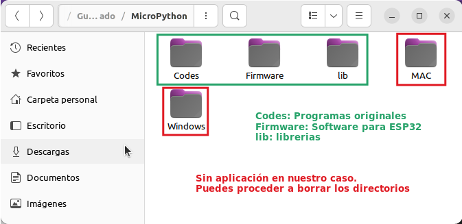{.center-img100}

En [Descarga de programas](https://fgcoca.github.io/Guia_Coding_Box_2.0/files/descargaMP/) puedes encontrar el enlace para descargar solamente lo necesario para trabajar en Linux.

Conecta Coding Box al ordenador y arranca Thonny. Si todo es correcto en la parte inferior derecha aparecerá reconocido el puerto USB, tal y como se observa en la imagen siguiente:

{.center-img33}

Si el puerto USB no se reconoce consulta estas [Consideraciones para Linux](https://fgcoca.github.io/Guia_Coding_Box_2.0/files/guiaMB/#consideraciones-para-linux).

Vamos a proceder a grabar en Coding Box el interprete para MicroPython ESP32 que hemos descargado y tenemos localizado en nuestro ordenador. Para ello dirigirte a "Ejecutar $→$ Configurar interprete...":

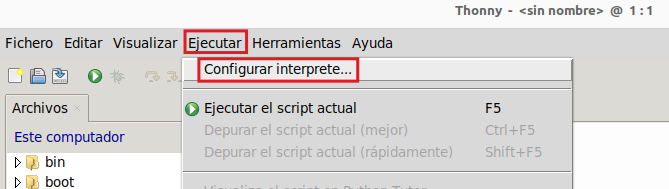{.center-img75}

Se abrirá la ventana de configuración y en la pestaña "Intérprete" tenemos explicado el proceso. Seleccionamos el puerto USB al que está conectada Coding Box, en Linux se refleja como ```/dev/ttyUSB0``` para nuestro caso. Hacemos clic en el enlace señalado:

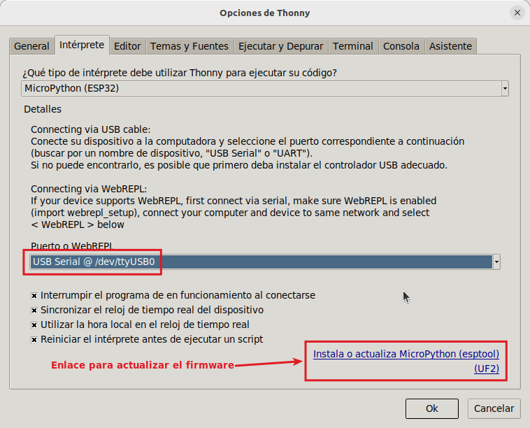{.center-img75}

Se abre la ventana "Install MicroPython (esptool)" en la que seleccionamos el puerto, si no lo está ya, y hacemos clic en el botón para seleccionar una imagen local de MicroPython.

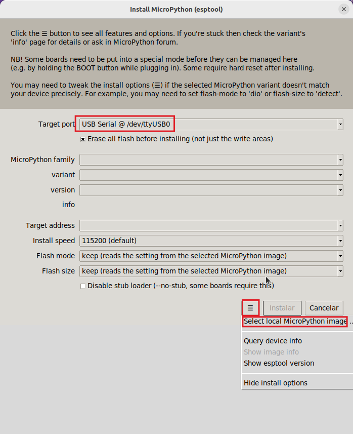{.center-img75}

Se inicia el proceso que tardará un ratito.

* Se procede al borrado de la memoria flash:

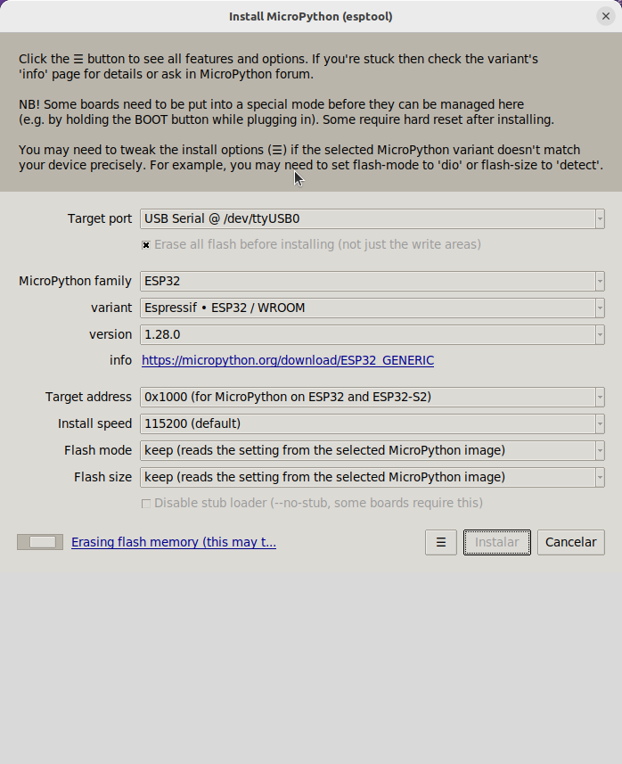{.center-img75}

* Después se inicia la grabación del firmware:

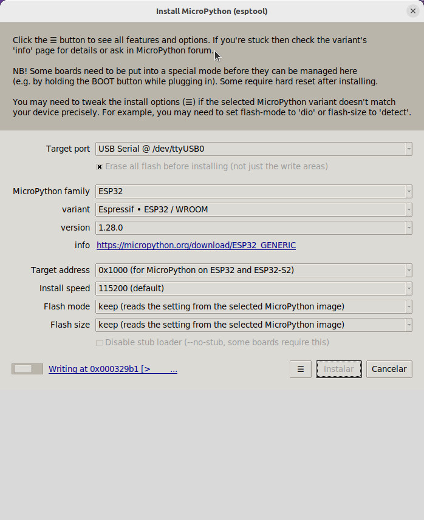{.center-img75}

* Finaliza el proceso:

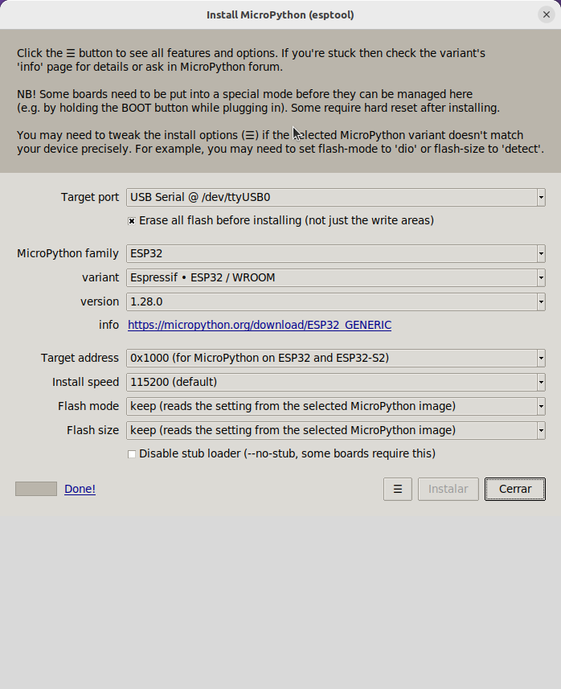{.center-img75}

## <FONT COLOR=#007575>**Primeros pasos con Thonny**</font>


## <FONT COLOR=#007575>**Explicación de código MicroPython**</font>

⇛ <FONT COLOR=#0000FF><b><i>from machine import Pin</i></b></font>

Importa "Pin"" de "machine" para activar sus funciones y dar acceso a pines.

La clase ***machine.Pin*** tiene la siguiente sintaxis:

```python
machine.Pin(id,mode,pull,value)
```

* ```id```: Número de pin GPIO en ESP32. Por ejemplo para habilitar el pin GPIO22 deberás escribir 22.
* ```mode```: El modo de trabajo del pin puede ser ```Pin.IN(0)``` para configurar el pin como entrada; ```Pin.OUT(1)``` para configurar el pin como salida (normal) o ```Pin.OPEN_DRAIN(2)``` que configura el pin como salida de drenador abierto.
* ```pull```: Especifica si el pin está conectado a una resistencia de polarización y solo es válido en modo de entrada y puede ser ```None``` para sin polarización (ni pull-up ni pull-down); ```Pin.PULL_UP(1)``` que habilita la resistencia de pull-up o ```Pin.PULL_DOWN(2)``` que habilita la resistencia de pull-down.
* ```value```: Solo funcionan en los modos ```Pin.OUT``` y ```Pin.OPEN_DRAIN```; asigna el valor inicial del pin de salida. De lo contrario, el estado del pin permanece inalterado. El 0 corresponde al estado lógico bajo (apagado), mientras que el 1 corresponde al estado lógico alto (encendido). ```Pin.on()``` - establece el pin en estado alto y ```Pin.off()``` - establece el pin en estado bajo.

⇛ <FONT COLOR=#0000FF><b><i>import time</i></b></font>

Para poder utilizar funciones relacionadas.

⇛ <FONT COLOR=#0000FF><b><i>led = Pin23(Pin.OUT)</i></b></font>

Conecta el LED al pin io23 y configura el pin como salida.

!!! Quote "¿Por qué salida?"
    El código está escrito para la placa base. En esta placa, el pin io23 envía niveles de tensión (alto o bajo) al módulo conectado.

⇛ <FONT COLOR=#0000FF><b><i>While True:</i></b></font>

Las instrucciones de esta función se ejecutarán en un bucle infinito.

⇛ <FONT COLOR=#0000FF><b><i>led.on() y led.off()</i></b></font>

En el pin io23 de la placa base, se envía un nivel alto (1) y un nivel bajo (0), respectivamente; es decir, envía un nivel alto (1) o un nivel bajo (0) al módulo LED para encenderlo o apagarlo.

⇛ <FONT COLOR=#0000FF><b><i>time.sleep(1)</i></b></font>

Retardo de un segundo.

⇛ <FONT COLOR=#0000FF><b><i>time.sleep_ms(1)</i></b></font>

Retardo de un milisegundo. El de uso más común.

⇛ <FONT COLOR=#0000FF><b><i>time.sleep_us(1)</i></b></font>

Retardo de un microsegundo.

<center>Conversión: 1s = 1000 ms, 1 ms = 1000 µs</center>

