**STEAMakersBlocks** dispone de infinidad de recursos de documentación sobre la utilización del IDE y las placas soportadas por la plataforma.

* [Acceso a la web de recursos](https://www.steamakersblocks.com/web/site/doc#)

El manejo de la plataforma es sencillo y está todo explicado en:

* [Libro sobre el manejo de STEAMakersBlocks](https://docs.google.com/document/u/1/d/e/2PACX-1vQSrOKHpbLQHVbGFdAvp7DcndoftoHDI20nvwGMaxu_7bGc1bUCmi4U6DZrJWRSudc2iXBg43QMuzCT/pub)

## **Programando con STEAMakersBlocks**
Para poder conectar y programar las placas con STEAMakersBlocks, es necesario instalar [Connector](https://www.steamakersblocks.com/web/site/abconnector) para permitir la comunicación entre el entorno STEAMakersBlocks y la placa electrónica.

En [Recursos](https://www.steamakersblocks.com/web/site/doc#) de [STEAMakersBlocks](https://www.steamakersblocks.com/) tenemos todas las opciones de descarga y condiciones de instalación de [Connector](https://www.steamakersblocks.com/web/site/abconnector) para los sistemas operativos soportados. Para el caso de Ubuntu nos indica:

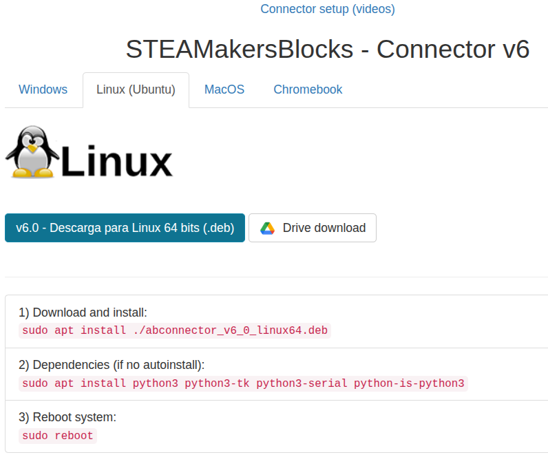{.center-img75}

Una vez instalado lo podemos encontrar entre las aplicaciones:

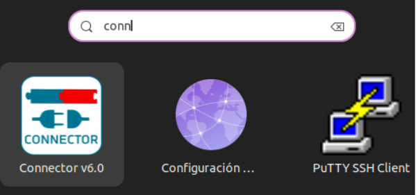{.center-img75}

Al abrir Connector, aparece este cuadro de diálogo que va mostrando información sobre la placa y STEAMakersBlocks:

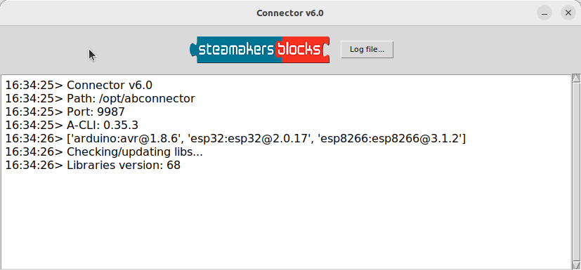{.center-img75}

Dejamos Connector en ejecución minimizado en segundo plano.
!!! Info "IMPORTANTE:"
    !!! Example ""
    Las imágenes pueden no corresponderse con la plataforma STEAMakersBlocks porque fueron capturadas cuando se llamaba ArduinoBlocks, pero básicamente el cambio estará en el logotipo.

El procedimiento de creación de programas es el siguiente:

<b>1.</b> En **STEAMakersBlocks**, crea una cuenta pulsando en “Iniciar sesión” y, posteriormente, en “nuevo usuario”:

{.center-img75}

!!! Success "Nuevas formas de acceso:"
    También es posible iniciar sesión utilizando una cuenta existente en Google o Microsoft
    !!! Question ""
        
    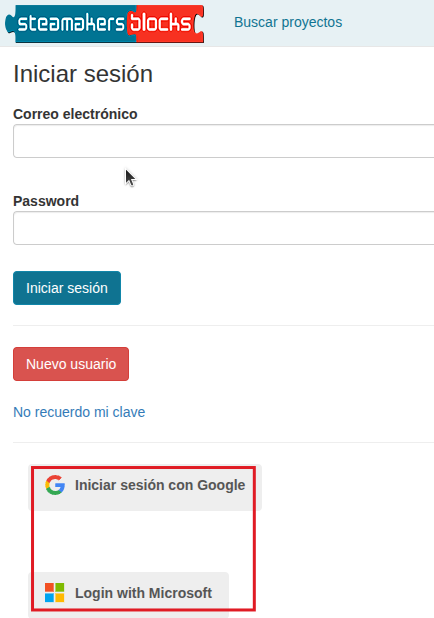{.center-img} 

<b>2. </b> Al entrar en la plataforma te encontrarás esta pantalla:

{.center-img}

<b>3.</b> Al hacer clic en "Empezar un nuevo proyecto!" aparece la siguiente pantalla para seleccionar el tipo de proyecto:

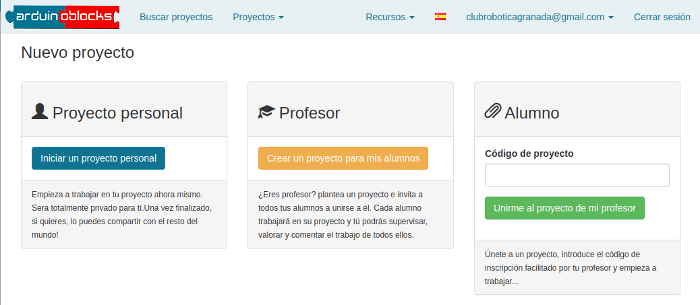{.center-img}

<b>4.</b> Para crear un nuevo **proyecto personal**, debes rellenar un formulario. Para programar Coding Box 2.0 debes seleccionar ESP32 / WROOM en **Tipo de proyecto**.

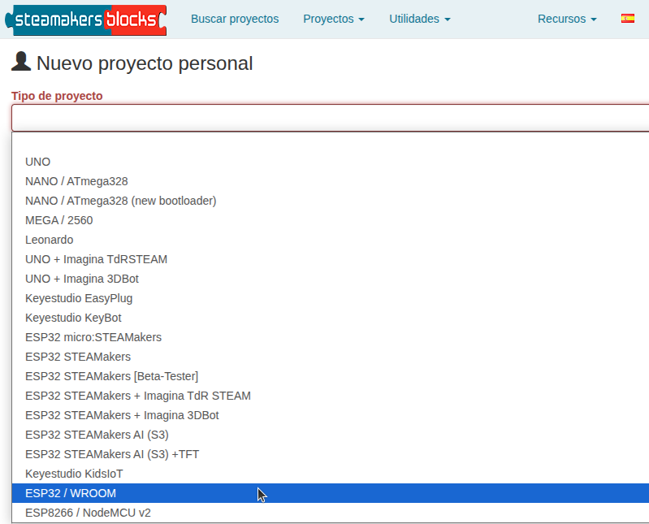{.center-img}

<b>5.</b> Una vez creado el proyecto, después de haber cumplimentado su nombre y demás campos del formulario, se abre el entorno de programación:

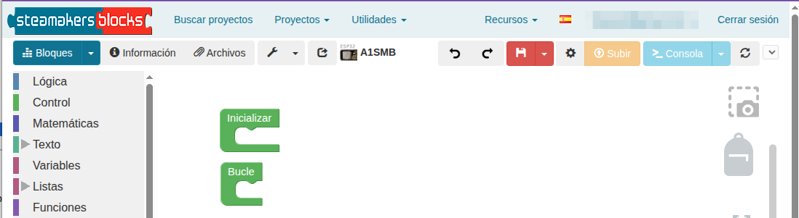{.center-img}

<b>6.</b> En la parte izquierda de esta pantalla, encontrarás los bloques disponibles clasificados por diferentes categorías. Por ejemplo, en la siguiente imagen puedes ver los bloques de algunos de los sensores que se pueden controlar.

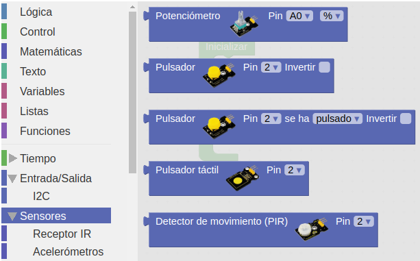{.center-img}

<b>7.</b> Arrastra los bloques al espacio de programación para programar tu placa. Por ejemplo, podemos programar el envío en bucle de un mensaje por puerto serie. El **puerto serie**, también conocido como puerto de comunicaciones serie o interfaz serie, es un tipo de conexión utilizada en ordenadores y dispositivos periféricos para la transferencia de datos. La característica principal del puerto serie es que envía los datos en serie; es decir, bit a bit, a través de un solo canal o hilo. Los bloques más importantes para utilizar el puerto serie son:

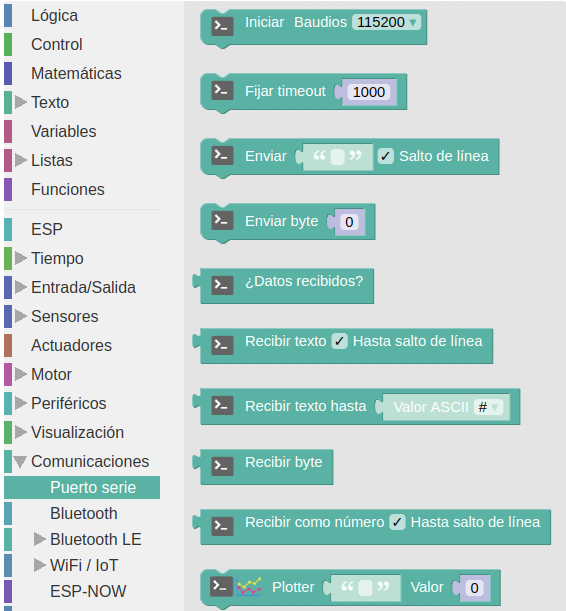{.center-img75}

<b>8.</b> Un programa de ejemplo sería así:

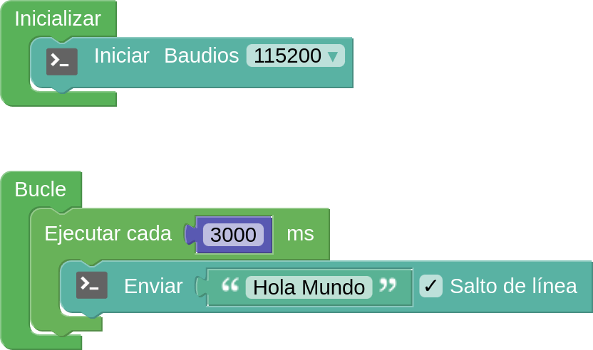  
***[Programa Hola mundo](../programas/SMB/HolaMundo.abp)***

Dentro de la estructura “**Inicializar**” colocamos el bloque de configuración de la velocidad de transferencia de datos (“**baudrate**”) del puerto serie a 115200. Y en el bucle principal, colocamos el bloque para enviar un mensaje en concreto, seleccionando que se realice un salto de línea. Para que el mensaje no se muestre tan rapidamente hacemos que se reproduzca cada cierto tiempo.

<b>9.</b> Una vez creado el programa, debes transferirlo (subirlo) a la placa. Para ello, sigue los siguientes pasos:

* Comprueba que AB-Connector está ejecutańdose.
* Conecta la placa al ordenador mediante un cable USB.
* Selecciona el puerto de comunicación. Puedes conectar y desconectar el cable USB del ordenador para diferenciar cuál es el puerto de comunicación que utiliza la placa.
* Si no aparece el "/dev/ttyUSBn" directamente, pulsa en el icono de actualización. En entornos Linux, MacOS y Chromebook se muestra así el nombre. En Windows se muestra como COM.

{.center-img75}

* Pulsando en el botón “Subir”, carga el programa en la placa.

{.center-img75}

!!! info "Tiempo de subida"
    En ESP32 el tiempo de subida será bastante mayor que en otras placas debido a la cantidad y peso de las librerias que utiliza ESP32.

Para poder visualizar el monitor serie y comprobar qué mensajes está enviando la placa al ordenador, debes abrirlo en tu entorno de programación, pulsando el botón “Consola”:

{.center-img75}

<b>10.</b> Se abrirá la ventana siguiente:

{.center-img100}

<b>11.</b> Selecciona la tasa de baudios (velocidad de transmisión de datos) con la que has iniciado el puerto serie y después haz clic en conectar. Verás el resultado en pantalla.

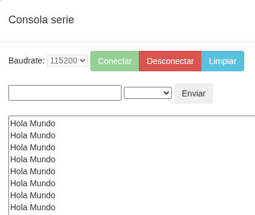  
