Enlaces donde encontrar toda la información actualizada sobre esta funcionalidad de STEAMakersBlocks:

* **[Paneles IoT en Ardutaller](https://www.ardutaller.com.es/steamakersblocks/paneles-iot)** con todas las opciones.
* **[Documento online](https://docs.google.com/document/d/1uO3YvSCc0Hs2I25K4nB1yzLQcXYeNEOWp5JXBtIA8xI/edit?tab=t.0)** que será siempre el mas actualizado.

???+ info ""
    Si accedes a **"Archivo $→$ Descargar $→$ Documento PDF (.pdf)** puedes obtener la versión en ese instante en este formato o en el resto de opciones de descarga disponibles.

* **[Video tutorial: STEAMakersBlocks Paneles IoT](https://www.youtube.com/watch?v=QRK_pghFR40)**. Presentación sobre la creación de paneles IoT basados en MQTT para ESP32 STEAMakers y ESP32 micro:STEAMakers realizada por Juanjo López.
* **[Documento en pdf](https://docs.google.com/document/d/1uO3YvSCc0Hs2I25K4nB1yzLQcXYeNEOWp5JXBtIA8xI/export?format=pdf)** aunque es posible que no esté tan actualizado como el documento online.

!!! Quote ""
    !!! note ""
        La funcionalidad **Paneles IoT** solamente está disponible para usuarios premium de STEAMakerblocks. Puedes saber si eres usuario premium porque aparece en la ventana que se abre después de iniciar sesión:

        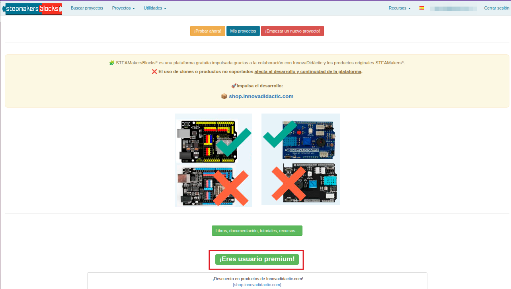{.center-img100}

## **Creación de un panel IoT**
Accede a Paneles IoT en utilidades:

{.center-img75}

En la parte superior derecha de la pantalla hay un botón de color verde con el texto en blanco "Nuevo panel": . Para crear el panel basta con ponerle título, subtítulo y hacerlo público:

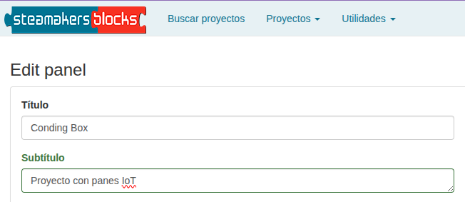{.center-img100}

Justo después está el enlace "Use HiveMQ (for testing only)" que nos muestra una ventana emergente con la advertencia en inglés que puedes ver traducida haciendo clic sobre el botón siguiente:

<button onclick="document.getElementById('id01').style.display='block'" class="md-button">Use HiveMQ (for testing only)</button>

  

    
    <h2>STEAMakersBlocks dice</h2>
    
Advertencia: El servidor público de HiveMQ (broker.hivemq.com) no requiere
    autenticación y no es seguro. Úselo solo con fines educativos. No lo use en
    producción. ¿Desea completar los campos con valores de HiveMQ para
    realizar pruebas?

<!-- Botón de cierre en la parte inferior derecha -->

<button onclick="document.getElementById('id01').style.display='none'" class="md-button">Cerrar</button>

  

La configuración de los campos de conexión con el broker MQTT se realiza de manera automática para trabajar de forma gratuita con HiveMQ cuando pulsamos sobre el enlace citado. Mientras tanto el aspecto será el siguiente:

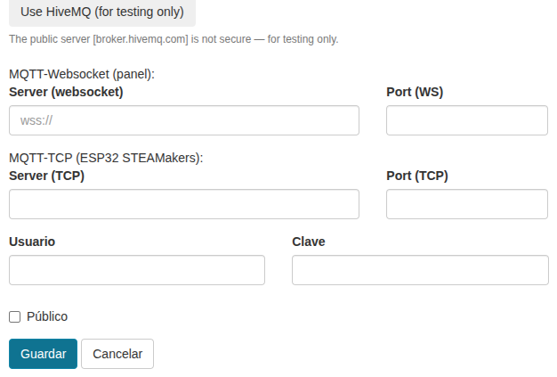{.center-img100}

Si queremos utilizar nuestro propio servidor debemos cumplimentar estos campos. Para el caso de HiveMQ se dejan en blanco Usuario y Clave y a decisión propia decidimos si los datos son públicos o no. Los paneles creados se verán así:

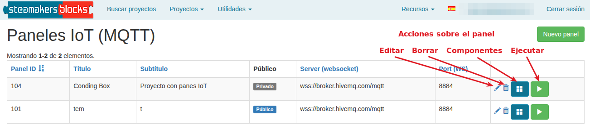{.center-img100}

## **Creación de nuevo componente**
Si accedemos a los componentes del panel vemos la siguiente pantalla:

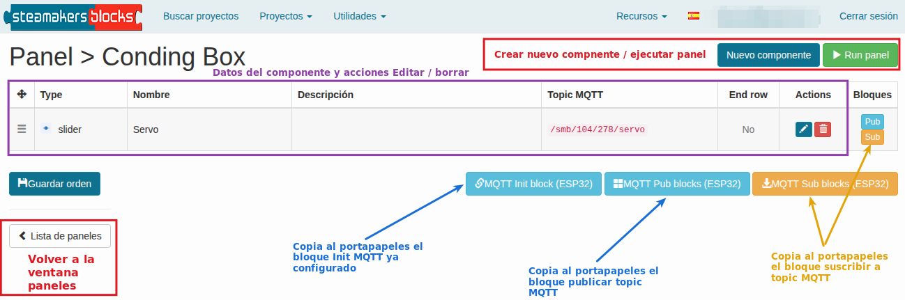{.center-img100}

!!! Danger ""
    !!! Question ""
        **Los botones grandes situados debajo de los datos del componente copian al portapapeles todos los bloques publicar y/o suscribir de todos los componentes existentes en el panel. Por el contrario, los botones situados en la parte derecha de cada componente solamente copian al portapapeles el bloque publicar o suscribir de ese componente.**

Cuando haces clic sobre alguno de los botones se muestra el mensaje siguiente:

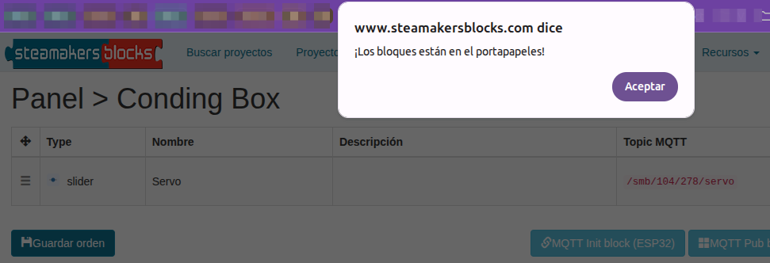{.center-img100}

Pulsa en "Aceptar" y dirigete al menú "Utilidades" dentro de tu proyecto. Observa que ahora aparece la opción de "Pegar bloques" y si pulsas sobre la misma se pega el bloque, ya configurado, en el área de programa.

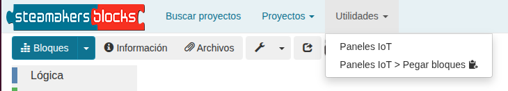{.center-img75}

El aspecto de bloques pegado es el siguiente:

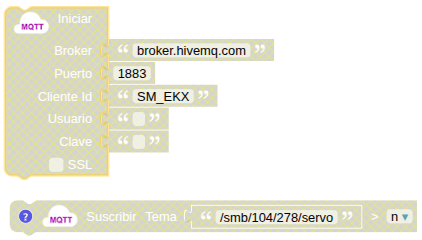{.center-img75}

Tan solo resta colocarlos en el lugar adecuado de nuestro programa.

El botón 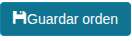 sirve para conservar la organización establecida cuando tenemos varios componentes en un panel.

## **Componentes disponibles**
Los componentes tienen como campos comunes los siguientes:

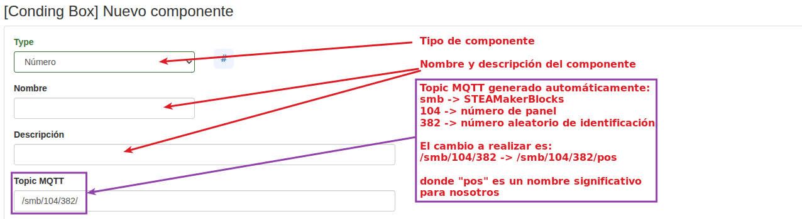{.center-img100}

Los componentes son sencillos de configurar y bastante intuitivos por lo que simplemente citaremos los diez tipos existentes. Detalles sobre los mismos con ejemplos de uso se pueden consultar en las referencias dadas al principio.

Los tipos de componentes son:

1. **Número** 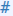. Para mostrar en el panel un valor de tipo numérico enviado desde la placa al broker MQTT.
2. **Indicador** . Para mostrar el estado de una variable booleana.
3. **Gráfico** 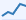. Para trazar gráficos XY. Tanto los ejes X e Y como el máximo de datos a visualizar son configurables. Si se habilita "Scroll" aparece una línea que nos permite el desplazamiento en la gráfica.
4. **Semicírculo** . Muestra el valor de la variable en una gráfica en forma de semicírculo.
5. **Nivel horizontal** 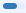. La visualización se realiza en una gráfica consistente en una barra horizontal.
6. **Interruptor** 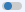. Para enviar información desde el navegador a la placa. En lugar de publicar un topic hay que suscribirse a uno. Podemos recibir el estado del interruptor en una variable.
7. **Deslizador** 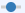. Para enviar información desde el navegador a la placa.  En lugar de publicar un topic hay que suscribirse a uno. El valor que se envía a la placa lo define la posición del deslizador.
8. **Texto** 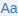. Para mostrar un valor de tipo texto enviado desde la placa, por ejemplo una cadena introducida en la consola serie.
9. **Enviar texto** . Realiza el proceso contrario al anterior, es decir envía un texto desde el panel para guardarlo en la placa.
10. **Mapa** . Permite mostrar en un mapa en el panel una localización geográfica. Dicha localización se puede introducir manualmente si es fija o bien obtenerla con un GPS si es móvil.
