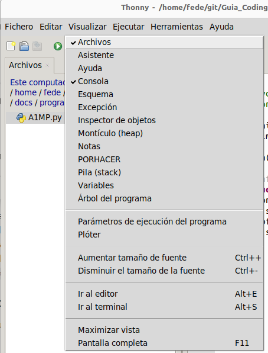
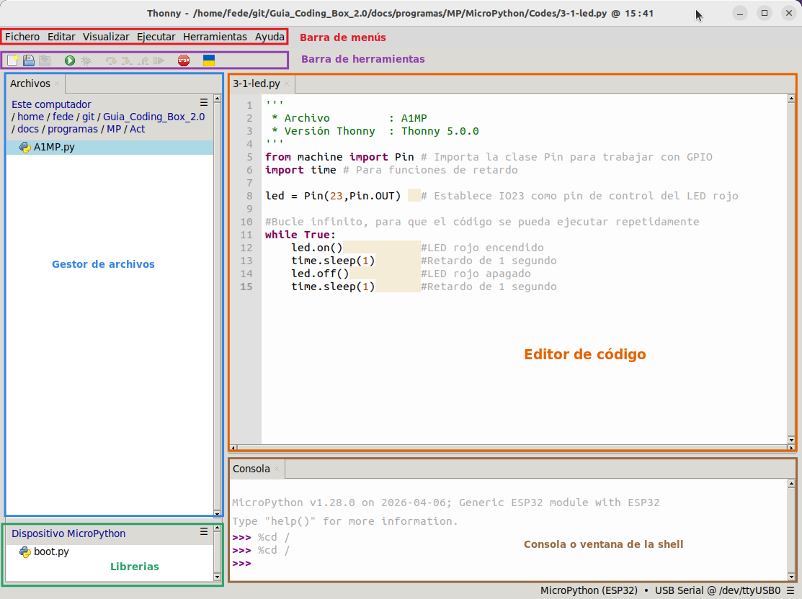
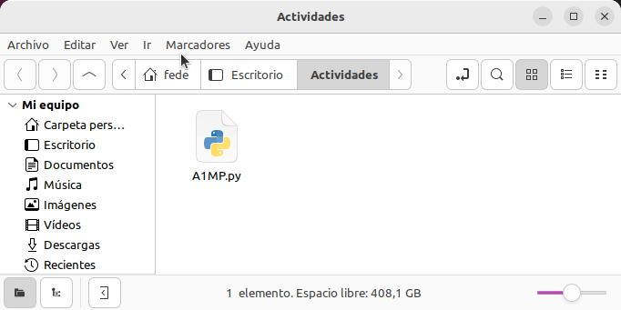
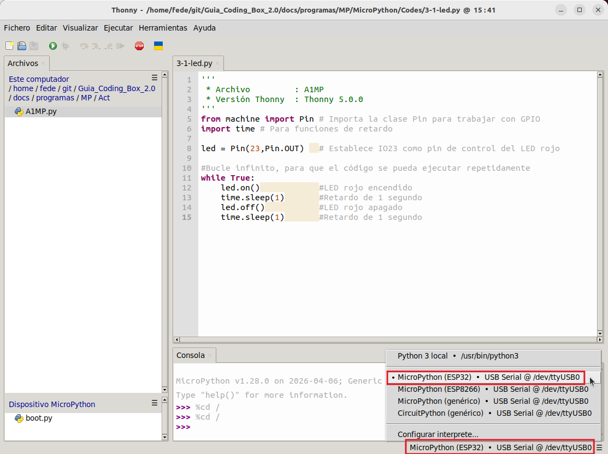
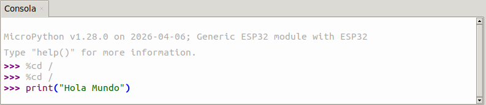
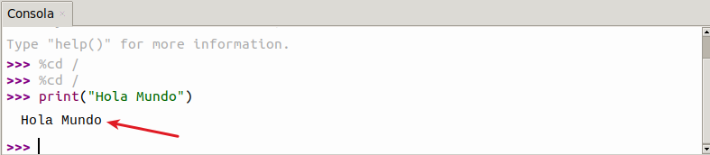
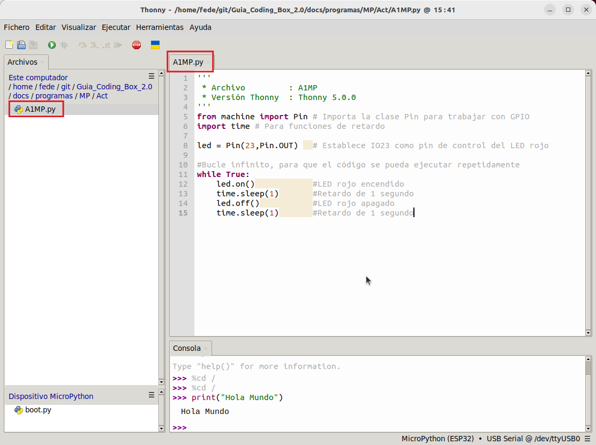
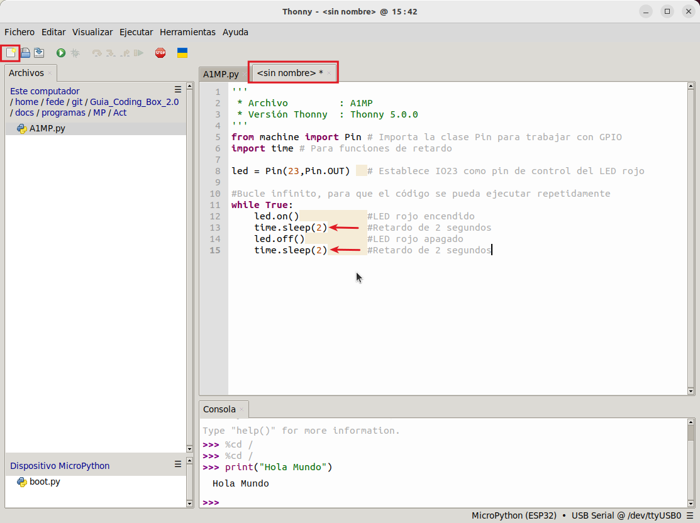
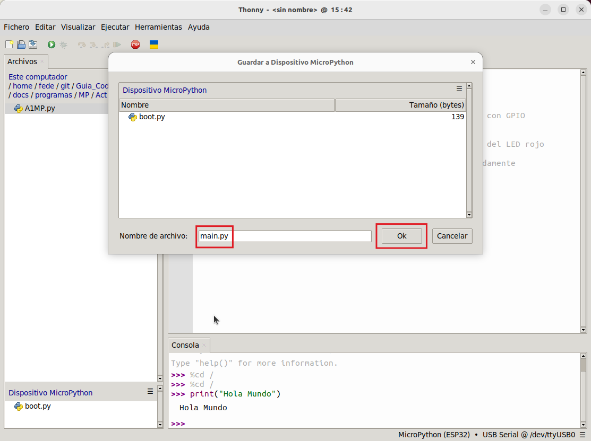

## <FONT COLOR=#007575>**Interfaz**</font>
Lo primero que vamos a hacer es poner visible la ruta de archivos y la consola. Para ello haz clic en "Visualizar" y marca "Archivos" y "Consola" si no lo están ya.

{.center-img}

Esto hará que se abran las ventanas correspondientes en el IDE, que tendrá el aspecto siguiente:

{.center-img100}

A continuación se indica la funcionalidad de los botones de la barra de herramientas.

<center>

|Icono|Función|Icono|Función|
|:-:|---|:-:|---|
||Nuevo (Ctrl+N) ||Abrir (Ctrl+O) |
||Guardar (Ctrl+S) ||Ejecutar programa actual (F5) |
||Depurar programa actual||Depurar línea a línea (F6) |
||Depurar, entrar en función (F7) ||Depurar, salir de función |
||Salir de depuración (F8) ||Detener/Reiniciar el intérprete |

</center>

## <FONT COLOR=#007575>**Prueba de MicroPython en ESP32**</font>
Procede a descargar el programa [A1MP.py](../programas/MP/Act/A1MP.py) en tu ordenador. Lo aconsejable es tenerlo en un directorio de fácil acceso, como por ejemplo una carpeta "Actividades" en el escritorio.

{.center-img75}

Abre el archivo en Thonny y conecta Coding Box. Si has completados todos los procesos descritos en [Guia de inicio MicroPython](https://fgcoca.github.io/Guia_Coding_Box_2.0/files/guiaMP/) Thonny está listo para ejecutar el programa.

{.center-img100}

## <FONT COLOR=#007575>**Prueba de la Consola de comandos**</font>
Introduce el siguiente código en la Shell:

```python
print("Hola Mundo")
```

{.center-img100}

Si presionas la teclar "Entrar" la consola imprimirá **Hola Mundo**.

{.center-img100}

## <FONT COLOR=#007575>**Prueba de ejecución con conexión**</font>
La situación que debes tener es la mostrada anteriormente con el programa en el IDE y la conexión con ESP32 correcta.

{.center-img100}

Pulsas el botón  para ejecutar el código y el LED de la placa parpadeará: permanecerá encendido durante 1s y apagado durante 1s.

## <FONT COLOR=#007575>**Prueba de ejecución sin conexión**</font>
Haz clic en  para crear un nuevo programa. Ahora copia y pega todo el código de A1MP.py en el área de edición del nuevo programa y modifica los tiempos de espera a 2 segundos.

{.center-img100}

Haz clic en  para guardarlo en el dispositivo MicroPython.

{.center-img100}

Ponle de nombre "main.py".

{.center-img100}

Una vez guardado el archivo, el código de ```main.py``` se ejecutará automáticamente siempre que Coding Box esté alimentada y encendida. Verás que el LED rojo parpadea una vez cada dos segundos.

!!! info ""
    Si quieres ejecutar un código sin conexión, debes cargarlo en Coding Box con el nombre ```main.py```.

    !!! Warning ""
        Ten en cuenta que **no se ejecutará** tras guardar el archivo a menos que pulses el botón de reinicio.

