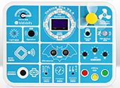
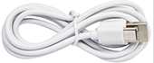
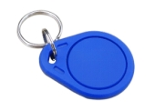
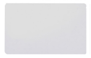
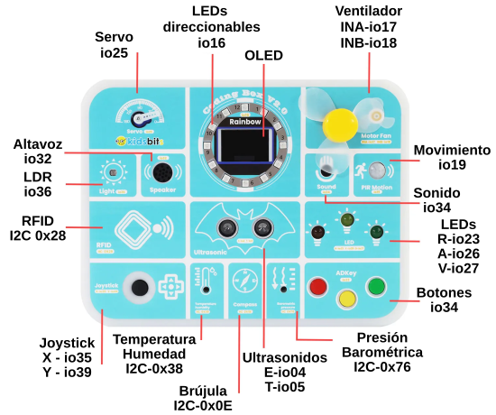

# **Guia de Coding Box 2.0**
Coding Box 2.0 integra 16 sensores y actuadores, entre los que se incluyen varios LEDs, tres botones, una pantalla OLED de 1,3 pulgadas, una fotorresistencia LDR, un sensor de sonido, un altavoz, un sensor de temperatura y humedad y un sensor de presión, un sensor RFID, un Joystick, un sensor de ultrasonidos, un conjunto de 16 LEDs direccionables, una brújula, un servomotor y un motor DC.

Cada proyecto incluye tres métodos de programación:

* Programación gráfica con MicroBlocks
* Programación gráfica con STEAMakersBlocks
* MicroPython

Por lo tanto, este kit resulta muy útil para el desarrollo inicial del pensamiento computacional.

==**^^Enlaces de interés^^**==

* [Documentación de Ardutaller](https://www.ardutaller.com.es/kits/coding-box-v2-o)
* [kidsbits WIKI](https://wiki.kidsbits.cc/projects/KD2124/en/latest/index.html#)
* [Documentación de STEAMakersBlocks](https://www.steamakersblocks.com/web/site/doc)

## **Características y materiales del kit**

* **No requieres realizar conexiones**: de esta forma se evitan errores que puedan romper algún módulo.
* **Multifunción**: la caja contiene múltiples sensores y actuadores que se pueden alimentar desde USB, mediante una fuente de 7 a 12 V CC o mediante 6 pilas AA.
* **Estructura robusta y sencilla**: el Coding Box 2.0 está listo para usar.
* **Capacidad de expansión**: hay cuatro conectores I2C listos para usar.
* **Programación**: desde lo más básico en entornos visuales hasta MicroPython.

El kit incluye:

* Un Coding Box V2.0 con ESP32

{.center-img33}

* Un cable USB tipo C

{.center-img33}

* Una llave RFID

{.center-img33}

* Una tarjeta RFID

{.center-img33}

## **Pinout**
En la imagen vemos los elementos disponibles en Coding Box 2.0 y los pines asociados.

{.center-img100}

En la tabla siguiente se da la descripción literal de pines.

|Dispositivo|Pin|Dispositivo|Pin|
|:-:|:-:|:-:|:-:|
|Servo|io25|LDR|io36|
|Altavoz|io32|RFID|I2C 0x28|
|Joystick|Eje X - io35  Eje Y - io39 |OLED|I2C 0x3C|
|LEDs RGB direcionables|io16|Ultrasonidos|Emisor - io4  Transmisor - io5 |
|Temperatura|I2C - 0x38|Brújula|I2C - 0x0E|
|Presión atmosférica|I2C - 0x76|Ventilador|INA - io17  INB - io18 |
|Sensor sonido| io34|Sensor movimiento PIR|io19|
|LED rojo|io23|LED amarillo|io26|
|LED verde|io27|ADKey (botones)|io33|

Coding Box 2.0 tiene como controlador principal un ESP32 que integra de manera nativa WiFi y Bluetooth. Se puede alimentar con 6 pilas AA o con un alimentador externo entre 7 y 12 voltios de corriente continua. Dispone de 4 conectores RJ11 con conexión I2C para interface con otros elementos. Dispone de conector USB-C para programación y alimentación. En sus laterales dispone de orificios compatibles con los pines sin estrias de tipo LEGO. Los elementos disponibles son:

* 3 botones
* 16 sensores
* 3 LEDs, Rojo, Verde y Amarillo
* 12 LEDs RGB direccionables
* Botón de reset
* Pantalla OLED
* Ultrasonidos
* Módulo RFID
* Módulo Joystick
* Sensor de temperatura y humedad
* Sensor de dirección
* Sensor de presión
